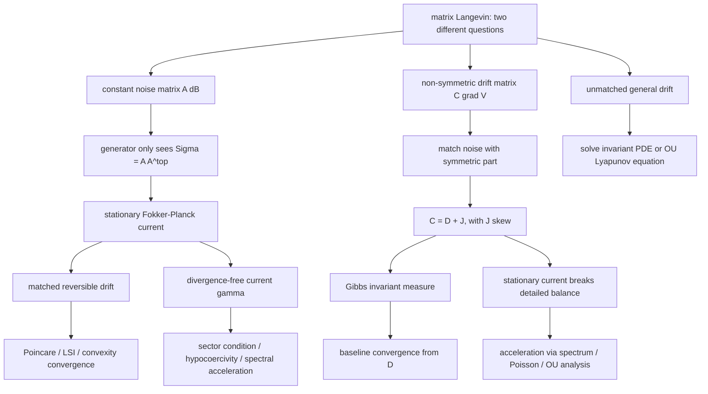

## 路线图

本讲义的问题顺序是：先去掉“非对称矩阵噪声”的表面迷惑，再给出 Gibbs 平衡态的 current 检查，最后进入真正的不可逆矩阵 drift。核心分界线是：常系数噪声矩阵 $`A`$ 的非对称外形会被 $`AA^\top`$ 吸收；drift 中的反对称部分 $`J\nabla V`$ 才会产生非零 stationary current。读者如果已经确认自己关心的是 $`dX_t=-C\nabla V(X_t)dt+\sqrt{2D}dB_t`$，可以把第 1-12 节当作防错铺垫，然后重点读第 13-20 节。
