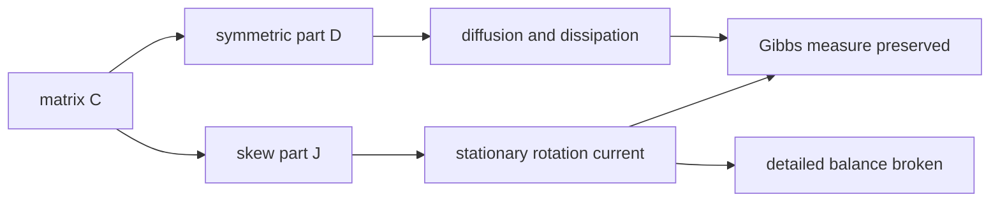

## 13. 追加模块：drift 为非对称矩阵乘梯度的不可逆 Langevin

这一节修正并补全一个更核心的不可逆 Langevin 情形。上一版主要强调“常系数非对称噪声矩阵 $`A`$ 本身不产生不可逆性”；真正常见、也更有用的不可逆模型是 drift 本身带非对称矩阵：

$$
dX_t=-C\nabla V(X_t)\,dt+\sqrt{2D}\,dB_t,
$$

其中 $`C`$ 不一定对称，$`D=D^\top\succeq0`$ 是噪声协方差的一半。最重要的结论是：若目标仍然是

$$
\pi(dx)=Z^{-1}e^{-V(x)}dx,
$$

那么常矩阵情形的自然匹配条件是

$$
C=D+J,\qquad D=D^\top\succeq0,\qquad J=-J^\top.
$$

也就是说，$`C`$ 的对称部分必须给出 diffusion/dissipation，$`C`$ 的反对称部分才是不可逆旋转流。此时

$$
dX_t=-(D+J)\nabla V(X_t)\,dt+\sqrt{2D}\,dB_t
$$

以 $`e^{-V}`$ 为不变分布；若 $`J\ne0`$，通常不满足 detailed balance。

**本追加模块要解决的问题。**

| 问题 | 正确回答 |
|---|---|
| $`C`$ 非对称是否自动保持 Gibbs？ | 不。需要噪声与 $`\operatorname{Sym}C`$ 匹配。 |
| 反对称部分 $`J`$ 做了什么？ | 保持 $`\pi`$ 不变但产生 stationary current，破坏 reversibility。 |
| 收敛如何证明？ | 保底由 $`D`$ 的 Poincare/LSI/Lyapunov 控制；加速由 $`J`$ 改变谱和慢模态耦合。 |
| 线性 Gaussian 时能否完全算清？ | 可以。平衡态由 Lyapunov 方程检查，收敛由 $`(D+J)H`$ 的谱与 prefactor 控制。 |

**Reference 定位。** Hwang-Hwang-Ma-Sheu 把 $`-\nabla U`$ 加上 weighted divergence-free drift 来加速 diffusion；Lelièvre-Nier-Pavliotis 研究 Gaussian/linear drift 中最优不可逆扰动；Duncan-Lelièvre-Pavliotis 研究非可逆 Langevin 的 asymptotic variance；Ma-Chen-Fox 给出 $`D+Q`$ 的一般 SG-MCMC recipe。
