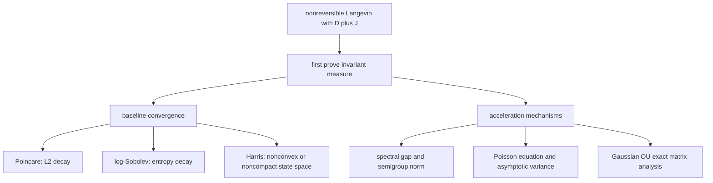

## 17. 收敛到平衡态：保底结论、加强结论和真正的加速

本节的逻辑是先给不依赖 $`J`$ 的保底收敛，再解释哪些工具真正能看到 $`J`$ 的加速效应。这样可以避免一个常见误读：Poincare 或 LSI 证明看不到加速，并不说明不可逆项没有用；它只说明这些能量证明过于保守。

### 17.1 $`L^2`$ 保底：Poincare rate 不会变坏

令 $`h_t=P_t h_0`$，并假设 $`\int h_0d\pi=1`$。在 $`L^2(\pi)`$ 中，

$$
\frac{d}{dt}\|h_t-1\|_{L^2(\pi)}^2
=2\langle h_t-1,\mathcal L(h_t-1)\rangle_\pi
=2\langle h_t-1,\mathcal S(h_t-1)\rangle_\pi.
$$

反对称部分完全消失。若 $`\pi`$ 满足相对于 $`D`$ 的 Poincare inequality

$$
\operatorname{Var}_\pi(f)
\le C_P\int \nabla f^\top D\nabla f\,d\pi,
$$

则

$$
\|P_tf-\pi f\|_{L^2(\pi)}^2
\le e^{-2t/C_P}\|f-\pi f\|_{L^2(\pi)}^2.
$$

这个 rate 是保底 rate。它不展示 $`J`$ 的加速，因为这个证明只看能量耗散，不看 $`J`$ 如何改变谱结构。

### 17.2 熵保底：log-Sobolev rate 也由 $`D`$ 控制

令 $`h_t=d\rho_t/d\pi`$。Fokker-Planck 对 $`h_t`$ 的演化是 $`\partial_t h_t=\mathcal L^\dagger h_t=\mathcal S h_t-\mathcal A h_t`$。熵导数为

$$
\frac{d}{dt}\operatorname{Ent}_\pi(h_t)
=\int (\mathcal S h_t-\mathcal A h_t)\log h_t\,d\pi.
$$

其中反对称项为零：

$$
\int \mathcal A h_t\log h_t\,d\pi
=\int \mathcal A\Phi(h_t)\,d\pi=0,
\qquad \Phi'(r)=\log r.
$$

对称项给出

$$
\frac{d}{dt}\operatorname{Ent}_\pi(h_t)
=-\int \frac{\nabla h_t^\top D\nabla h_t}{h_t}\,d\pi.
$$

若 log-Sobolev inequality

$$
\operatorname{Ent}_\pi(h)
\le C_{LS}\int \frac{\nabla h^\top D\nabla h}{h}\,d\pi
$$

成立，则

$$
\operatorname{Ent}_\pi(h_t)
\le e^{-t/C_{LS}}\operatorname{Ent}_\pi(h_0).
$$

同样，这只是保底 rate；它说明 $`J`$ 不破坏熵收敛，但不完全量化 $`J`$ 的加速潜力。

### 17.3 谱加速：Hwang-Hwang-Ma-Sheu 型结论

Hwang-Hwang-Ma-Sheu 的设定是

$$
dX_t=(-\nabla U(X_t)+C(X_t))dt+\sqrt2dW_t,
\qquad \nabla\cdot(Ce^{-U})=0.
$$

在本节常矩阵模型中，可以取 $`D=I`$、$`C(x)=-J\nabla U(x)`$。他们把 generator 看成

$$
\mathcal L_C=\mathcal L_0+C\cdot\nabla,
$$

其中 $`C\cdot\nabla`$ 是 $`L^2(\pi)`$ 中的反对称 perturbation。其谱比较结论可粗略理解为：非可逆 perturbation 通常让非零谱的实部更负，从而改善 spectral gap / convergence exponent；等号只在特殊情形出现。

**需要注意的技术条件。** 这类结论通常要求：

| 条件 | 为什么需要 |
|---|---|
| $`U`$ confining，$`e^{-U}`$ 可积 | 存在目标概率分布 |
| reversible generator 有离散谱或 spectral gap | 才能比较 convergence exponent |
| $`C`$ smooth 且 $`\nabla\cdot(Ce^{-U})=0`$ | invariant measure 不变且反对称性成立 |
| 过程 non-explosive / ergodic | 谱结论对应真实 Markov 收敛 |

### 17.4 Poisson 方程与 asymptotic variance

对 observable $`f`$，MCMC 长时间平均的中心极限定理通常通过 Poisson 方程

$$
-\mathcal L\phi=f-\pi f
$$

控制。asymptotic variance 可写成与 $`\phi`$ 和 $`\mathcal L`$ 相关的二次型。Duncan-Lelievre-Pavliotis 研究了

$$
\mathcal L=\mathcal S+\alpha\mathcal A
$$

中反对称强度 $`\alpha`$ 对 asymptotic variance 的影响。核心现象是：适当不可逆扰动通常降低 variance；但强扰动极限受 $`\ker\mathcal A`$ 控制。若 observable 落在不可逆 transport 无法混合的守恒方向上，加速会有限。

### 17.5 Harris / Lyapunov 条件：非凸和非紧空间的实用收敛

如果 $`V`$ 非凸、目标有 heavy tail、或者谱方法难以直接使用，一个常用 sufficient package 是：

1. $`D\succ0`$ 给 uniform ellipticity。
2. $`V`$ 光滑，$`\nabla V`$ 局部 Lipschitz，保证局部 well-posedness。
3. 存在 Lyapunov function $`W\ge1`$，使

$$
\mathcal LW\le -aW+b\mathbf 1_K
$$

对某个 compact set $`K`$ 成立。
4. transition kernel 在 $`K`$ 上有 minorization，或由 ellipticity/irreducibility 推出 small set。

则 Harris theorem 给 geometric ergodicity；若 drift 条件是 subgeometric，就只能给 subgeometric ergodicity。Eberle-Guillin-Zimmer 的定量 Harris/coupling 工作给出了这类条件下的显式 Wasserstein/total variation 型收敛常数。

**本节带走什么。** Poincare/LSI 给 invariant-measure functional inequality 下的保底收敛；Hwang 和后续工作解释不可逆项如何改善谱；Poisson 方程解释 variance reduction；Harris/Lyapunov 是非凸非紧情形最稳的 existence-and-convergence 工具。
