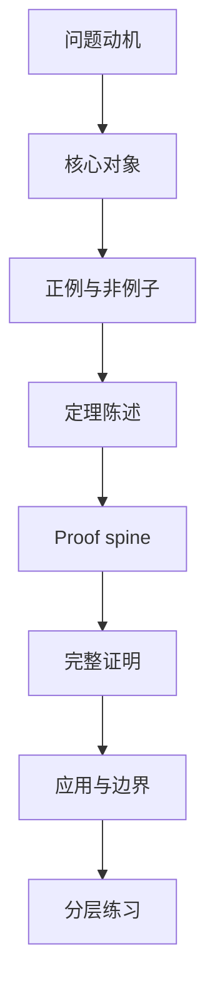

## 一页摘要

这个页面定义以后在 `Lecture Notes` 下生成中文数学讲义的最低标准。核心原则是：讲义不是 reference dump，而是帮助读者从问题、对象、例子、定理、证明和练习中重建一个 topic 的数学结构。默认读者是 目标读者：可以接受严谨证明，但需要讲义明确说明为什么这个对象自然、定理的 proof spine 是什么、假设在哪里使用，以及这个 topic 如何进入研究判断。

## 目录

<table_of_contents color="gray"/>

## 预备知识

读这套标准不需要额外数学背景，但后续每份具体讲义必须写清楚自己的预备知识。例如一份随机过程讲义应该标注需要测度论概率、ODE、偏微分方程还是泛函不等式；一份优化讲义应该标注是否需要凸分析、谱理论或随机近似。

## 学习目标

一份合格讲义至少要达到三个层次。

| 层次 | 读者结束后应该能做什么 | 讲义必须提供什么 |
|---|---|---|
| 概念层 | 说清核心对象为什么出现 | 动机、定义、正例、非例子 |
| 技术层 | 复现核心 theorem 的证明路线 | proof spine、关键估计、假设使用点 |
| 研究层 | 判断 topic 能否迁移到新问题 | 边界、反例、open-ended exercises |

## 路线图

本路线图是默认生成顺序。若某个 topic 更适合从例子进入，可以把例子提前，但不能删除定理、证明和边界分析。

## 核心定义：什么叫合格讲义

**定义。** 一份中文数学讲义称为合格，如果它把一个 topic 表示成三层对象：问题层 $`Q`$、结构层 $`S`$、证明层 $`P`$。讲义必须解释 $`Q \to S`$ 为什么自然，$`S \to P`$ 为什么足够，并说明 $`P`$ 的哪些步骤依赖哪些假设。

用公式表示，讲义不是简单罗列

$$
\text{Definition}_1,\text{Definition}_2,\ldots,\text{Theorem}_k,
$$

而应该给出一条可学习路径

$$
\text{problem}\longrightarrow \text{object}\longrightarrow \text{example}\longrightarrow \text{theorem}\longrightarrow \text{proof}\longrightarrow \text{boundary}.
$$

## 例子

**正例。** 如果 topic 是 Langevin dynamics，讲义应先问为什么我们要构造一个连续时间随机过程来采样目标分布 $`\pi(dx)\propto e^{-V(x)}dx`$。然后定义 SDE，说明噪声与漂移如何共同保持 $`\pi`$ 不变，再证明 Fokker-Planck 方程的 stationary solution。

**非例子。** 只写“Langevin dynamics 是 $`dX_t=-\nabla V(X_t)dt+\sqrt{2}dB_t`$，它的 invariant distribution 是 $`e^{-V}`$，证明略”，不合格。这里缺少问题动机、假设、proof spine、边界与练习。

## 定理：讲义结构完整性

**定理。** 若一份讲义对每个核心 theorem 都给出假设解释、proof spine、完整证明或明确引用、正例、非例子与练习，则它通常可以同时作为学习材料和后续 reference 使用。

**证明路线。** 学习材料和 reference 的冲突不在内容多少，而在组织方式。学习材料需要读者沿着因果路径进入对象；reference 需要编号、定理和证明可定位。若两者都存在，读者先用 narrative 建模，再用 theorem/proof 回查。

**证明。** 把讲义正文拆成两类块：解释块和形式块。解释块说明动机、例子、误区；形式块给出定义、定理、证明、练习。若只有解释块，读者无法检查严谨性；若只有形式块，读者无法知道为什么这些形式对象被选择。两类块交替出现，并且每个形式块都由前面的解释块引入，就得到可学习路径。每个 theorem 后的 proof spine 将长证明压缩成有限步骤 $`s_1,\ldots,s_m`$，完整证明再展开每个 $`s_i`$，因此也保留 reference 功能。

## Notion 数学公式标准

Inline math 必须写成 Notion 稳定格式，例如 $`X_t`$、$`\nabla V`$、$`\mathcal L`$。Display math 使用双美元块：

$$
\mathcal L f = b\cdot \nabla f + \frac{1}{2}\operatorname{Tr}(a\nabla^2 f).
$$

不得使用普通 inline dollar math。不得把 $`\mathbb R^d`$ 写坏成缺少反斜杠的形式，且矩阵转置必须写作 $`A^\top`$ 而不是纯文本近似。

## 排版与图文标准

| 元素 | 用途 | 最低要求 |
|---|---|---|
| 表格 | 对比定义、假设、定理版本 | 每份长讲义至少一个 |
| 可点击目录 | 提供页面内跳转导航 | 一页摘要后必须有 `## 目录` + `<table_of_contents color="gray"/>` |
| Mermaid 或 ASCII 图 | 展示依赖关系、流程或相图 | topic 允许时使用 |
| display equation | 展示核心公式 | 不把大公式塞进段落 |
| callout 风格段落 | 标注误区、记忆点、边界 | 每个主要章节至少一个 |
| 练习区 | 主动学习 | 至少五层题目 |

## 练习

Level 0：把“合格讲义”的定义改写成你自己的话，并指出 $`Q`$、$`S`$、$`P`$ 分别代表什么。

Level 1：给一个你熟悉的 topic，写出它的问题层、结构层、证明层。

Level 2：选择一个 theorem，写出三步 proof spine，并说明哪一步最容易被讲义写坏。

Level 3：构造一份不合格讲义的反例：它内容正确但学习体验很差。指出失败原因。

Level 4：为一个研究 topic 设计一份讲义目录，使它同时服务学习、复现证明和写 paper。

## 常见误解

- 误区一：讲义越长越好。实际标准是认知路径越清楚越好。
- 误区二：有完整证明就够了。没有动机、例子和假设解释，证明会变成不可复用的文本。
- 误区三：图文并茂等于装饰。视觉结构必须承载数学依赖、算法流程或例子对比。
- 误区四：Notion 数学可以随便写。普通 inline dollar math 容易被转义或字面显示，必须使用稳定格式。
- 误区五：手写目录列表等于可跳转目录。完成版讲义必须用 Notion 原生 `<table_of_contents color="gray"/>`，保证目录项可点击跳转。

## 总结

- 讲义的核心任务是把 topic 的问题、对象、定理、证明和边界组织成可学习路径。
- 每个核心概念需要动机、定义、正例、非例子。
- 每个核心 theorem 需要 proof spine、完整证明或明确引用、假设使用说明。
- Notion 版本必须保证公式显示正确，页面排版清爽，视觉元素服务数学理解，并且带可点击跳转目录。
