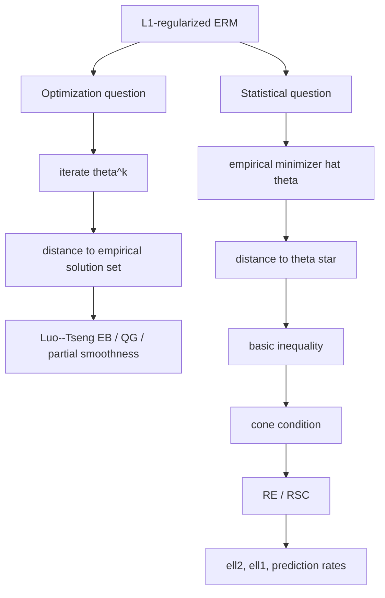

## 一页摘要
这份讲义回答一个很容易混淆的问题：L1 惩罚 convex ERM 的“minimizer convergence rate”到底有哪些证明路线？核心答案是两条线要分开看。

第一条是优化线：给定一个经验目标
$$
F_n(\theta)=L_n(\theta)+\lambda \|\theta\|_1,
$$
proximal gradient、coordinate descent、homotopy 等算法产生迭代点 $`\theta^k`$。这时要证明的是 $`\operatorname{dist}(\theta^k,\widehat\Theta_n)`$ 收敛，其中 $`\widehat\Theta_n=\arg\min F_n`$ 是经验问题的解集。Luo--Tseng error bound、quadratic growth、partial smoothness、restricted/constant-nullspace strong convexity 都属于这个轴。没有 error bound 或 curvature 时，loss gap 小不等于 minimizer distance 小。

第二条是统计线：经验 minimizer 本身 $`\widehat\theta`$ 和真参数或人口 minimizer $`\theta^\star`$ 有多近。你提到的 Bin Yu/RSC 就在这里：典型证明是
$$
\text{basic inequality}\quad \Longrightarrow\quad \text{cone condition}\quad \Longrightarrow\quad \text{RSC/RE converts loss curvature to norm error}.
$$
在 sparse linear model 里，若 $`s=|\operatorname{supp}(\theta^\star)|`$，$`\lambda\asymp \sigma\sqrt{\log p/n}`$，且 restricted eigenvalue 常数为正，则
$$
\|\widehat\theta-\theta^\star\|_2=O\left(\sigma\sqrt{\frac{s\log p}{n}}\right),
\qquad
\|\widehat\theta-\theta^\star\|_1=O\left(\sigma s\sqrt{\frac{\log p}{n}}\right).
$$
这不是 loss gap bound，而是 minimizer 的参数收敛率。

本讲义的主证明会从 LASSO 的最小化定义开始，一行一行推出 cone condition、RE/RSC 如何进入、以及为什么最后得到的是 $`\ell_2`$ 和 $`\ell_1`$ 的 minimizer rate。后面再把这个 proof spine 映射到 Negahban--Ravikumar--Wainwright--Yu 的 decomposable regularizer 框架，并说明 Luo--Tseng 路线和统计 RSC 路线如何相接。

## 目录
<table_of_contents color="gray"/>

## 读者画像、预备知识与目标
默认读者是 目标读者：已经熟悉 convex optimization、basic probability 和 high-dimensional statistics 的语言，但希望证明不要跳步，尤其不要把 “basic inequality implies cone” 或 “RSC gives estimator rate” 当作黑箱。

预备知识包括：

- 凸函数最小化和 subgradient optimality。
- Hölder 不等式：$`|u^\top v|\le \|u\|_\infty\|v\|_1`$。
- L1 norm 的 support decomposition：若 $`S\subset[p]`$，则 $`\Delta=(\Delta_S,\Delta_{S^c})`$。
- 线性回归的经验 Gram 矩阵 $`X^\top X/n`$。

学习目标分成三层。

<table header-row="true">
<tr><td>层次</td><td>结束后要会什么</td><td>本讲义怎么支持</td></tr>
<tr><td>概念层</td><td>区分 optimization iterate convergence 和 statistical minimizer convergence</td><td>先给两轴地图，再列文献谱系</td></tr>
<tr><td>技术层</td><td>能从 LASSO optimality 推出 $`\ell_2`$ estimator rate</td><td>完整证明 basic inequality、cone、RE 三步</td></tr>
<tr><td>研究层</td><td>能判断一篇 L1-ERM paper 的 rate proof 属于哪种条件</td><td>对比 RE、RSC、compatibility、irrepresentable、Luo--Tseng EB</td></tr>
</table>

本页不是为了把所有 LASSO 应用变体展开证明，而是给出核心证明机制和阅读地图。凡是只给路线、不完整证明的部分，我会标成“参考地图”。

**本节带走什么。**

- “minimizer convergence” 可以指算法迭代到经验解，也可以指经验解到真参数。
- 你现在关心的 ERM minimizer rate 主要是第二种。
- RSC/RE 是把经验曲率变成参数范数误差的桥。

## 两种 minimizer convergence：先把问题分清
考虑同一个 L1-regularized ERM：
$$
\widehat\theta \in \arg\min_{\theta\in\mathbb R^p}\left\{L_n(\theta)+\lambda\|\theta\|_1\right\}.
$$
这里有两个不同的“收敛”。

<table header-row="true">
<tr><td>问题</td><td>对象</td><td>典型 bound</td><td>核心条件</td><td>代表文献</td></tr>
<tr><td>算法收敛到经验 minimizer</td><td>$`\theta^k \to \widehat\Theta_n`$</td><td>$`\operatorname{dist}(\theta^k,\widehat\Theta_n)`$ 或 residual 线性收敛</td><td>Luo--Tseng error bound、quadratic growth、partial smoothness、restricted curvature</td><td>Luo--Tseng 1993；Tseng--Yun 2009；Zhang--Jiang--Luo 2013；Drusvyatskiy--Lewis 2016；Liang--Fadili--Peyre 2014/2017</td></tr>
<tr><td>统计 minimizer 收敛到真对象</td><td>$`\widehat\theta-\theta^\star`$</td><td>$`\ell_2`$、$`\ell_1`$、prediction norm、support recovery</td><td>score control + decomposability + RE/RSC/compatibility；selection 还需 irrepresentability</td><td>Zhao--Yu 2006；Bunea--Tsybakov--Wegkamp 2007；Bickel--Ritov--Tsybakov 2009；Meinshausen--Yu 2009；Negahban--Ravikumar--Wainwright--Yu 2012</td></tr>
</table>

一个最小反例说明为什么不能只看 loss gap。令 $`F(\theta_1,\theta_2)=\theta_1^2`$，所有点 $`(0,t)`$ 都是 minimizer。若 $`\theta^k=(1/k,k)`$，则 $`F(\theta^k)-F^\star=1/k^2\to0`$，但它到某一个指定 minimizer $`(0,0)`$ 的距离发散。若只问到解集的距离，则 $`\operatorname{dist}(\theta^k,\widehat\Theta)=1/k`$，可以收敛；若问到真参数，就需要真参数在可识别方向上的 curvature。

因此看一篇 paper 时第一句要问：它证明的是
$$
\operatorname{dist}(\theta^k,\widehat\Theta_n)
\quad\text{还是}\quad
\|\widehat\theta-\theta^\star\|?
$$
前者是 optimization；后者是 statistical estimation。

## 路线图：从问题到证明

**本节带走什么。**

- Loss gap 是标量；minimizer distance 是几何量。
- L1 penalty 本身给 sparsity geometry，但不能自动给 full-space curvature。
- RSC/RE 只在 LASSO residual 会落入的 cone 上要求曲率，这正是高维可行性的来源。

## 文献地图：哪些 paper 真正在讲 minimizer rate
下面这张表按证明机制而不是时间排序。它不是“所有应用 paper”列表，而是主干谱系：读完这些，你基本能识别后续 L1-penalized ERM 的 proof template。

<table header-row="true">
<tr><td>谱系</td><td>文献</td><td>主要结论</td><td>和 minimizer rate 的关系</td></tr>
<tr><td>起点与固定维 asymptotics</td><td>Tibshirani (1996), `Regression Shrinkage and Selection via the Lasso`；Knight--Fu (2000), `Asymptotics for LASSO-type estimators`</td><td>定义 LASSO；分析 LASSO-type estimator 的极限分布，包含在 0 处有 mass 的非光滑现象</td><td>给出 L1 estimator 是 minimizer 的基本统计对象；固定维 asymptotic 是高维 rate 之前的路线</td></tr>
<tr><td>变量选择条件</td><td>Zhao--Yu (2006), `On Model Selection Consistency of Lasso`；Wainwright (2009), sharp thresholds；Meinshausen--Buhlmann (2006) neighborhood selection</td><td>irrepresentable condition 几乎必要且充分；支持恢复需要比估计误差更强的条件</td><td>这是 support minimizer convergence，不等同于 $`\ell_2`$ rate；要小心不要把 selection condition 当作 RSC</td></tr>
<tr><td>早期 oracle inequality</td><td>Bunea--Tsybakov--Wegkamp (2007), `Sparsity oracle inequalities for the Lasso`；Candes--Tao (2007), Dantzig selector</td><td>在高维中给 prediction / oracle bound；Dantzig 与 LASSO 技术相邻</td><td>prediction loss 可再经 RE/compatibility 转成参数 norm rate</td></tr>
<tr><td>RE/compatibility 主线</td><td>Bickel--Ritov--Tsybakov (2009), `Simultaneous analysis of Lasso and Dantzig selector`；van de Geer--Buhlmann (2009), `On the conditions used to prove oracle results for the Lasso`</td><td>restricted eigenvalue、compatibility、RIP/coherence 条件之间的关系；给 $`\ell_p`$ coefficient loss 和 prediction bound</td><td>这是最标准的 LASSO minimizer rate proof template</td></tr>
<tr><td>Bin Yu 相关估计率</td><td>Meinshausen--Yu (2009), `Lasso-type recovery of sparse representations for high-dimensional data`；Raskutti--Wainwright--Yu (2011), minimax rates over $`\ell_q`$ balls</td><td>即使不能选对 support，也能在 $`\ell_2`$ sense consistent；并给最优 rate / minimax rate</td><td>直接回答“ERM minimizer 的收敛率”这个问题</td></tr>
<tr><td>RSC/decomposable 统一框架</td><td>Negahban--Ravikumar--Wainwright--Yu (2012), `A Unified Framework for High-Dimensional Analysis of M-estimators with Decomposable Regularizers`</td><td>decomposable regularizer + RSC + score dual norm control 推出 $`\ell_2`$ 和相关 norm 的 estimator rate</td><td>这是你记得的 Bin Yu/RSC 主框架；L1 是其中最重要例子</td></tr>
<tr><td>GLM 与 exponential family</td><td>van de Geer (2008), high-dimensional GLM and Lasso；Kakade--Shamir--Sridharan--Tewari (2010), exponential families；Ravikumar--Wainwright--Lafferty (2010), L1-logistic Ising selection</td><td>把 least squares proof 扩展到 logistic / exponential family / graphical model</td><td>proof 仍是 score + curvature + L1 geometry，只是 curvature 是 Fisher/Hessian 形式</td></tr>
<tr><td>算法到统计精度</td><td>Agarwal--Negahban--Wainwright (2012), `Fast global convergence...`；Yen--Hsieh--Ravikumar--Dhillon (2014), CNSC；SAGA/RSC 后续工作</td><td>优化算法在高维非强凸目标上几何收敛到 statistical precision</td><td>把 optimization convergence 和 statistical minimizer error 接起来</td></tr>
<tr><td>Luo--Tseng / proximal route</td><td>Luo--Tseng (1993), error bounds；Tseng--Yun (2009), nonsmooth separable minimization；Zhang--Jiang--Luo (2013), PGM for sparse/group Lasso；Xiao--Zhang (2012), proximal-gradient homotopy；Drusvyatskiy--Lewis (2016), EB/QG</td><td>在没有 full strong convexity 时，用 error bound、effective restricted curvature 或 active-set geometry 得到迭代收敛</td><td>这是算法点到经验 minimizer 的 convergence；不是统计 ERM minimizer 到真参数的 rate</td></tr>
<tr><td>active manifold / partial smoothness</td><td>Liang--Fadili--Peyre (2014, 2017)；Vaiter--Peyre--Fadili (2014)</td><td>forward-backward finite activity identification 后进入 local linear regime；model consistency 使用 generalized irrepresentable condition</td><td>解释为什么 LASSO 算法常先识别 support，再在低维 active manifold 上线性收敛</td></tr>
</table>

建议阅读顺序不是按年份，而是：先读 LASSO 基本 proof；再读 Bickel--Ritov--Tsybakov 和 van de Geer--Buhlmann；然后读 Negahban--Ravikumar--Wainwright--Yu；最后回到 Luo--Tseng/Drusvyatskiy--Lewis 看算法距离收敛。

**本节带走什么。**

- Zhao--Yu 是 Bin Yu 参与的 support recovery 线，条件是 irrepresentable。
- Meinshausen--Yu 和 Negahban--Ravikumar--Wainwright--Yu 更直接服务 $`\ell_2`$ minimizer rate。
- Luo--Tseng 是优化几何，不应和 statistical estimation rate 混成一个 theorem。

## Running example：LASSO minimizer rate 的完整证明
我们从最标准的 sparse linear model 开始，因为它把所有机制暴露得最干净。

观测模型：
$$
y=X\beta^\star+w,
\qquad X\in\mathbb R^{n\times p},\quad w\in\mathbb R^n.
$$
LASSO estimator 定义为任意 minimizer
$$
\widehat\beta\in\arg\min_{\beta\in\mathbb R^p}\left\{\frac{1}{2n}\|y-X\beta\|_2^2+\lambda\|\beta\|_1\right\}.
$$
令
$$
\Delta=\widehat\beta-\beta^\star,
\qquad S=\operatorname{supp}(\beta^\star),
\qquad s=|S|.
$$
我们要证明 $`\|\Delta\|_2`$ 和 $`\|\Delta\|_1`$ 的上界，而不是只证明 objective gap。

### 假设

**假设 A：score control。**
$$
\left\|\frac{1}{n}X^\top w\right\|_\infty\le \frac{\lambda}{2}.
$$
这要求 regularization parameter 至少覆盖 empirical noise score。若 $`w_i`$ 是 sub-Gaussian 且 columns 规范化，通常取
$$
\lambda\asymp \sigma\sqrt{\frac{\log p}{n}}.
$$

**假设 B：restricted eigenvalue。** 对所有满足 cone condition
$$
\|u_{S^c}\|_1\le 3\|u_S\|_1
$$
的向量 $`u`$，有
$$
\frac{1}{n}\|Xu\|_2^2\ge \kappa\|u\|_2^2
$$
其中 $`\kappa>0`$。注意这不是要求 $`X^\top X/n`$ 在全空间正定。若 $`p>n`$，全空间正定不可能，但 restricted cone 上可以有正曲率。

### 定理：LASSO 的 $`\ell_2`$ 与 $`\ell_1`$ minimizer rate
在假设 A 和 B 下，任意 LASSO minimizer 满足
$$
\|\widehat\beta-\beta^\star\|_2\le \frac{3\lambda\sqrt{s}}{\kappa},
\qquad
\|\widehat\beta-\beta^\star\|_1\le \frac{12\lambda s}{\kappa},
$$
并且 prediction error 满足
$$
\frac{1}{n}\|X(\widehat\beta-\beta^\star)\|_2^2\le \frac{9\lambda^2s}{\kappa}.
$$
若 $`\lambda\asymp \sigma\sqrt{\log p/n}`$，则
$$
\|\widehat\beta-\beta^\star\|_2=O\left(\sigma\sqrt{\frac{s\log p}{n}}\right).
$$

### 证明第一步：basic inequality
因为 $`\widehat\beta`$ 是 objective 的 minimizer，把 $`\beta^\star`$ 作为竞争者，得到
$$
\frac{1}{2n}\|y-X\widehat\beta\|_2^2+\lambda\|\widehat\beta\|_1
\le
\frac{1}{2n}\|y-X\beta^\star\|_2^2+\lambda\|\beta^\star\|_1.
$$
代入 $`y=X\beta^\star+w`$ 和 $`\widehat\beta=\beta^\star+\Delta`$。左边残差为
$$
y-X\widehat\beta=X\beta^\star+w-X(\beta^\star+\Delta)=w-X\Delta.
$$
右边残差为
$$
y-X\beta^\star=w.
$$
因此 basic inequality 变成
$$
\frac{1}{2n}\|w-X\Delta\|_2^2+\lambda\|\beta^\star+\Delta\|_1
\le
\frac{1}{2n}\|w\|_2^2+\lambda\|\beta^\star\|_1.
$$
展开平方：
$$
\|w-X\Delta\|_2^2
=
\|w\|_2^2-2w^\top X\Delta+\|X\Delta\|_2^2.
$$
把这个展开式代回并消去两边的 $`\|w\|_2^2/(2n)`$，得到
$$
\frac{1}{2n}\|X\Delta\|_2^2
\le
\frac{1}{n}w^\top X\Delta+
\lambda\left(\|\beta^\star\|_1-\|\beta^\star+\Delta\|_1\right).
$$
这一步没有概率、没有 RE，只用了 minimizer 定义。

### 证明第二步：score term 用 $`\lambda`$ 控制
由 Hölder 不等式，
$$
\frac{1}{n}w^\top X\Delta
=\left(\frac{1}{n}X^\top w\right)^\top \Delta
\le
\left\|\frac{1}{n}X^\top w\right\|_\infty\|\Delta\|_1.
$$
在假设 A 下，
$$
\frac{1}{n}w^\top X\Delta\le \frac{\lambda}{2}\|\Delta\|_1.
$$
代回 basic inequality：
$$
\frac{1}{2n}\|X\Delta\|_2^2
\le
\frac{\lambda}{2}\|\Delta\|_1+
\lambda\left(\|\beta^\star\|_1-\|\beta^\star+\Delta\|_1\right).
$$
这一步解释了为什么 $`\lambda`$ 要比 score 大：如果 $`\lambda`$ 太小，噪声 inner product 就无法被 L1 penalty geometry 吸收。

### 证明第三步：L1 decomposition 给出 cone condition
因为 $`\beta^\star`$ 的 support 是 $`S`$，所以 $`\beta^\star_{S^c}=0`$。于是
$$
\|\beta^\star\|_1
=\|\beta^\star_S\|_1.
$$
同时
$$
\|\beta^\star+\Delta\|_1
=\|\beta^\star_S+\Delta_S\|_1+\|\Delta_{S^c}\|_1.
$$
用反三角不等式
$$
\|\beta^\star_S+\Delta_S\|_1\ge \|\beta^\star_S\|_1-\|\Delta_S\|_1.
$$
因此
$$
\|\beta^\star+\Delta\|_1
\ge
\|\beta^\star_S\|_1-\|\Delta_S\|_1+\|\Delta_{S^c}\|_1.
$$
移项得到
$$
\|\beta^\star\|_1-\|\beta^\star+\Delta\|_1
\le
\|\Delta_S\|_1-\|\Delta_{S^c}\|_1.
$$
再用 $`\|\Delta\|_1=\|\Delta_S\|_1+\|\Delta_{S^c}\|_1`$，前面的 inequality 变成
$$
\frac{1}{2n}\|X\Delta\|_2^2
\le
\frac{\lambda}{2}\left(\|\Delta_S\|_1+\|\Delta_{S^c}\|_1\right)
+\lambda\left(\|\Delta_S\|_1-\|\Delta_{S^c}\|_1\right).
$$
整理右边：
$$
\frac{1}{2n}\|X\Delta\|_2^2
\le
\frac{3\lambda}{2}\|\Delta_S\|_1-\frac{\lambda}{2}\|\Delta_{S^c}\|_1.
$$
左边非负，所以右边也必须非负：
$$
0\le \frac{3\lambda}{2}\|\Delta_S\|_1-\frac{\lambda}{2}\|\Delta_{S^c}\|_1.
$$
因为 $`\lambda>0`$，两边乘以 $`2/\lambda`$ 得到
$$
\|\Delta_{S^c}\|_1\le 3\|\Delta_S\|_1.
$$
这就是 cone condition。它不是额外假设，而是由 minimizer optimality 和 L1 decomposability 推出来的。

### 证明第四步：RE 把 prediction curvature 变成 $`\ell_2`$ error
因为刚刚已经证明 $`\Delta`$ 落在 cone 中，假设 B 可以用于 $`\Delta`$：
$$
\frac{1}{n}\|X\Delta\|_2^2\ge \kappa\|\Delta\|_2^2.
$$
另一方面，第三步的不等式丢掉负项后给出
$$
\frac{1}{2n}\|X\Delta\|_2^2
\le
\frac{3\lambda}{2}\|\Delta_S\|_1.
$$
由于 $`\Delta_S`$ 只有至多 $`s`$ 个非零坐标，Cauchy--Schwarz 给出
$$
\|\Delta_S\|_1\le \sqrt{s}\|\Delta_S\|_2\le \sqrt{s}\|\Delta\|_2.
$$
于是
$$
\frac{1}{2n}\|X\Delta\|_2^2
\le
\frac{3\lambda}{2}\sqrt{s}\|\Delta\|_2.
$$
再用 RE 的下界：
$$
\frac{\kappa}{2}\|\Delta\|_2^2
\le
\frac{1}{2n}\|X\Delta\|_2^2
\le
\frac{3\lambda}{2}\sqrt{s}\|\Delta\|_2.
$$
若 $`\Delta=0`$，结论成立。若 $`\Delta\ne0`$，两边除以 $`\|\Delta\|_2/2`$，得到
$$
\kappa\|\Delta\|_2\le 3\lambda\sqrt{s}.
$$
因此
$$
\|\Delta\|_2\le \frac{3\lambda\sqrt{s}}{\kappa}.
$$
这就是 minimizer 的 $`\ell_2`$ convergence rate。

### 证明第五步：$`\ell_1`$ 和 prediction rate
由 cone condition，
$$
\|\Delta\|_1=\|\Delta_S\|_1+\|\Delta_{S^c}\|_1
\le 4\|\Delta_S\|_1
\le 4\sqrt{s}\|\Delta\|_2.
$$
代入 $`\ell_2`$ bound：
$$
\|\Delta\|_1\le 4\sqrt{s}\cdot \frac{3\lambda\sqrt{s}}{\kappa}
=\frac{12\lambda s}{\kappa}.
$$
prediction error 从第四步的上界得到：
$$
\frac{1}{2n}\|X\Delta\|_2^2
\le
\frac{3\lambda}{2}\sqrt{s}\|\Delta\|_2
\le
\frac{3\lambda}{2}\sqrt{s}\cdot \frac{3\lambda\sqrt{s}}{\kappa}
=
\frac{9\lambda^2s}{2\kappa}.
$$
两边乘以 2：
$$
\frac{1}{n}\|X\Delta\|_2^2\le \frac{9\lambda^2s}{\kappa}.
$$
证明完成。

**假设在哪里用：逐条复盘。**

- minimizer 定义：只用于 basic inequality。
- score control：只用于把 $`w^\top X\Delta/n`$ 变成 $`\lambda\|\Delta\|_1/2`$。
- exact sparsity：用于把 L1 penalty difference 分解成 $`\|\Delta_S\|_1-\|\Delta_{S^c}\|_1`$。
- RE：只在 cone 已经推出后使用，不需要全空间强凸。
- $`|S|=s`$：只在 $`\|\Delta_S\|_1\le\sqrt{s}\|\Delta\|_2`$ 使用。

**非例子。** 如果 $`X`$ 有两列完全相同，且真 support 只含第一列，则第二列方向可能没有 restricted curvature 或不满足 selection 条件。此时 loss 可以几乎不区分把质量放在第一列还是第二列；objective gap 小不保证参数坐标接近。L1 penalty 可能仍给 prediction 好结果，但 support recovery 和 coordinate-wise parameter recovery 会失败。

**本节带走什么。**

- LASSO rate proof 的核心不是 KKT 本身，而是 basic inequality + L1 decomposability。
- Cone condition 是结论，不是凭空假设。
- RE/RSC 的任务很单一：在 cone 上把 prediction norm 转成 parameter norm。

## 从 LASSO proof 到 RSC/decomposable 框架
Negahban--Ravikumar--Wainwright--Yu 的统一框架把上一节证明抽象成三个组件。

<table header-row="true">
<tr><td>LASSO 证明组件</td><td>统一框架名字</td><td>数学形式</td><td>作用</td></tr>
<tr><td>$`\|\cdot\|_1`$ 可按 support 分解</td><td>decomposable regularizer</td><td>$`\mathcal R(u+v)=\mathcal R(u)+\mathcal R(v)`$ for compatible subspaces</td><td>推出 cone 或近似 cone</td></tr>
<tr><td>score 被 $`\lambda`$ 压住</td><td>dual norm score bound</td><td>$`\mathcal R^\ast(\nabla L_n(\theta^\star))\le \lambda/2`$</td><td>把 stochastic linear term 吸收到 penalty</td></tr>
<tr><td>loss 在相关方向有曲率</td><td>restricted strong convexity</td><td>$`\delta L_n(\Delta;\theta^\star)\ge \alpha\|\Delta\|^2-\tau\Phi^2(\Delta)`$</td><td>把 basic inequality 转成 norm error</td></tr>
</table>

这里
$$
\delta L_n(\Delta;\theta^\star)
=
L_n(\theta^\star+\Delta)-L_n(\theta^\star)-\langle \nabla L_n(\theta^\star),\Delta\rangle.
$$
对 least squares，
$$
\delta L_n(\Delta;\beta^\star)=\frac{1}{2n}\|X\Delta\|_2^2.
$$
所以 RSC 就是上一节 RE 的 generalized version。

### 统一 proof spine
设
$$
\widehat\theta\in\arg\min_\theta\{L_n(\theta)+\lambda\mathcal R(\theta)\}.
$$
令 $`\Delta=\widehat\theta-\theta^\star`$。basic inequality 给
$$
\delta L_n(\Delta;\theta^\star)
\le
-\langle \nabla L_n(\theta^\star),\Delta\rangle
+\lambda\{\mathcal R(\theta^\star)-\mathcal R(\theta^\star+\Delta)\}.
$$
若 $`\lambda\ge2\mathcal R^\ast(\nabla L_n(\theta^\star))`$，则
$$
-\langle \nabla L_n(\theta^\star),\Delta\rangle
\le
\mathcal R^\ast(\nabla L_n(\theta^\star))\mathcal R(\Delta)
\le \frac{\lambda}{2}\mathcal R(\Delta).
$$
然后 decomposability 把 $`\mathcal R(\theta^\star)-\mathcal R(\theta^\star+\Delta)`$ 分成 model subspace 内外两部分，得到 cone。最后 RSC 给
$$
\alpha\|\Delta\|^2
\lesssim
\lambda\Psi^2(\mathcal M)
$$
或
$$
\|\Delta\|
\lesssim
\frac{\lambda\Psi(\mathcal M)}{\alpha}.
$$
对 L1 sparse vector，subspace compatibility constant 是
$$
\Psi(\mathcal M)=\sqrt{s},
$$
于是回到
$$
\|\widehat\beta-\beta^\star\|_2
\lesssim
\frac{\lambda\sqrt{s}}{\alpha}.
$$

**这个抽象到底多有用？** 它说明 LASSO、group Lasso、nuclear norm matrix recovery、graphical model、sparse additive model等看似不同的问题，其实都有同一证明结构。不同 paper 的主要工作通常只是在证明 score bound 和 RSC。

**本节带走什么。**

- RSC 框架不是另一种证明；它是上一节 LASSO 证明的抽象版。
- 对 L1，dual norm 是 $`\ell_\infty`$，compatibility 是 $`\sqrt{s}`$。
- 读新 paper 时，先找它的 score event 和 RSC lemma；找不到这两个，rate proof 多半不完整。

## Luo--Tseng 路线：把 LASSO 的算法收敛证明拆开
前面 LASSO rate 证明回答的是统计问题：经验 minimizer $`\widehat\beta`$ 离真参数 $`\beta^\star`$ 多近。本节回答另一个问题：给定同一个经验目标，proximal gradient 产生的算法点 $`\beta^k`$ 离经验解集 $`\widehat\Theta`$ 多近。

固定样本和设计矩阵，写
$$
F(\beta)=f(\beta)+g(\beta),
\qquad
f(\beta)=\frac{1}{2n}\|X\beta-y\|_2^2,
\qquad
g(\beta)=\lambda\|\beta\|_1.
$$
令
$$
A=\frac{1}{n}X^\top X,
\qquad
b=\frac{1}{n}X^\top y,
\qquad
\nabla f(\beta)=A\beta-b.
$$
LASSO 的 proximal-gradient map 是
$$
T_\eta(\beta)
=
\operatorname{prox}_{\eta\lambda\|\cdot\|_1}\{\beta-\eta(A\beta-b)\}
=S_{\eta\lambda}\{\beta-\eta(A\beta-b)\},
$$
其中 $`S_\tau`$ 是 coordinate-wise soft-thresholding：
$$
S_\tau(u)_j=
\begin{cases}
 u_j-\tau, & u_j>\tau,\\
 0, & |u_j|\le \tau,\\
 u_j+\tau, & u_j<-\tau.
\end{cases}
$$
定义 step 和 residual：
$$
d_\eta(\beta)=T_\eta(\beta)-\beta,
\qquad
r_\eta(\beta)=\frac{\beta-T_\eta(\beta)}{\eta}=-\frac{d_\eta(\beta)}{\eta}.
$$
Luo--Tseng proof 的中心不是 cone condition，而是下面这条链：
$$
\text{soft-threshold residual small}
\Longrightarrow
\text{distance to KKT solution set small}
\Longrightarrow
\text{cost-to-go controlled by step size}
\Longrightarrow
\text{linear convergence}.
$$

### 第零步：soft-threshold fixed point 就是 LASSO KKT
经验解集记作
$$
\widehat\Theta=\arg\min_\beta F(\beta).
$$
LASSO 的 KKT 条件是
$$
0\in A\beta-b+\lambda\partial\|\beta\|_1.
$$
逐坐标写就是
$$
\begin{cases}
(A\beta-b)_j+\lambda=0, & \beta_j>0,\\
(A\beta-b)_j-\lambda=0, & \beta_j<0,\\
|(A\beta-b)_j|\le \lambda, & \beta_j=0.
\end{cases}
$$
现在证明 $`\beta=T_\eta(\beta)`$ 等价于 KKT。设
$$
u=\beta-\eta(A\beta-b).
$$
若 $`\beta=T_\eta(\beta)`$，逐坐标看：

- 若 $`\beta_j>0`$，soft-thresholding 必须处在正分支，所以 $`\beta_j=u_j-\eta\lambda`$。代入 $`u_j=\beta_j-\eta(A\beta-b)_j`$，得 $`(A\beta-b)_j+\lambda=0`$。
- 若 $`\beta_j<0`$，soft-thresholding 必须处在负分支，所以 $`\beta_j=u_j+\eta\lambda`$，得 $`(A\beta-b)_j-\lambda=0`$。
- 若 $`\beta_j=0`$，soft-thresholding 处在中间分支，所以 $`|u_j|\le\eta\lambda`$，即 $`|(A\beta-b)_j|\le\lambda`$。

反过来，如果 KKT 成立，三种坐标情况代回 soft-thresholding 公式，会得到 $`T_\eta(\beta)_j=\beta_j`$。因此
$$
\operatorname{Fix}(T_\eta)=\widehat\Theta.
$$
这一步很重要：proximal residual 不是任意 stopping criterion，它的零点正好是 LASSO 解集。

**本小节带走什么。**

- LASSO 的 non-smooth KKT 可以完全由 soft-thresholding 三分支表示。
- $`r_\eta(\beta)=0`$ 等价于 $`\beta`$ 是经验 LASSO minimizer。
- Luo--Tseng error bound 要做的事，是把 “$`r_\eta`$ 很小”升级成“离 $`\widehat\Theta`$ 很近”。

### 定理：LASSO 的 Luo--Tseng error bound
取 $`0<\eta<1/L`$，其中 $`L=\|A\|_{\operatorname{op}}`$ 是 $`\nabla f`$ 的 Lipschitz 常数。固定初始点 $`\beta^0`$，考虑 level set
$$
\mathcal L_0=\{\beta:F(\beta)\le F(\beta^0)\}.
$$
因为 $`\lambda>0`$，$`F`$ coercive，所以 $`\mathcal L_0`$ 是 compact。则存在一个依赖于 $`X,y,\lambda,\eta,\beta^0`$ 的常数 $`C_{\rm EB}`$，使得对所有 $`\beta\in\mathcal L_0`$，
$$
\operatorname{dist}(\beta,\widehat\Theta)
\le
C_{\rm EB}\|r_\eta(\beta)\|_2
=
\frac{C_{\rm EB}}{\eta}\|\beta-T_\eta(\beta)\|_2.
$$
这就是 LASSO 版本的 Luo--Tseng error bound：step length 或 proximal residual 控制到解集的距离。

### 证明第一步：把 soft-thresholding 分成有限多个 polyhedral 区域
对每个坐标，soft-thresholding 有三种分支。令
$$
u(\beta)=\beta-\eta(A\beta-b).
$$
给定一个三分支模式 $`\sigma\in\{+,0,-\}^p`$，定义区域
$$
P_\sigma=\{\beta:
u_j(\beta)\ge \eta\lambda\ \text{if }\sigma_j=+,
\ -\eta\lambda\le u_j(\beta)\le\eta\lambda\ \text{if }\sigma_j=0,
\ u_j(\beta)\le -\eta\lambda\ \text{if }\sigma_j=-
\}.
$$
每个 $`P_\sigma`$ 都由线性不等式定义，所以是 polyhedron。这样的区域只有 $`3^p`$ 个。虽然数量很大，但证明只需要“有限多个”。

在固定区域 $`P_\sigma`$ 内，$`T_\eta`$ 是 affine map，残差 $`r_\eta`$ 也是 affine map。逐坐标地说：
$$
r_\eta(\beta)_j=
\begin{cases}
(A\beta-b)_j+\lambda, & \sigma_j=+,\\
\beta_j/\eta, & \sigma_j=0,\\
(A\beta-b)_j-\lambda, & \sigma_j=-.
\end{cases}
$$
这个公式值得停一下看。正分支和负分支测的是 KKT stationarity violation；中间分支测的是坐标本身离零有多远。也就是说 residual 同时看 stationarity 和 active-set consistency。

### 证明第二步：在一个非空 fixed-face 上用 Hoffman bound
先调用一个标准引理。

**Hoffman bound。** 若一个 polyhedral set
$$
Q=\{x:Bx\le c,\ Dx=e\}
$$
非空，则存在常数 $`H_Q<\infty`$，使得所有 $`x`$ 都满足
$$
\operatorname{dist}(x,Q)
\le
H_Q\left(\|(Bx-c)_+\|_2+\|Dx-e\|_2\right).
$$
这个引理的作用是：对线性等式和线性不等式系统，只要 violations 小，到可行集的距离就小。

现在固定一个模式 $`\sigma`$。令
$$
Q_\sigma=\{\beta\in P_\sigma:r_\eta(\beta)=0\}.
$$
由于 $`P_\sigma`$ 是 polyhedron，且 $`r_\eta`$ 在 $`P_\sigma`$ 上是 affine，$`Q_\sigma`$ 也是 polyhedron。若 $`Q_\sigma`$ 非空，则对任意 $`\beta\in P_\sigma`$，区域不等式已经满足，唯一剩下的 violation 是 $`r_\eta(\beta)`$。Hoffman bound 给
$$
\operatorname{dist}(\beta,Q_\sigma)
\le H_\sigma\|r_\eta(\beta)\|_2.
$$
又因为 $`r_\eta=0`$ 等价于 KKT，所以
$$
Q_\sigma\subseteq \widehat\Theta.
$$
因此
$$
\operatorname{dist}(\beta,\widehat\Theta)
\le
\operatorname{dist}(\beta,Q_\sigma)
\le
H_\sigma\|r_\eta(\beta)\|_2.
$$
这就是 error bound 在一个 active face 上的证明。

### 证明第三步：处理没有 fixed point 的区域
如果某个 $`Q_\sigma`$ 是空的，不能直接用上一段。可是这种区域在 compact level set 上也不会坏。

考虑 $`\mathcal L_0\cap P_\sigma`$。这是 compact set。若 $`Q_\sigma=\varnothing`$，则在这个 compact set 上不可能有 $`r_\eta(\beta)=0`$，否则就得到一个 fixed point。于是连续函数 $`\|r_\eta(\beta)\|_2`$ 有正下界：
$$
\delta_\sigma
=
\min_{\beta\in\mathcal L_0\cap P_\sigma}\|r_\eta(\beta)\|_2
>0.
$$
另一方面，$`\mathcal L_0`$ compact，所以到解集的距离有有限上界
$$
D_0=\sup_{\beta\in\mathcal L_0}\operatorname{dist}(\beta,\widehat\Theta)<\infty.
$$
因此对 $`\beta\in\mathcal L_0\cap P_\sigma`$，
$$
\operatorname{dist}(\beta,\widehat\Theta)
\le D_0
\le \frac{D_0}{\delta_\sigma}\|r_\eta(\beta)\|_2.
$$
所以空 fixed-face 也有 error bound，只是常数来自 compactness，而不是 Hoffman。

### 证明第四步：有限覆盖取最大常数
一共有有限多个 $`P_\sigma`$。对有 fixed point 的区域取 Hoffman 常数 $`H_\sigma`$；对没有 fixed point 的区域取 $`D_0/\delta_\sigma`$。令 $`C_{\rm EB}`$ 是这些常数的最大值，就得到对整个 level set 的统一 bound：
$$
\operatorname{dist}(\beta,\widehat\Theta)
\le C_{\rm EB}\|r_\eta(\beta)\|_2.
$$
证明完成。

**这段证明为什么是 Luo--Tseng 味道？** 因为它没有要求 $`A=X^\top X/n`$ 在全空间正定。高维时 $`p>n`$，$`A`$ 必然 rank deficient，全空间 strong convexity 不可能。证明依靠的是两件事：soft-threshold map 的 polyhedral 分支结构，以及 residual 到 fixed point set 的 Hoffman 型距离估计。这正是 Luo--Tseng error-bound route 的精神。

**本小节带走什么。**

- LASSO 的 proximal residual 在每个 threshold pattern 上是 affine。
- $`\ell_1`$ 的 polyhedral geometry 让 Hoffman bound 可用。
- error bound 是 residual-to-solution-distance，不是 statistical parameter rate。

### 从 error bound 到 proximal-gradient linear convergence
现在把 error bound 接到算法收敛。令
$$
\beta^+=T_\eta(\beta),
\qquad
d=\beta^+-\beta.
$$
proximal step 的定义等价于
$$
\beta^+
=
\arg\min_z\left\{
\langle \nabla f(\beta),z-\beta\rangle+\frac{1}{2\eta}\|z-\beta\|_2^2+g(z)
\right\}.
$$
把 $`z=\beta`$ 作为竞争者，得到
$$
\langle \nabla f(\beta),d\rangle+\frac{1}{2\eta}\|d\|_2^2+g(\beta^+)
\le g(\beta).
$$
即
$$
\langle \nabla f(\beta),d\rangle+g(\beta^+)-g(\beta)
\le
-\frac{1}{2\eta}\|d\|_2^2.
$$
由 $`L`$-smoothness，
$$
f(\beta^+)
\le
f(\beta)+\langle \nabla f(\beta),d\rangle+\frac{L}{2}\|d\|_2^2.
$$
两式相加：
$$
F(\beta^+)
\le
F(\beta)-\left(\frac{1}{2\eta}-\frac{L}{2}\right)\|d\|_2^2.
$$
记
$$
c_{\rm dec}=\frac{1}{2\eta}-\frac{L}{2}>0.
$$
于是
$$
F(\beta)-F(\beta^+)
\ge c_{\rm dec}\|d\|_2^2.
$$
这就是 sufficient decrease。

接着证明 cost-to-go。取 $`\beta^\star_\eta`$ 为 $`\beta`$ 到 $`\widehat\Theta`$ 的一个最近点。proximal optimality 给存在 $`s^+\in\partial g(\beta^+)`$，使得
$$
s^+=-\nabla f(\beta)-\frac{1}{\eta}d.
$$
由 convexity，
$$
g(\beta^+)-g(\beta^\star_\eta)
\le
\langle s^+,\beta^+-\beta^\star_\eta\rangle,
$$
并且
$$
f(\beta^+)-f(\beta^\star_\eta)
\le
\langle \nabla f(\beta^+),\beta^+-\beta^\star_\eta\rangle.
$$
相加得
$$
F(\beta^+)-F^\star
\le
\left\langle
\nabla f(\beta^+)-\nabla f(\beta)-\frac{1}{\eta}d,
\beta^+-\beta^\star_\eta
\right\rangle.
$$
用 Cauchy--Schwarz 和 Lipschitz gradient，
$$
F(\beta^+)-F^\star
\le
\left(L+\frac{1}{\eta}\right)\|d\|_2\,\|\beta^+-\beta^\star_\eta\|_2.
$$
而
$$
\|\beta^+-\beta^\star_\eta\|_2
\le
\|\beta-\beta^\star_\eta\|_2+\|d\|_2
=
\operatorname{dist}(\beta,\widehat\Theta)+\|d\|_2.
$$
由 error bound 和 $`\|r_\eta(\beta)\|_2=\|d\|_2/\eta`$，
$$
\operatorname{dist}(\beta,\widehat\Theta)
\le
\frac{C_{\rm EB}}{\eta}\|d\|_2.
$$
于是
$$
F(\beta^+)-F^\star
\le
\left(L+\frac{1}{\eta}\right)
\left(1+\frac{C_{\rm EB}}{\eta}\right)
\|d\|_2^2.
$$
记右侧常数为 $`C_{\rm cg}\|d\|_2^2`$，即
$$
F(\beta^+)-F^\star
\le C_{\rm cg}\|d\|_2^2.
$$
把 sufficient decrease 代入，
$$
F(\beta^+)-F^\star
\le
\frac{C_{\rm cg}}{c_{\rm dec}}
\{F(\beta)-F(\beta^+)\}.
$$
令
$$
a=F(\beta)-F^\star,
\qquad
a^+=F(\beta^+)-F^\star,
\qquad
\gamma=\frac{C_{\rm cg}}{c_{\rm dec}}.
$$
上式是
$$
a^+\le \gamma(a-a^+).
$$
移项得到
$$
(1+\gamma)a^+\le \gamma a,
$$
所以
$$
a^+\le q a,
\qquad
q=\frac{\gamma}{1+\gamma}<1.
$$
这就证明了 objective gap 的 Q-linear convergence：
$$
F(\beta^{k})-F^\star
\le
q^k\{F(\beta^0)-F^\star\}.
$$
再由 error bound 和 sufficient decrease，
$$
\operatorname{dist}(\beta^k,\widehat\Theta)
\le
\frac{C_{\rm EB}}{\eta}\|\beta^{k+1}-\beta^k\|_2
\le
\frac{C_{\rm EB}}{\eta\sqrt{c_{\rm dec}}}
\sqrt{F(\beta^k)-F(\beta^{k+1})},
$$
因此 distance to solution set 也以几何速度下降，通常写成 R-linear distance convergence。

### 一个二维例子：为什么 residual 比 objective gap 更像“到解集的距离”
取
$$
F(\beta_1,\beta_2)=\frac{1}{2}(\beta_1-c)^2+\lambda(|\beta_1|+|\beta_2|),
\qquad c>\lambda>0.
$$
这里 $`X`$ 只看第一坐标，第二坐标完全不进入 loss。解是
$$
\widehat\beta_1=c-\lambda,
\qquad
\widehat\beta_2=0.
$$
虽然 smooth loss 对 $`\beta_2`$ 没有任何曲率，但 L1 的 soft-thresholding 中间分支直接给
$$
r_\eta(\beta)_2=\beta_2/\eta
\quad\text{when }|\beta_2|\le\eta\lambda.
$$
也就是说，靠近零 active face 时，residual 直接测量第二坐标离 active face $`\beta_2=0`$ 多远。这就是 L1 polyhedral geometry 补上 rank deficiency 的最小模型。它不是 strong convexity；它是 kink 加上 Hoffman error bound。

### 和统计 RSC 证明如何合并
若你真正关心算法输出 $`\beta^k`$ 到真参数 $`\beta^\star`$ 的距离，应当分两项：
$$
\|\beta^k-\beta^\star\|_2
\le
\operatorname{dist}(\beta^k,\widehat\Theta)
+
\sup_{\widehat\beta\in\widehat\Theta}\|\widehat\beta-\beta^\star\|_2.
$$
第一项由本节 Luo--Tseng EB + PGM convergence 控制；第二项由前面的 basic inequality + cone + RE/RSC 控制。因此算法误差和统计误差的组合形式是
$$
\|\beta^k-\beta^\star\|_2
\lesssim
\rho^k\operatorname{dist}(\beta^0,\widehat\Theta)
+
\frac{\lambda\sqrt{s}}{\kappa}.
$$
更精确地说，第一项的指数率常数来自 optimization geometry 和 step size；第二项的统计率来自 score event 和 restricted curvature。两者不是同一个 theorem，但可以叠加成算法输出的总误差。

### 假设在哪里用，弱化会坏在哪里
<table header-row="true">
<tr><td>假设/工具</td><td>用在哪里</td><td>弱化后的风险</td></tr>
<tr><td>$`\lambda>0`$ 与 level set compact</td><td>空 fixed-face 的 residual 正下界、统一常数</td><td>常数可能不能在整条迭代路径上统一</td></tr>
<tr><td>$`\ell_1`$ polyhedral</td><td>soft-threshold 分成有限个 affine 区域</td><td>非 polyhedral penalty 不能直接套 Hoffman 分区证明</td></tr>
<tr><td>Hoffman bound</td><td>把 affine KKT violation 转成到 fixed-face 的距离</td><td>只有 residual 小，但没有距离估计</td></tr>
<tr><td>$`0<\eta<1/L`$</td><td>sufficient decrease</td><td>step 太大时 objective 不一定下降，线性收敛拼不起来</td></tr>
<tr><td>convexity 与 $`L`$-smoothness</td><td>cost-to-go proof</td><td>非凸时需要 stationarity/KL/subregularity 等额外条件</td></tr>
</table>

### 局部 active-set 直觉，但不要把它当成完整证明
很多 LASSO 算法看起来像“先识别 support，再在线性子空间上线性收敛”。这是一种有用直觉：一旦 threshold pattern 稳定，$`T_\eta`$ 就是一个 affine map，active coordinates 上的行为由 restricted Hessian 控制，inactive coordinates 由 soft-thresholding 压回零。

但 Luo--Tseng proof 更强一点：它不要求你先证明 support 已经正确识别，也不要求解唯一。它直接在所有可能的 threshold faces 上用有限分区和 error bound 统一控制到解集的距离。active-set identification 是这个几何的后续现象，不是 error bound 本身的前提。

**本节带走什么。**

- Luo--Tseng 线证明的是 $`\operatorname{dist}(\beta^k,\widehat\Theta)`$，不是 $`\|\widehat\beta-\beta^\star\|_2`$。
- 对 LASSO，关键是 soft-threshold map 是 piecewise affine，fixed point set 等于 KKT solution set。
- Hoffman bound 把每个 active face 上的 KKT violation 转成距离；有限 face 和 compact level set 给统一常数。
- PGM linear convergence 由三块拼出：sufficient decrease、error bound、cost-to-go。

### 本节练习
Level 0：逐坐标验证 $`\beta=T_\eta(\beta)`$ 与 LASSO KKT 三种情况等价。

Level 1：在一个固定 threshold pattern $`\sigma`$ 上，手算 $`r_\eta(\beta)_j`$ 的三分支 affine 公式。

Level 2：把 $`p=2`$ 且 $`A=\operatorname{diag}(1,0)`$ 的例子完整分区，画出 $`\beta_2`$ 如何被 soft-threshold residual 控制。

Level 3：用本节 cost-to-go 推导检查常数：证明 $`a^+\le\gamma(a-a^+)`$ 确实推出 $`a^+\le\gamma(1+\gamma)^{-1}a`$。

Level 4：比较本节的 error bound 和前一节统计 RE：找一个 $`X`$，使 $`A`$ 不全空间正定，但 LASSO PGM 仍可有 Luo--Tseng EB；再解释为什么这不自动给 support recovery。
## 常见误解与判断清单
**误区一：RSC 等于 strong convexity。** 不对。Strong convexity 要求全空间二次下界；RSC 只要求在 estimator error 可能出现的方向上有曲率。高维 $`p>n`$ 时，全空间强凸通常不可能。

**误区二：support recovery 条件就是 estimation rate 条件。** 不对。Irrepresentable condition 更接近变量选择的必要条件；$`\ell_2`$ rate 通常只需要 RE/RSC/compatibility 这样的弱条件。Zhao--Yu 是 selection 主线；Bickel--Ritov--Tsybakov 和 Negahban--Ravikumar--Wainwright--Yu 是 estimation-rate 主线。

**误区三：objective gap bound 足以推出 parameter convergence。** 不对。必须有 quadratic growth、error bound、RSC 或其他 curvature。否则 flat directions 会让 minimizer set 很大。

**误区四：L1 penalty 自动让问题可识别。** 不对。L1 penalty 给 sparsity bias 和 decomposability；可识别性来自 design/loss curvature。

读 paper 时可以用这个 checklist：

<table header-row="true">
<tr><td>要找什么</td><td>如果存在，说明什么</td><td>如果不存在，风险是什么</td></tr>
<tr><td>score event</td><td>$`\lambda`$ 足以覆盖 stochastic gradient</td><td>basic inequality 无法进入 cone</td></tr>
<tr><td>decomposability</td><td>penalty 能区分 support 内外 error</td><td>cone condition 没有几何来源</td></tr>
<tr><td>RE/RSC/compatibility</td><td>loss 在 cone 上可识别</td><td>只能得到 prediction 或 objective，不一定有 parameter rate</td></tr>
<tr><td>irrepresentable condition</td><td>可望 support recovery/sign consistency</td><td>不能选对变量，但仍可能有 $`\ell_2`$ consistency</td></tr>
<tr><td>Luo--Tseng EB/QG</td><td>算法 residual 可以转成 distance to solution set</td><td>只有 sublinear objective gap，不够解释 iterate distance</td></tr>
</table>

**本节带走什么。**

- 想要 ERM minimizer rate，优先找 basic inequality、score、cone、RSC。
- 想要算法 iterate rate，优先找 residual、error bound、quadratic growth。
- 想要 support recovery，才去找 irrepresentable condition 和 beta-min 条件。

## 分层练习
Level 0：在 LASSO proof 中，指出哪一步使用了 $`\widehat\beta`$ 是 minimizer，哪一步使用了 $`\beta^\star`$ sparse。

Level 1：把 score control 从 $`\lambda/2`$ 改成 $`\lambda/c`$，其中 $`c>1`$。重新推 cone constant，看看 $`3`$ 会变成什么。

Level 2：证明若 $`\|\Delta_{S^c}\|_1\le 3\|\Delta_S\|_1`$，则 $`\|\Delta\|_1\le4\sqrt{s}\|\Delta\|_2`$。不要跳过中间的 support 分解。

Level 3：构造一个 $`p>n`$ 的 design，使 $`X^\top X/n`$ 不全空间正定，但某个 sparse cone 上仍满足 RE。解释为什么这并不矛盾。

Level 4：选择一个 GLM 的 L1-regularized ERM，写出它的 $`\delta L_n(\Delta;\theta^\star)`$，并说明 RSC 要证明哪一个 Hessian/Fisher lower bound。

Level 5：读 Negahban--Ravikumar--Wainwright--Yu 的主定理，把其中的 $`\mathcal R`$、dual norm、compatibility constant 分别替换成 LASSO 的 $`\ell_1`$、$`\ell_\infty`$、$`\sqrt{s}`$，复原本讲义的 LASSO theorem。

## 参考文献与阅读路线
### 先读证明主干

1. Peter J. Bickel, Ya'acov Ritov, Alexandre B. Tsybakov, [`Simultaneous analysis of Lasso and Dantzig selector`](https://www.stat.berkeley.edu/users/bickel/BickelRitovTsybakov2009aos.pdf), Annals of Statistics, 2009. 读 RE condition、cone proof、$`\ell_p`$ coefficient bound。
2. Sahand Negahban, Pradeep Ravikumar, Martin J. Wainwright, Bin Yu, [`A Unified Framework for High-Dimensional Analysis of M-estimators with Decomposable Regularizers`](https://arxiv.org/abs/1010.2731), Statistical Science, 2012. 读 decomposable regularizer + RSC 主定理。
3. Sara van de Geer, Peter Buhlmann, [`On the conditions used to prove oracle results for the Lasso`](https://arxiv.org/abs/0910.0722), Electronic Journal of Statistics, 2009. 读 RE、compatibility、RIP、coherence、irrepresentable 的关系。

### 再读 Bin Yu 相关与 selection/rate 分叉

4. Peng Zhao, Bin Yu, [`On Model Selection Consistency of Lasso`](https://www.jmlr.org/papers/v7/zhao06a.html), JMLR, 2006. 读 irrepresentable condition；这是 support recovery，不是单纯 $`\ell_2`$ rate。
5. Nicolai Meinshausen, Bin Yu, [`Lasso-type recovery of sparse representations for high-dimensional data`](https://arxiv.org/abs/0806.0145), Annals of Statistics, 2009. 读在 irrepresentable 失败时仍有 $`\ell_2`$ consistency/rate。
6. Cun-Hui Zhang, Jian Huang, [`The sparsity and bias of the Lasso selection in high-dimensional linear regression`](https://arxiv.org/abs/0808.0967), Annals of Statistics, 2008. 读 sparse Riesz、bias、selected model size。
7. Garvesh Raskutti, Martin J. Wainwright, Bin Yu, [`Minimax rates of estimation for high-dimensional linear regression over ell_q-balls`](https://arxiv.org/abs/0910.2042), IEEE TIT, 2011. 读 minimax rate，判断 LASSO rate 是否 optimal。

### GLM / exponential family / graphical model

8. Sara van de Geer, [`High-dimensional generalized linear models and the lasso`](https://arxiv.org/abs/0804.0703), Annals of Statistics, 2008. 读 GLM oracle inequality。
9. Sham Kakade, Ohad Shamir, Karthik Sridharan, Ambuj Tewari, [`Learning Exponential Families in High-Dimensions: Strong Convexity and Sparsity`](https://proceedings.mlr.press/v9/kakade10a.html), AISTATS, 2010. 读 exponential family 的 restricted strong convexity。
10. Pradeep Ravikumar, Martin J. Wainwright, John Lafferty, [`High-dimensional Ising Model Selection using L1-Regularized Logistic Regression`](https://arxiv.org/abs/1010.0311), Annals of Statistics, 2010. 读 L1 logistic regression 在 graphical model selection 中如何用 Fisher/coherence 条件。

### 优化算法与 Luo--Tseng 线

11. Zhi-Quan Luo, Paul Tseng, [`Error bounds and convergence analysis of feasible descent methods: a general approach`](https://doi.org/10.1007/BF02096261), Annals of Operations Research, 1993. 读 error bound 到 linear convergence 的框架。
12. Paul Tseng, Sangwoon Yun, [`A coordinate gradient descent method for nonsmooth separable minimization`](https://link.springer.com/article/10.1007/s10107-007-0170-0), Mathematical Programming, 2009. 读 smooth + separable nonsmooth 包含 L1 的 coordinate descent convergence。
13. Hai-Bin Zhang, Jiao-Jiao Jiang, Zhi-Quan Luo, [`On the Linear Convergence of a Proximal Gradient Method for a Class of Nonsmooth Convex Minimization Problems`](https://www.jorsc.shu.edu.cn/EN/Y2013/V1/I2/163), JORSC, 2013/2014. 读 sparse group Lasso 形式的 local EB + PGM linear convergence。
14. Dmitriy Drusvyatskiy, Adrian S. Lewis, [`Error bounds, quadratic growth, and linear convergence of proximal methods`](https://arxiv.org/abs/1602.06661), 2016. 读 EB 和 quadratic growth 的现代等价解释。
15. Jingwei Liang, Jalal Fadili, Gabriel Peyre, [`Local Linear Convergence of Forward-Backward under Partial Smoothness`](https://arxiv.org/abs/1407.5611), NeurIPS, 2014；以及 [`Activity Identification and Local Linear Convergence of Forward--Backward-type Methods`](https://arxiv.org/abs/1503.03703), SIAM J. Optimization 2017。读 finite activity identification 后的 local linear regime。
16. Lin Xiao, Tong Zhang, [`A Proximal-Gradient Homotopy Method for the L1-Regularized Least-Squares Problem`](https://icml.cc/2012/papers/447.pdf), ICML, 2012. 读 RIP/restricted eigenvalue 如何同时支持 sparse recovery bound 和 homotopy proximal convergence。
17. Alekh Agarwal, Sahand Negahban, Martin J. Wainwright, [`Fast global convergence of gradient methods for high-dimensional statistical recovery`](https://arxiv.org/abs/1104.4824), Annals of Statistics, 2012. 读算法几何收敛到 statistical precision。
18. Ian Yen, Cho-Jui Hsieh, Pradeep Ravikumar, Inderjit Dhillon, [`Constant Nullspace Strong Convexity and Fast Convergence of Proximal Methods under High-Dimensional Settings`](https://papers.nips.cc/paper/5257-constant-nullspace-strong-convexity-and-fast-convergence-of-proximal-methods-under-high-dimensional-settings), NeurIPS, 2014. 读高维 Hessian rank-deficient 时的 proximal linear convergence。

### 书

19. Peter Buhlmann, Sara van de Geer, [`Statistics for High-Dimensional Data`](https://link.springer.com/book/10.1007/978-3-642-20192-9), Springer, 2011. 系统读 LASSO theory、oracle inequalities、GLM、variable selection。
20. Trevor Hastie, Robert Tibshirani, Martin Wainwright, [`Statistical Learning with Sparsity`](https://www.routledge.com/product/isbn/9781498712163), CRC, 2015. 系统读 LASSO/generalizations 的建模、算法与理论。

## 最后压缩
如果只记一个 theorem skeleton，记这个：

$$
\widehat\theta \text{ minimizes } L_n+\lambda\mathcal R
\Longrightarrow
\text{basic inequality}
\Longrightarrow
\text{cone}
\Longrightarrow
\text{RSC}
\Longrightarrow
\|\widehat\theta-\theta^\star\|.
$$

如果只记一个条件分叉，记这个：

<table header-row="true">
<tr><td>目标</td><td>需要的核心条件</td></tr>
<tr><td>参数估计率</td><td>score control + decomposability + RE/RSC/compatibility</td></tr>
<tr><td>support recovery</td><td>上面条件之外，还要 irrepresentable / beta-min</td></tr>
<tr><td>algorithm iterate 到经验解</td><td>Luo--Tseng EB / quadratic growth / partial smoothness / restricted curvature</td></tr>
</table>

这就是你要的 “ERM minimizer convergence rate 而不是 loss gap” 的主干地图。LASSO proof 是基本模板；Negahban--Ravikumar--Wainwright--Yu 是可迁移模板；Luo--Tseng 是算法 residual-to-solution-distance 模板。