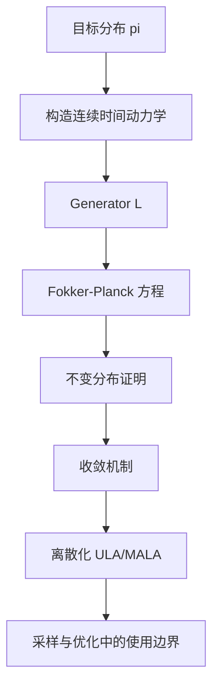

## 一页摘要

Langevin dynamics 是把“沿着能量下降”和“用噪声保持探索”合在一起的连续时间随机动力系统。最常见的 overdamped Langevin dynamics 用 SDE

$$
dX_t=-\nabla V(X_t)\,dt+\sqrt{2\beta^{-1}}\,dB_t
$$

来构造以 $`\pi(dx)=Z^{-1}e^{-\beta V(x)}dx`$ 为不变分布的 Markov 过程。它同时是三件事：采样算法的连续极限、Fokker-Planck 方程的概率流、以及相对熵在 Wasserstein 空间中的梯度流。本讲义的目标不是穷尽 stochastic analysis，而是让你掌握 Langevin dynamics 的核心结构：为什么这个 SDE 自然，为什么 Gibbs 分布不变，什么时候会收敛，离散化会引入什么误差。

## 目录

<table_of_contents color="gray"/>

## 预备知识

默认读者熟悉多元微积分、ODE、基础概率、Brownian motion 的直觉、以及基本测度记号。严格随机积分理论不是第一遍阅读的必要条件；本讲义会把 Itô 公式作为标准工具使用。若要完全证明存在唯一性、非爆炸和 hypocoercivity，需要更完整的 SDE 与 PDE 背景。

## 学习目标

读完后应该能做到：

| 层次 | 目标 | 检查方式 |
|---|---|---|
| 概念 | 解释漂移 $`-\nabla V`$ 和噪声 $`\sqrt{2\beta^{-1}}dB_t`$ 为什么匹配 Gibbs 分布 | 能从 generator 推导 stationary equation |
| 技术 | 证明 $`\pi`$ 是不变分布 | 能完成分部积分或 Fokker-Planck 证明 |
| 收敛 | 区分 Poincare、log-Sobolev、strong convexity 的作用 | 能说清 $`\chi^2`$、熵、Wasserstein 收敛的差别 |
| 算法 | 理解 ULA/MALA 的偏差来源 | 能解释 step size 造成的 invariant measure bias |
| 研究 | 判断某个 Langevin 变体适合采样、优化还是分析神经网络噪声 | 能识别问题中的目标分布、几何和离散误差 |

## 路线图

本讲义先从采样问题进入，然后建立 SDE 与 generator，再证明不变分布，最后讨论收敛和离散化。这样组织的原因是：如果先讲 SDE 技术，读者容易忘记 Langevin dynamics 的核心任务其实是“让一个容易模拟的 Markov 过程长期停在目标分布附近”。

## 1. 从采样问题出发

我们想从一个高维密度

$$
\pi(x)=\frac{1}{Z}e^{-\beta V(x)},\qquad x\in\mathbb R^d
$$

采样。这里 $`V`$ 是 potential 或 energy，$`\beta`$ 是 inverse temperature，$`Z=\int e^{-\beta V(x)}dx`$ 是通常不可计算的归一化常数。直接采样困难的原因是：$`Z`$ 不知道，高维空间体积巨大，而 $`V`$ 的低能区域可能很窄。

最朴素的想法是做梯度下降：

$$
\dot x_t=-\nabla V(x_t).
$$

这会把点推向 $`V`$ 的局部极小值，但它不会采样。它会塌缩到点质量，而不是探索整个 Gibbs 分布。于是我们加噪声，让过程既倾向低能区域，又能从局部 basin 中逃出：

$$
dX_t=-\nabla V(X_t)\,dt+\sqrt{2\beta^{-1}}\,dB_t.
$$

噪声强度不是随便选的。系数 $`2\beta^{-1}`$ 正好让 diffusion 与 drift 在 stationary state 里满足 detailed balance。

**本节带走什么。** Langevin dynamics 的第一性问题是采样，不是优化。梯度项负责偏向低能区域，Brownian 噪声负责探索，二者的比例决定长期分布。

## 2. 核心定义

**定义 1，overdamped Langevin dynamics。** 给定足够光滑的 potential $`V:\mathbb R^d\to\mathbb R`$ 与 $`\beta>0`$，overdamped Langevin dynamics 是 SDE

$$
dX_t=-\nabla V(X_t)\,dt+\sqrt{2\beta^{-1}}\,dB_t,
$$

其中 $`B_t`$ 是 $`d`$ 维 Brownian motion。

**定义 2，generator。** 对光滑测试函数 $`f`$，该过程的 infinitesimal generator 是

$$
\mathcal L f(x)=-\nabla V(x)\cdot \nabla f(x)+\beta^{-1}\Delta f(x).
$$

直觉上，$`\mathcal L f`$ 描述 $`f(X_t)`$ 的瞬时平均变化率：

$$
\frac{d}{dt}\mathbb E[f(X_t)] = \mathbb E[(\mathcal L f)(X_t)].
$$

**定义 3，Fokker-Planck 方程。** 若 $`\rho_t`$ 是 $`X_t`$ 的密度，则形式上满足

$$
\partial_t\rho_t=\nabla\cdot(\rho_t\nabla V)+\beta^{-1}\Delta \rho_t.
$$

这也可以写成连续性方程

$$
\partial_t\rho_t=\nabla\cdot\left(\rho_t\nabla\left(V+\beta^{-1}\log\rho_t\right)\right).
$$

后一种写法暴露了自由能结构。

**本节带走什么。** Langevin 的三个核心对象是 SDE、generator 和 Fokker-Planck 方程。SDE 描述样本路径，generator 描述 observable 的瞬时变化，Fokker-Planck 描述密度如何流动；证明平衡态时三者要能互相翻译。

## 3. 正例与非例子

| 对象 | 是不是 Langevin dynamics 的典型场景 | 原因 |
|---|---|---|
| $`V(x)=\frac{1}{2}\lVert x\rVert^2`$ | 是 | 得到 Ornstein-Uhlenbeck 过程，可完全解出 |
| strongly convex $`V`$ | 是 | 有单峰几何和快速收敛理论 |
| double-well potential | 是但更难 | 有 metastability，局部 basin 间跳转慢 |
| 纯梯度下降 | 不是采样版 Langevin | 没有噪声，长期是点质量或局部极小集合 |
| 纯 Brownian motion | 不是目标采样 | 没有 drift，不能保持一般 Gibbs 分布 |

**Running example：高斯目标。** 取 $`V(x)=\frac{1}{2}\lVert x\rVert^2`$，$`\beta=1`$。则

$$
dX_t=-X_t\,dt+\sqrt{2}\,dB_t.
$$

显式解是

$$
X_t=e^{-t}X_0+\sqrt{2}\int_0^t e^{-(t-s)}dB_s.
$$

因此若 $`X_0`$ 固定，$`X_t`$ 是高斯，均值 $`e^{-t}X_0`$，协方差 $`(1-e^{-2t})I`$，所以 $`X_t`$ 收敛到 $`N(0,I)`$。

**非例子：错误噪声强度。** 若写成

$$
dX_t=-\nabla V(X_t)\,dt+\sigma dB_t,
$$

则不变分布通常是 $`e^{-2V/\sigma^2}`$ 对应的温度，而不是 $`e^{-\beta V}`$。所以 drift 与 diffusion 的比例是数学内容，不是单位选择。

**本节带走什么。** 正例负责展示 Langevin 为什么能采样；非例子负责暴露边界。最重要的边界是：只加噪声不够，drift 与 diffusion 的比例必须和目标温度匹配。

## 4. 定理一：Gibbs 分布是不变分布

**定理。** 假设 $`V`$ 足够光滑且 $`Z=\int_{\mathbb R^d}e^{-\beta V(x)}dx<\infty`$，并且边界项在无穷远处消失。则

$$
\pi(dx)=Z^{-1}e^{-\beta V(x)}dx
$$

是 overdamped Langevin dynamics 的不变分布。

**假设解释。** 光滑性让 generator 和分部积分合法；$`Z<\infty`$ 让 $`\pi`$ 是概率分布；边界项消失排除概率流从无穷远漏掉。

**Proof spine。**

1. 写出 Fokker-Planck 方程。
2. 把 $`\rho=Z^{-1}e^{-\beta V}`$ 代入右端。
3. 利用 $`\nabla \rho=-\beta \rho\nabla V`$ 抵消 drift flux 与 diffusion flux。

**证明。** Fokker-Planck 方程为

$$
\partial_t\rho_t=\nabla\cdot(\rho_t\nabla V)+\beta^{-1}\Delta\rho_t.
$$

令 $`\rho=Z^{-1}e^{-\beta V}`$。则

$$
\nabla \rho=-\beta \rho\nabla V.
$$

因此概率流可以写成

$$
J= -\rho\nabla V-\beta^{-1}\nabla\rho.
$$

代入上式得

$$
J=-\rho\nabla V-\beta^{-1}(-\beta\rho\nabla V)=0.
$$

所以 $`\partial_t\rho=-\nabla\cdot J=0`$，即 $`\rho`$ 是 stationary density。于是若初始分布就是 $`\pi`$，之后所有时刻仍是 $`\pi`$。

**假设在哪里用。** $`Z<\infty`$ 保证 stationary density 可归一化；边界项消失保证局部通量为零能推出全局不变性；光滑性保证 Fokker-Planck 推导合法。

**本节带走什么。** Langevin 的 stationary 分布不是猜出来的，而是 drift flux 与 diffusion flux 的精确抵消。

## 5. 定理二：收敛来自泛函不等式

仅有不变分布不代表快速收敛。收敛速度取决于 $`V`$ 的几何。一个干净版本是 Poincare inequality。

**定义，Poincare inequality。** 若存在 $`\lambda>0`$，使得所有光滑 $`f`$ 满足

$$
\operatorname{Var}_\pi(f)\le \frac{1}{\lambda}\int \lVert \nabla f\rVert^2d\pi,
$$

则称 $`\pi`$ 满足 Poincare inequality，常数为 $`\lambda`$。

**定理。** 若 $`\pi`$ 满足 Poincare inequality，且 Langevin semigroup 为 $`P_t`$，则对均值为零的 $`f`$，有

$$
\lVert P_t f\rVert_{L^2(\pi)}^2\le e^{-2\beta^{-1}\lambda t}\lVert f\rVert_{L^2(\pi)}^2.
$$

**Proof spine。**

1. 利用 reversibility 得到 Dirichlet form：$`\langle f,-\mathcal L f\rangle_\pi=\beta^{-1}\int\lVert\nabla f\rVert^2d\pi`$。
2. 对 $`u_t=P_t f`$ 计算 $`L^2(\pi)`$ 能量导数。
3. 用 Poincare inequality 把梯度能量下界成方差。

**证明。** 令 $`u_t=P_tf`$，且 $`\int f d\pi=0`$。由 semigroup 方程 $`\partial_tu_t=\mathcal L u_t`$，

$$
\frac{d}{dt}\lVert u_t\rVert_{L^2(\pi)}^2
=2\langle u_t,\mathcal L u_t\rangle_\pi.
$$

对 Langevin generator 分部积分可得

$$
\langle u_t,\mathcal L u_t\rangle_\pi
=-\beta^{-1}\int\lVert\nabla u_t\rVert^2d\pi.
$$

再由 Poincare inequality，且 $`u_t`$ 保持零均值，

$$
\int\lVert\nabla u_t\rVert^2d\pi\ge \lambda \lVert u_t\rVert_{L^2(\pi)}^2.
$$

所以

$$
\frac{d}{dt}\lVert u_t\rVert_{L^2(\pi)}^2
\le -2\beta^{-1}\lambda \lVert u_t\rVert_{L^2(\pi)}^2.
$$

Gronwall 不等式给出结论。

**常见误区。** Strong convexity 是方便条件，不是唯一条件。非凸分布也可能满足 Poincare inequality，但常数可能非常差；double-well 中 barrier 越高，mixing 越慢。

**本节带走什么。** 不变性回答“极限分布对不对”，泛函不等式回答“多久接近极限”。Poincare 给 $`L^2`$/方差收敛，是最基础的 spectral-gap 入口；它不是所有收敛理论的替代品。

## 6. 自由能与 Wasserstein 梯度流直觉

Fokker-Planck 方程还可以看成自由能

$$
\mathcal F(\rho)=\int V(x)\rho(x)dx+\beta^{-1}\int \rho(x)\log\rho(x)dx
$$

在 Wasserstein 空间中的梯度流。形式变分导数为

$$
\frac{\delta \mathcal F}{\delta \rho}=V+\beta^{-1}(1+
\log\rho).
$$

忽略常数项，梯度流方程是

$$
\partial_t\rho=\nabla\cdot\left(\rho\nabla\left(V+\beta^{-1}\log\rho\right)\right),
$$

正是 Fokker-Planck 方程。

这给出一个重要图像：Langevin dynamics 不是单个粒子的随机运动而已；在分布层面，它是让 $`\rho_t`$ 沿着自由能下降，最终到达 minimizer $`\pi`$。

**本节带走什么。** Fokker-Planck 方程不只是密度 PDE；它也解释了为什么 Gibbs 分布是自由能最小点。这个视角适合连接最优传输、熵耗散和采样算法的连续极限。

## 7. 离散化：ULA 与 MALA

真实计算不能模拟连续时间 SDE，只能离散化。Euler-Maruyama 给出 unadjusted Langevin algorithm：

$$
X_{k+1}=X_k-h\nabla V(X_k)+\sqrt{2\beta^{-1}h}\,\xi_k,
\qquad \xi_k\sim N(0,I).
$$

这叫 ULA。它简单、便宜，但 invariant distribution 通常不是精确的 $`\pi`$，而是一个 $`h`$ 依赖的近似分布。

MALA 在 ULA proposal 后加 Metropolis-Hastings correction，使目标分布精确为 $`\pi`$，但每一步需要接受拒绝，且高维时步长选择更敏感。

| 方法 | 每步形式 | 长期目标 | 主要误差/代价 |
|---|---|---|---|
| 连续 Langevin | SDE | 精确 $`\pi`$ | 不能直接计算 |
| ULA | Euler step | 近似 $`\pi_h`$ | discretization bias |
| MALA | ULA proposal + accept/reject | 精确 $`\pi`$ | 接受率与维度/步长相关 |
| SGLD | noisy gradient + noise | 近似 posterior 或 Gibbs | gradient noise 与 step schedule |

**非例子。** 把 ULA 当成精确采样器是错误的，除非能控制 $`h\to0`$ 的极限、混合时间和总计算预算。很多实践问题里，bias 与 mixing error 同时存在。

**本节带走什么。** 连续时间 Langevin 给理论目标，离散算法给实际计算。ULA 的风险是 invariant measure bias；MALA 用接受拒绝修正 bias，但付出接受率和维度 scaling 的代价。

## 8. Underdamped Langevin：加入动量

Overdamped 版本只有位置 $`X_t`$。Underdamped Langevin 加入速度 $`V_t`$ 或 momentum $`P_t`$：

$$
dX_t=P_t\,dt,
$$

$$
dP_t=-\nabla V(X_t)\,dt-\gamma P_t\,dt+\sqrt{2\gamma\beta^{-1}}\,dB_t.
$$

这里 $`-\gamma P_t`$ 是 friction，噪声只打在 momentum 上。它的不变分布是

$$
\pi(dx,dp)\propto e^{-\beta(V(x)+\frac{1}{2}\lVert p\rVert^2)}dxdp.
$$

这个过程不再是简单 reversible gradient diffusion，而是有 Hamiltonian transport 加 friction/noise 的 hypocoercive 系统。直觉上，动量可以减少 random walk behavior，提高穿越狭长 valley 的效率。

**本节带走什么。** Underdamped Langevin 的核心新对象是 momentum。噪声只打在动量上，所以收敛不再靠直接 elliptic smoothing，而靠 transport、friction 和 noise 的 hypocoercive 耦合。

## 9. 研究使用边界

Langevin dynamics 在不同领域扮演不同角色。

| 场景 | Langevin 的角色 | 需要警惕什么 |
|---|---|---|
| Bayesian sampling | posterior sampler | 高维 scaling、离散 bias、preconditioning |
| 非凸优化 | noise-assisted exploration | invariant measure 不等于找到 global minimizer |
| 统计物理 | heat bath dynamics | metastability 与 rare transitions |
| 深度学习 | SGD noise 的近似模型 | SGD noise 非高斯、非各向同性、state-dependent |
| 扩散模型 | reverse dynamics 的亲戚 | score dynamics 与 Langevin sampling 不完全同一问题 |

**判断准则。** 当你看到某个论文使用 Langevin dynamics，先问四个问题：目标分布是什么？漂移和噪声是否满足 fluctuation-dissipation balance？收敛靠什么几何条件？离散算法是否仍保持理论目标？

**本节带走什么。** 研究里不要只认 “Langevin” 这个名字。每次都要重新检查目标分布、噪声匹配、收敛几何和离散误差；这些才决定模型能否支撑论文里的结论。

## 10. 常见误解

- 误区一：Langevin dynamics 就是带噪声的梯度下降。更准确地说，它是设计成保持 Gibbs 分布的 diffusion；优化只是低温极限或短时行为中的一种解释。
- 误区二：有 invariant distribution 就说明采样有效。实际还需要 mixing time；double-well 中 stationary 正确但跨 barrier 很慢。
- 误区三：ULA 近似连续 Langevin，所以自动正确。步长固定时，ULA 的 invariant distribution 有 bias。
- 误区四：所有噪声都能写成 Langevin。若噪声协方差 state-dependent 或与 drift 不匹配，stationary law 会改变。

## 11. 分层练习

Level 0：对 $`V(x)=\frac{1}{2}x^2`$，写出一维 Langevin SDE，并说明 stationary distribution 是什么。

Level 1：从 generator

$$
\mathcal L f=-\nabla V\cdot\nabla f+\beta^{-1}\Delta f
$$

出发，用分部积分证明 $`\mathcal L`$ 在 $`L^2(\pi)`$ 中是对称的。

Level 2：对 $`V(x)=\frac{1}{2}x^TAx`$，其中 $`A`$ 对称正定，求 OU 过程的 stationary covariance。

Level 3：构造一个 double-well potential，解释为什么 invariant distribution 正确但 mixing 可能指数慢。

Level 4：阅读一篇使用 SGLD 或 Langevin approximation 分析 SGD 的论文，检查它是否明确控制了 gradient noise 与 Brownian noise 的差距。

## 12. 总结

- Langevin dynamics 的核心是 drift 与 diffusion 的平衡：$`-\nabla V`$ 把质量推向低能区域，Brownian noise 保持探索。
- Gibbs 分布不变来自 flux cancellation：$`\rho\nabla V+\beta^{-1}\nabla\rho=0`$。
- 收敛速度不是自动的，需要 Poincare、log-Sobolev、convexity 或 hypocoercivity 等结构。
- 离散化是算法中的主要风险：ULA 有 bias，MALA 修正 bias 但引入接受率问题。
- 对研究判断来说，永远同时检查目标分布、几何条件、噪声匹配和离散误差。
