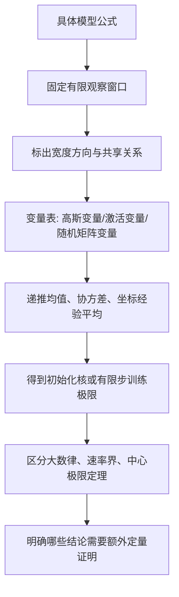

## 前置路线图

```mermaid
graph TD
    A[具体模型公式] --> B[固定有限观察窗口]
    B --> C[标出宽度方向与共享关系]
    C --> D[变量表: 高斯变量/激活变量/随机矩阵变量]
    D --> E[递推均值、协方差、坐标经验平均]
    E --> F[得到初始化核或有限步训练极限]
    F --> G[区分大数律、速率界、中心极限定理]
    G --> H[明确哪些结论需要额外定量证明]
```

一句话路径：模型公式 → 有限观察窗口 → 变量表 → 协方差递推 → 极限输出 → 速率/CLT 边界。
