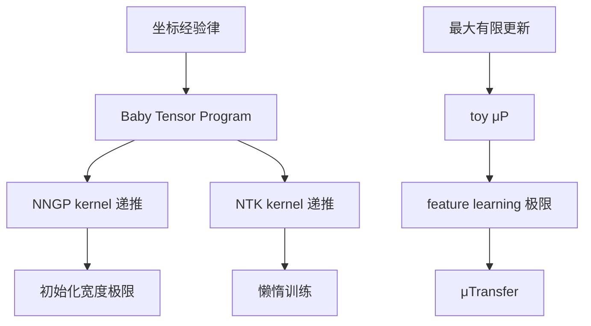

## 一页摘要

这份讲义是一个系统学习 μP 与 Tensor Programs 的入口，不把整套 Tensor Programs 系列压成参考书式摘要。我们先回答一个可证明的问题：为什么宽神经网络的坐标级计算可以被一个极限 Gaussian 语义描述？然后回答第二个可证明的问题：为什么“最大更新”不是口号，而是在一个固定 convention 下由宽度临界缩放推出的有限、非懒惰训练动力学。

本讲的核心结论是三句话。

1. Tensor Program 的基本语义是：随机矩阵乘法把有限多个向量的经验 Gram 矩阵送到一个 Gaussian 坐标族；坐标非线性再通过经验平均把新的 Gram 矩阵递推出来。
2. 在普通 NTK 缩放下，函数可以在一步内有 `$`O(1)`$` 变化，但每个隐藏单元的特征坐标只动 `$`O(n^{-1/2})`$`，所以宽度极限是懒惰的 kernel 动力学。
3. 在本讲固定的 readout-average convention 下，输出写成 `$`n^{-1}\sum_i a_i\phi(w_i\cdot x)`$`，梯度下降学习率取 `$`n\eta`$` 时，每个 neuron 的坐标更新有非零有限极限，输出仍保持 `$`O(1)`$`；这就是 toy μP 的最大有限更新原则。

本讲不会伪装成已经证明完整 Tensor Programs IV/V 的分类定理。那些大定理会作为精确定理引用，放在后续讲义路线中。本讲完整证明 baby Tensor Program master theorem、NNGP 递推、NTK 懒惰更新量级、以及 toy μP 的一阶最大更新定理。

## 目录
<table_of_contents color="gray"/>

## 0. 读者画像、预备知识与学习目标

默认读者是 目标读者：会概率论、矩阵计算、神经网络反向传播和基本经验过程；愿意看完整证明，但不想在符号海里失去主线。

**预备知识。** 需要知道 Gaussian 向量、条件分布、弱收敛、Chebyshev 不等式、梯度下降和多层感知机。不会用到自由概率、完整 NNGP/NTK 文献、Transformer 细节或 μP library 的工程 API。

**学习目标。**

- 会算：能从一个宽层 `$`h_i=n^{-1/2}\sum_j W_{ij}x_j`$` 推出坐标 Gaussian 极限。
- 会证明：能证明有限输入集上的 NNGP kernel 递推。
- 能用于研究：能判断一个参数化是不是让隐藏特征在宽度极限中真的移动。
- 知道边界：知道本讲证明的是 baby 版本，完整 Tensor Programs 的大定理在哪里进入。

**路线图。**

| 层级 | 本讲对象 | 证明状态 | 后续学习目标 |
|---|---|---|---|
| 坐标极限 | baby Tensor Program master theorem | 本讲完整证明 | 一般 Tensor Program master theorem |
| 初始化 | NNGP 递推 | 本讲完整证明 | 任意架构 GP 语义 |
| 训练 | NTK vs maximal update toy model | 本讲完整证明 | Tensor Programs IV 的 feature-learning 分类 |
| 调参 | μTransfer 语义 | 本讲只精确定理引用 | Tensor Programs V 与工程 μP |

**本节带走什么。**

- 本讲不是百科式介绍，而是从两个可证明入口进入 μP/Tensor Programs。
- 看到“μP”时先问：在什么 convention 下，哪个坐标或 preactivation 的更新是最大但有限的？
- 后续大定理会被引用，但不会替代本讲的本地证明。

## 1. 问题先行：为什么需要 Tensor Programs 和 μP

宽网络理论的第一个困难是表达能力太宽：MLP、RNN、attention、normalization、skip connection 都在做不同的张量计算。Tensor Programs 的想法是把这些计算拆成少数 primitive：随机矩阵乘法、坐标非线性、坐标平均、拼接和转置式反向传播。只要 primitive 的极限语义稳定，复杂架构就可以由程序组合来分析。

μP 解决的是第二个困难：宽度变大时，哪些超参数还能稳定迁移？如果参数化让隐藏表示几乎不动，那么宽网络只是 kernel machine；如果参数化让坐标更新爆炸，那么极限不存在。μP 的 slogan 可以压缩为一句话：**选择使特征更新在无限宽极限中尽可能大、但仍然有限的参数化。**

### 核心定义 1.1：坐标经验律

给定向量族 `$`u^1,\ldots,u^k\in\mathbb R^n`$`，它们的坐标经验律是

$$
\widehat\mu_n
=\frac1n\sum_{i=1}^n\delta_{(u_i^1,\ldots,u_i^k)}.
$$

若对足够多测试函数 `$`\psi`$` 有

$$
\frac1n\sum_{i=1}^n\psi(u_i^1,\ldots,u_i^k)
\longrightarrow
\mathbb E\,\psi(U^1,\ldots,U^k),
$$

就说这些坐标有极限坐标律 `$`\mathcal L(U^1,\ldots,U^k)`$`。

**例子。** 若 `$`u_i`$` 是独立同分布 `$`N(0,1)`$`，则经验律收敛到 `$`N(0,1)`$`。这只是最简单的 LLN。

**非例子。** 若 `$`u_i=Z`$` 对所有 `$`i`$` 共用同一个随机变量，则 `$`n^{-1}\sum_i\psi(u_i)=\psi(Z)`$` 不收敛到非随机常数；坐标之间没有足够的平均化。Tensor Program master theorem 的条件本质上是在防止这种全坐标共享噪声破坏自平均。

### 核心定义 1.2：最大有限更新

考虑宽度 `$`n`$` 的一族网络和一个训练步。若某个内部坐标 `$`q_{n,i}`$` 的更新满足

$$
\Delta q_{n,i}=\Theta(1)
$$

并且网络输出在有限输入集上也保持 `$`O(1)`$`，则称这个坐标处在最大有限更新尺度。若 `$`\Delta q_{n,i}\to0`$`，训练在该坐标上是懒惰的；若 `$`|\Delta q_{n,i}|\to\infty`$`，通常没有有限宽度极限。

**常见误区。** “输出能训练”不等于“特征能学习”。NTK 缩放下输出可以动 `$`O(1)`$`，但隐藏单元坐标移动趋零。

**本节带走什么。**

- Tensor Programs 关心坐标经验律，而不是单个神经元的轨迹。
- μP 关心最大有限更新，而不是简单把某个学习率调大。
- 反例提醒我们：没有坐标自平均，就不能期待 Tensor Program 极限。

## 2. Baby Tensor Program：随机矩阵乘法的 Gaussian 语义

本节证明最小版本的 Tensor Program master theorem。它只包含一个随机矩阵乘法和一个坐标测试函数，但已经包含 Tensor Programs 的核心机制。

### 定理 2.1：一个矩阵乘法的坐标 master theorem

令 `$`W_n\in\mathbb R^{n\times n}`$` 的元素独立且服从 `$`N(0,1/n)`$`。给定 `$`k`$` 个随机或确定性向量 `$`x_n^1,\ldots,x_n^k\in\mathbb R^n`$`，假设它们与 `$`W_n`$` 独立，并且经验 Gram 矩阵逐项依概率收敛：

$$
Q_n^{ab}=\frac1n\sum_{j=1}^n x_{n,j}^a x_{n,j}^b
\xrightarrow{p}
Q^{ab},\qquad 1\le a,b\le k.
$$

定义

$$
z_n^a=W_nx_n^a,\qquad a=1,\ldots,k.
$$

若 `$`\psi:\mathbb R^k\to\mathbb R`$` 连续，且存在常数 `$`C,p`$` 使

$$
|\psi(u)|\le C(1+\|u\|^p),
$$

并且 `$`Q_n`$` 的谱范数在概率意义下有界，则

$$
\frac1n\sum_{i=1}^n\psi(z_{n,i}^1,\ldots,z_{n,i}^k)
\xrightarrow{p}
\mathbb E\psi(G^1,
\ldots,G^k),
$$

其中 `$`G=(G^1,\ldots,G^k)`$` 是均值为零、协方差为 `$`Q`$` 的 Gaussian 向量。

### 证明路线

1. 条件在 `$`x_n^1,\ldots,x_n^k`$` 上，每个坐标向量 `$`(z_{n,i}^1,\ldots,z_{n,i}^k)`$` 是 Gaussian，协方差正是 `$`Q_n`$`。
2. 不同行 `$`i`$` 使用不同的 `$`W_n`$` 行，所以条件独立同分布。
3. 条件 LLN 把经验平均变成条件期望。
4. `$`Q_n\to Q`$` 把条件期望变成目标 Gaussian 期望。

### 完整证明

记 `$`\mathcal F_n=\sigma(x_n^1,\ldots,x_n^k)`$`。条件在 `$`\mathcal F_n`$` 上，对任意 `$`i`$`，有

$$
z_{n,i}^a=\sum_{j=1}^n W_{n,ij}x_{n,j}^a.
$$

这是独立 Gaussian 的线性组合，所以条件均值为零，并且

$$
\operatorname{Cov}(z_{n,i}^a,z_{n,i}^b\mid\mathcal F_n)
=\sum_{j=1}^n \frac1n x_{n,j}^a x_{n,j}^b
=Q_n^{ab}.
$$

同一行 `$`i`$` 给出一个 `$`k`$` 维 Gaussian 向量；不同行使用互相独立的权重，所以这些 `$`k`$` 维向量在条件下独立同分布。令 `$`G_n\mid\mathcal F_n\sim N(0,Q_n)`$`。则

$$
\mathbb E[\psi(z_{n,i}^1,\ldots,z_{n,i}^k)\mid\mathcal F_n]
=\mathbb E[\psi(G_n)\mid\mathcal F_n].
$$

先处理有界连续 `$`\psi`$`。条件方差满足

$$
\operatorname{Var}\!\left(
\frac1n\sum_{i=1}^n\psi(z_{n,i})\mid\mathcal F_n
\right)
=\frac1n\operatorname{Var}(\psi(G_n)\mid\mathcal F_n)
\le \frac{\|\psi\|_\infty^2}{n}.
$$

由条件 Chebyshev 不等式，对任意 `$`\varepsilon>0`$`，

$$
\mathbb P\!\left(
\left|\frac1n\sum_{i=1}^n\psi(z_{n,i})-
\mathbb E[\psi(G_n)\mid\mathcal F_n]\right|>\varepsilon
\,\middle|\,\mathcal F_n
\right)
\le \frac{\|\psi\|_\infty^2}{n\varepsilon^2}.
$$

对 `$`\mathcal F_n`$` 再取期望，得到经验平均与条件期望之差依概率趋零。

接着证明条件期望收敛。由于 `$`Q_n\to Q`$` 依概率，Gaussian 向量 `$`N(0,Q_n)`$` 的分布依概率趋于 `$`N(0,Q)`$`。对有界连续 `$`\psi`$`，Portmanteau 定理给出

$$
\mathbb E[\psi(G_n)\mid\mathcal F_n]
\xrightarrow{p}
\mathbb E\psi(G).
$$

两步合并得到有界连续情形。

现在处理多项式增长的连续 `$`\psi`$`。令截断函数 `$`\psi_R(u)=\max(-R,\min(\psi(u),R))`$`。有界连续情形已经给出 `$`\psi_R`$` 的结论。还需证明截断误差可以一致控制。由 Gaussian 矩估计，若 `$`\|Q_n\|_{op}`$` 在概率意义下有界，则对任意固定 `$`r`$`，随机变量 `$`\mathbb E[\|G_n\|^r\mid\mathcal F_n]`$` 在概率意义下有界。结合 `$`|\psi(u)|\le C(1+\|u\|^p)`$`，对 `$`R`$` 增大时，

$$
\mathbb E[|\psi(G_n)|\mathbf 1\{|\psi(G_n)|>R\}\mid\mathcal F_n]
$$

可由更高阶 Gaussian 矩和 Markov 不等式控制到任意小，概率意义下一致成立。经验平均侧同理：条件在 `$`\mathcal F_n`$` 上使用同一个尾部期望界，再用 Markov 不等式控制。于是先令 `$`n\to\infty`$`，再令 `$`R\to\infty`$`，得到原始 `$`\psi`$` 的结论。

这完成证明。

### 假设在哪里用

- `$`W_{ij}\sim N(0,1/n)`$` 用在条件 Gaussian 与协方差 `$`Q_n`$` 的计算。
- 行独立用在条件 LLN；若所有行共享同一个随机变量，经验平均不会自平均。
- `$`Q_n\to Q`$` 用在条件 Gaussian 分布的极限。
- 矩有界条件用在非有界 `$`\psi`$` 的截断误差。

### Worked example：两个输入的 preactivation covariance

令 `$`k=2`$`，`$`x_n^1,x_n^2`$` 的经验内积极限为

$$
Q=\begin{pmatrix}q_{11}&q_{12}\\q_{12}&q_{22}\end{pmatrix}.
$$

定理给出，对任意连续多项式增长的 `$`\psi`$`，

$$
\frac1n\sum_i\psi((Wx^1)_i,(Wx^2)_i)
\to
\mathbb E\psi(G_1,G_2),
\quad
(G_1,G_2)\sim N(0,Q).
$$

取 `$`\psi(u,v)=\phi(u)\phi(v)`$`，就得到下一层 kernel 的一项。

### 非例子：重尾权重

若 `$`W_{ij}`$` 没有足够二阶矩，协方差计算不再控制坐标极限；若权重尾部足够重，极限可能是 stable law 或由少数大坐标支配。此时 Gaussian Tensor Program 语义不适用，至少需要换定理。

**本节带走什么。**

- 随机矩阵乘法的极限信息只通过输入向量的经验 Gram 进入。
- 坐标独立不是最终目标，自平均才是最终目标。
- Tensor Program 的递推本质是“Gaussian 化 + 坐标平均”。

## 3. 从 Baby Tensor Program 到 NNGP kernel 递推

本节把上一节的单层结论串起来，证明一个有限输入集上的 NNGP 递推。这里的证明是 Tensor Programs I 的最小可读版本。

### 定理 3.1：有限输入集上的 NNGP 递推

固定输入 `$`x^1,\ldots,x^m\in\mathbb R^d`$`。考虑宽度为 `$`n`$` 的 `$`L`$` 层 MLP。第一层为

$$
h_i^1(x^a)=\sum_{r=1}^d W^1_{ir}x_r^a+b_i^1,
$$

其中 `$`W^1_{ir}\sim N(0,\sigma_w^2/d)`$`，`$`b_i^1\sim N(0,\sigma_b^2)`$`。对 `$`\ell\ge2`$`，

$$
h_i^\ell(x^a)=\frac1{\sqrt n}\sum_{j=1}^n W^\ell_{ij}\phi(h_j^{\ell-1}(x^a))+b_i^\ell,
$$

其中 `$`W^\ell_{ij}\sim N(0,\sigma_w^2)`$`，`$`b_i^\ell\sim N(0,\sigma_b^2)`$`，各层独立。假设 `$`\phi`$` 连续且有多项式增长。定义 `$`m\times m`$` 矩阵递推

$$
K^1_{ab}=\frac{\sigma_w^2}{d}\langle x^a,x^b\rangle+\sigma_b^2,
$$

并对 `$`\ell\ge2`$` 令

$$
K^\ell_{ab}
=\sigma_w^2\,\mathbb E\bigl[\phi(G_a^{\ell-1})\phi(G_b^{\ell-1})\bigr]+\sigma_b^2,
\qquad
G^{\ell-1}\sim N(0,K^{\ell-1}).
$$

则对每一层 `$`\ell`$` 和任意连续多项式增长 `$`\psi:\mathbb R^m\to\mathbb R`$`，

$$
\frac1n\sum_{i=1}^n
\psi(h_i^\ell(x^1),\ldots,h_i^\ell(x^m))
\xrightarrow{p}
\mathbb E\psi(G^\ell),
\quad G^\ell\sim N(0,K^\ell).
$$

### 证明路线

- 第一层坐标本来就是独立 Gaussian，协方差可直接计算。
- 若第 `$`\ell-1`$` 层的坐标经验律已经收敛，则激活后的经验 Gram 收敛。
- 对第 `$`\ell`$` 层条件使用定理 2.1，再加上 bias 的独立 Gaussian 项。

### 完整证明

第一层中，对每个 `$`i`$`，向量

$$
(h_i^1(x^1),\ldots,h_i^1(x^m))
$$

是 Gaussian。其协方差为

$$
\operatorname{Cov}(h_i^1(x^a),h_i^1(x^b))
=\sum_{r=1}^d \frac{\sigma_w^2}{d}x_r^a x_r^b+\sigma_b^2
=K^1_{ab}.
$$

不同行 `$`i`$` 独立，所以由普通 LLN 与上一节截断论证，第一层结论成立。

假设第 `$`\ell-1`$` 层结论成立。取测试函数 `$`\psi(u)=\phi(u_a)\phi(u_b)`$`，得到

$$
\frac1n\sum_{j=1}^n
\phi(h_j^{\ell-1}(x^a))\phi(h_j^{\ell-1}(x^b))
\xrightarrow{p}
\mathbb E[\phi(G_a^{\ell-1})\phi(G_b^{\ell-1})].
$$

记激活向量

$$
y_j^a=\sigma_w\phi(h_j^{\ell-1}(x^a)).
$$

则 `$`n^{-1}\sum_j y_j^a y_j^b`$` 收敛到 `$`\sigma_w^2\mathbb E[\phi(G_a^{\ell-1})\phi(G_b^{\ell-1})]`$`。条件在前一层激活上，矩阵乘法项

$$
\frac1{\sqrt n}\sum_j W^\ell_{ij}\phi(h_j^{\ell-1}(x^a))
$$

等价于对向量 `$`y^a`$` 施加定理 2.1。它给出一个条件 Gaussian 坐标族，其极限协方差是 `$`\sigma_w^2\mathbb E[\phi(G_a^{\ell-1})\phi(G_b^{\ell-1})]`$`。再加上独立 bias `$`b_i^\ell`$`，协方差矩阵增加 `$`\sigma_b^2`$` 到每个 `$`(a,b)`$` 位置，因为同一个 neuron 的 bias 对所有输入共享。因此极限协方差正是 `$`K^\ell`$`。

对一般连续多项式增长的 `$`\psi`$`，定理 2.1 的截断论证逐层适用；多项式增长经过 Gaussian 矩控制仍然有界于有限阶矩。归纳完成。

### 假设在哪里用

- `$`1/\sqrt n`$` 缩放使 preactivation 方差保持 `$`O(1)`$`。
- 层间独立使条件化后可以调用定理 2.1。
- bias 对输入共享，因此给所有 `$`K_{ab}`$` 加同一个 `$`\sigma_b^2`$`，不是只加对角线。
- `$`\phi`$` 的多项式增长保证 Gaussian 激活矩存在。

### 例子：线性激活

若 `$`\phi(t)=t`$`，则递推化为

$$
K^\ell=\sigma_w^2 K^{\ell-1}+\sigma_b^2\mathbf 1\mathbf 1^\top.
$$

这说明即使没有非线性，Tensor Program 也在追踪有限输入集上的 covariance 动力学。

### 非例子：把每层同一个 bias 用在所有 neuron 上

若第 `$`\ell`$` 层所有 neuron 共享同一个 bias `$`B^\ell`$`，则经验平均中会保留全局随机变量 `$`B^\ell`$`，极限通常是随机的而不是确定 kernel。这个非例子再次说明：坐标自平均假设不是装饰。

**本节带走什么。**

- NNGP 递推是定理 2.1 的逐层应用。
- kernel 递推不是猜出来的，是经验 Gram 收敛加条件 Gaussian 得到的。
- Tensor Programs 的一般版本把这里的 MLP primitive 推广到更复杂程序。

## 4. 缩放不是装饰：NTK 懒惰极限与 toy μP 的最大更新

本节只研究一个两层模型，但会完整证明缩放临界性。设训练集 `$`(x_s,y_s)_{s=1}^M`$` 固定，`$`\|x_s\|`$` 有界，`$`\phi`$` 和 `$`\phi'`$` 有界。损失为

$$
\mathcal L(f)=\frac1{2M}\sum_{s=1}^M(f(x_s)-y_s)^2.
$$

### 定理 4.1：NTK 缩放下隐藏特征一步移动趋零

考虑

$$
f_n^{\mathrm{NTK}}(x)=\frac1{\sqrt n}\sum_{i=1}^n a_i\phi(w_i\cdot x),
$$

其中 `$`a_i,w_i`$` 初始化为 `$`O(1)`$` 坐标，使用宽度无关学习率 `$`\eta`$` 做一步梯度下降。若训练误差 `$`e_s=f_n(x_s)-y_s`$` 在概率意义下有界，则每个固定 neuron 的隐藏权重更新满足

$$
\|\Delta w_i\|=O_p(n^{-1/2}).
$$

同时输出变化可以是 `$`O_p(1)`$`。

### 证明路线

- 直接写出 `$`\partial\mathcal L/\partial w_i`$`。
- 每个隐藏坐标的梯度有 `$`n^{-1/2}`$` 因子。
- 输出变化包含 `$`n`$` 个小项的平均，可以积累成 `$`O(1)`$`。

### 完整证明

对每个 `$`i`$`，链式法则给出

$$
\frac{\partial \mathcal L}{\partial w_i}
=\frac1M\sum_{s=1}^M e_s\frac{\partial f_n(x_s)}{\partial w_i}
=\frac1M\sum_{s=1}^M e_s\frac1{\sqrt n}a_i\phi'(w_i\cdot x_s)x_s.
$$

由 `$`e_s`$` 概率有界、`$`a_i`$` 对固定 `$`i`$` 概率有界、`$`\phi'`$` 有界、`$`x_s`$` 有界且 `$`M`$` 固定，得到

$$
\left\|\frac{\partial \mathcal L}{\partial w_i}\right\|=O_p(n^{-1/2}).
$$

一步梯度下降为 `$`\Delta w_i=-\eta\partial\mathcal L/\partial w_i`$`，所以 `$`\|\Delta w_i\|=O_p(n^{-1/2})`$`。

输出变化可以为 `$`O(1)`$`，因为 readout 梯度为

$$
\frac{\partial\mathcal L}{\partial a_i}
=\frac1M\sum_s e_s\frac1{\sqrt n}\phi(w_i\cdot x_s),
$$

于是 `$`\Delta a_i=O_p(n^{-1/2})`$`。在训练点 `$`x_t`$` 上，readout 更新贡献的一阶项为

$$
\frac1{\sqrt n}\sum_i \Delta a_i\phi(w_i\cdot x_t),
$$

这是 `$`n`$` 个量级 `$`1/n`$` 的相关平均，总量一般为 `$`O_p(1)`$`。更具体地，把 `$`\Delta a_i`$` 代入得到

$$
-\frac\eta M\sum_{s=1}^M e_s
\left[\frac1n\sum_{i=1}^n\phi(w_i\cdot x_s)\phi(w_i\cdot x_t)\right],
$$

括号内由 LLN 收敛到有限 kernel 值。因此输出可动，但隐藏特征移动消失。

### 假设在哪里用

- `$`1/\sqrt n`$` 输出缩放给隐藏梯度一个 `$`n^{-1/2}`$` 因子。
- `$`\phi'`$` 和输入有界用于控制坐标更新。
- 训练点数固定使求和不会引入额外宽度因子。

### 定理 4.2：readout-average convention 下的最大有限更新

现在考虑

$$
f_n^{\mu}(x)=\frac1n\sum_{i=1}^n a_i\phi(w_i\cdot x).
$$

使用宽度相关学习率 `$`\lambda_n`$`。对 `$`a_i`$` 和 `$`w_i`$` 同时做一步梯度下降。若 `$`\lambda_n/n\to\eta\in(0,\infty)`$`，则每个 neuron 的更新有非零有限极限尺度：

$$
\Delta a_i
=-\frac{\lambda_n}{n}\frac1M\sum_s e_s\phi(w_i\cdot x_s),
$$

$$
\Delta w_i
=-\frac{\lambda_n}{n}\frac1M\sum_s e_s a_i\phi'(w_i\cdot x_s)x_s.
$$

因此 `$`\Delta a_i`$` 和 `$`\Delta w_i`$` 都是 `$`O_p(1)`$`。如果 `$`\lambda_n/n\to0`$`，坐标更新趋零；如果 `$`\lambda_n/n\to\infty`$` 且对应梯度分量在某个正概率事件上不为零，则坐标更新不紧。这说明 `$`\lambda_n\asymp n`$` 是本 convention 下的最大有限更新尺度。

### 完整证明

先计算梯度。对 readout 参数，

$$
\frac{\partial\mathcal L}{\partial a_i}
=\frac1M\sum_s e_s\frac{\partial f_n(x_s)}{\partial a_i}
=\frac1M\sum_s e_s\frac1n\phi(w_i\cdot x_s).
$$

因此

$$
\Delta a_i=-\lambda_n\frac{\partial\mathcal L}{\partial a_i}
=-\frac{\lambda_n}{n}\frac1M\sum_s e_s\phi(w_i\cdot x_s).
$$

对隐藏权重，

$$
\frac{\partial\mathcal L}{\partial w_i}
=\frac1M\sum_s e_s\frac1n a_i\phi'(w_i\cdot x_s)x_s,
$$

所以

$$
\Delta w_i
=-\frac{\lambda_n}{n}\frac1M\sum_s e_s a_i\phi'(w_i\cdot x_s)x_s.
$$

若 `$`\lambda_n/n\to\eta\in(0,\infty)`$`，且 `$`e_s,a_i,\phi,\phi',x_s`$` 在概率意义下有界，则两个显示公式给出 `$`O_p(1)`$`。若 `$`\lambda_n/n\to0`$`，同一公式给出坐标更新趋零。若 `$`\lambda_n/n\to\infty`$`，并且存在某个 `$`c>0`$` 与正概率事件 `$`E`$`，使括号内梯度向量范数至少为 `$`c`$`，则在 `$`E`$` 上更新范数至少为 `$`c\lambda_n/n`$`，因而不紧。三种情形合并得到临界尺度。

还需说明输出保持有限。令 `$`\rho_n=n^{-1}\sum_i\delta_{(a_i,w_i)}`$` 是 neuron 经验测度。一步更新可以写成坐标映射

$$
(a_i^+,w_i^+)=T_{\eta,e}^{(n)}(a_i,w_i),
$$

其中 `$`T_{\eta,e}^{(n)}`$` 随 `$`\lambda_n/n`$` 收敛到有限映射 `$`T_{\eta,e}`$`。若初始化 neuron 独立同分布且有足够矩，则由 LLN，

$$
f_n^+(x_t)=\frac1n\sum_i a_i^+\phi((w_i^+)\cdot x_t)
\xrightarrow{p}
\mathbb E_{(a,w)\sim\rho_0}\left[a^+\phi((w^+)\cdot x_t)\right],
$$

其中 `$`(a^+,w^+)=T_{\eta,e}(a,w)`$`。右侧有限，因为 `$`T_{\eta,e}`$` 在本假设下把有限矩变量送到有限矩变量。输出有限性证明完成。

### 假设在哪里用

- `$`1/n`$` readout 平均使 `$`n`$` 个 neuron 的贡献以均值形式出现。
- `$`\lambda_n\asymp n`$` 正好抵消单坐标梯度中的 `$`1/n`$`。
- 有界激活导数和固定训练集保证坐标映射有限。
- 独立同分布初始化保证更新后输出仍由经验平均收敛。

### 例子：为什么这叫“最大”

若取 `$`\lambda_n=n^{1/2}`$`，则 `$`\lambda_n/n=n^{-1/2}`$`，每个 neuron 只动 `$`o(1)`$`。若取 `$`\lambda_n=n^2`$`，在非零梯度事件上每个 neuron 更新量为 `$`\Theta(n)`$`，一般没有有限粒子极限。只有 `$`\lambda_n=\Theta(n)`$` 同时给非零坐标移动和有限输出平均。

### 非例子：把 1/n readout 换成 1/sqrt(n) 后仍取 nη

在 NTK readout `$`n^{-1/2}\sum_i a_i\phi(w_i\cdot x)`$` 中，若直接把学习率放大到 `$`n\eta`$`，单坐标隐藏更新为 `$`O(\sqrt n)`$`，通常爆炸。这说明 μP 不是“学习率越大越好”；它必须和输出缩放、初始化缩放一起设计。

**本节带走什么。**

- NTK 缩放能训练输出，但隐藏特征一步移动趋零。
- readout-average convention 中 `$`\lambda_n\asymp n`$` 是最大有限更新尺度。
- μP 的不变量是“内部坐标最大但有限地动，输出仍有限”，不是某个孤立学习率数字。

## 5. Tensor Programs 如何支撑 μP 与 μTransfer

本节把本讲证明过的 baby 版本放回文献地图。下面的文献定理不是本讲本地证明的结论；它们是后续讲义要逐步展开的对象。

### 文献定理 A：Tensor Programs I/II/III 的极限语义

- Tensor Programs I 证明大类现代 feedforward 或 recurrent 网络在随机初始化下有 GP 极限，并把架构写成 tensor program 语言。
- Tensor Programs II 证明任意架构的 NTK 在宽度极限下收敛到确定极限，并讨论 gradient independence assumption 何时可用。
- Tensor Programs III 发展 neural matrix laws 与 Free Independence Principle，把 master theorem 推到随机矩阵谱律层面。

本讲定理 2.1 和定理 3.1 是 Tensor Programs I 方向的 baby 版本：只覆盖独立 Gaussian 矩阵乘法、坐标非线性和 MLP NNGP 递推。

### 文献定理 B：Tensor Programs IV/V 的 feature learning 与 μP

Tensor Programs IV 研究无限宽训练动力学中的 feature learning，说明某些参数化产生 kernel gradient descent，而某些参数化允许特征学习。Tensor Programs V 提出 Maximal Update Parametrization，并把它用于 μTransfer：在小模型上调许多超参数，再迁移到大模型。

本讲定理 4.2 是这条路线的 toy 版本。它没有覆盖深层网络、Adam、attention、embedding/readout 分层学习率，也没有覆盖 Tensor Programs V 中的工程规则；它证明的是最大有限更新原则为什么在最小模型里不是玄学。

### 概念关系图

### 常见误解

- 误区 1：Tensor Programs 只是 NNGP 的另一种写法。纠正：NNGP 是初始化极限的一部分；Tensor Programs 还处理 NTK、训练、矩阵律和更一般程序。
- 误区 2：μP 等于固定某张学习率表。纠正：学习率表依赖参数化 convention；不变量是最大有限更新和宽度稳定。
- 误区 3：小模型调参能迁移是经验巧合。纠正：Tensor Programs V 的主张是 μP 下许多最优超参数有宽度稳定性；经验验证和理论语义共同支撑这个范式。

**本节带走什么。**

- 本讲证明的是入口定理，不是完整 Tensor Programs 系列。
- 后续学习应按“初始化语义 → NTK → feature learning → μTransfer”推进。
- 每次读 μP 论文都要先翻译其 convention，再判断哪个对象在最大有限更新。

## 6. 分层练习

### Level 0：定义检查

1. 写出坐标经验律 `$`\widehat\mu_n`$` 的定义，并解释它与单个坐标分布的区别。
2. 在定理 2.1 中，为什么协方差是 `$`Q_n^{ab}=n^{-1}\sum_jx_j^ax_j^b`$`？
3. 说明 NNGP 递推中 bias 为什么给所有 `$`(a,b)`$` 位置加 `$`\sigma_b^2`$`。

### Level 1：复现证明关键步骤

1. 复现定理 2.1 的条件 Chebyshev 步骤。
2. 在定理 3.1 的归纳中，取 `$`\psi(u)=\phi(u_a)\phi(u_b)`$`，推出激活 Gram 的极限。
3. 重新计算定理 4.1 中 `$`\partial\mathcal L/\partial w_i`$` 的量级。

### Level 2：新例子

1. 对 `$`\phi(t)=t`$`，写出 `$`K^\ell`$` 的闭式递推。
2. 对 readout-average 模型，把平方损失换成交叉熵损失；只要 logits 在概率意义下有界，证明定理 4.2 的梯度量级仍成立。
3. 对 `$`f_n(x)=n^{-\alpha}\sum_i a_i\phi(w_i\cdot x)`$`，找出使单坐标梯度为 `$`n^{-1}`$` 的 `$`\alpha`$` 与学习率关系。

### Level 3：反例与边界

1. 构造一个共享 bias 反例，使经验平均极限仍含有随机变量。
2. 令 `$`\lambda_n/n\to\infty`$`，找一个单样本线性激活例子，使 toy μP 坐标更新不紧。
3. 令 `$`\phi`$` 增长快于任意多项式，说明定理 3.1 的矩控制步骤会卡在哪里。

### Level 4：研究式延伸

1. 把定理 2.1 推广到矩阵 `$`W`$` 右乘多个由前层非线性生成的向量；写出需要的条件独立结构。
2. 对三层 readout-average 网络，尝试写出每层学习率需要怎样随宽度缩放，才能让每层 preactivation 更新都是 `$`O(1)`$`。
3. 阅读 Tensor Programs V，把 library 中的 μP 规则翻译成本讲的“最大有限更新”语言，列出哪些缩放是 convention，哪些缩放是不变量。

## 7. 总结与下一步

本讲已经完整证明了三个基础事实。第一，随机矩阵乘法把经验 Gram 矩阵转成 Gaussian 坐标语义。第二，MLP 的 NNGP kernel 递推来自逐层应用这个语义。第三，在最小两层模型里，NTK 缩放导致隐藏特征懒惰，而 readout-average convention 下 `$`\lambda_n\asymp n`$` 给出最大有限坐标更新。

下一讲建议进入 Tensor Programs II：从前向 GP 语义转到反向传播和 NTK，重点处理为什么 gradient independence assumption 有时给对答案、有时会错。再下一讲进入 Tensor Programs IV/V：用 abc 参数化和 μP 规则系统比较 kernel limit、mean-field/feature-learning limit、maximal update limit。

## 参考文献与来源

- Greg Yang, [Tensor Programs I: Wide Feedforward or Recurrent Neural Networks of Any Architecture are Gaussian Processes](https://arxiv.org/abs/1910.12478), NeurIPS 2019.
- Greg Yang, [Tensor Programs II: Neural Tangent Kernel for Any Architecture](https://arxiv.org/abs/2006.14548), 2020.
- Greg Yang, [Tensor Programs III: Neural Matrix Laws](https://arxiv.org/abs/2009.10685), 2020.
- Greg Yang and Edward J. Hu, [Feature Learning in Infinite-Width Neural Networks](https://arxiv.org/abs/2011.14522), ICML 2021; also Tensor Programs IV.
- Greg Yang et al., [Tensor Programs V: Tuning Large Neural Networks via Zero-Shot Hyperparameter Transfer](https://arxiv.org/abs/2203.03466), NeurIPS 2021.
- Microsoft, [mup: maximal update parametrization and μTransfer](https://github.com/microsoft/mup), implementation notes.
