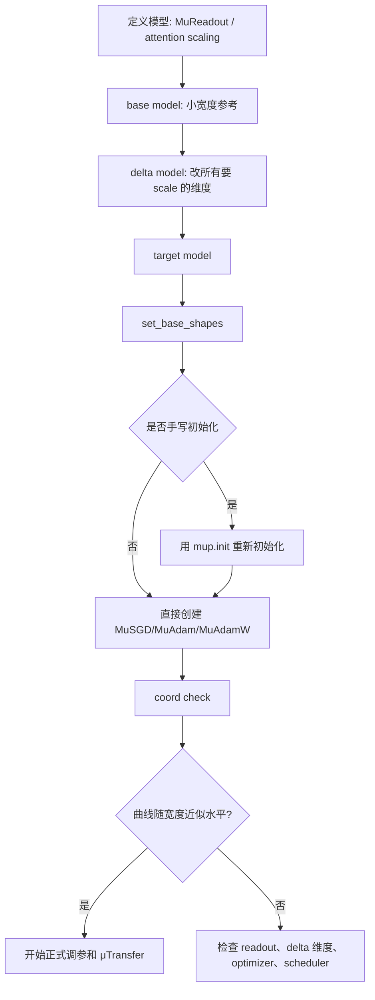

## 一页摘要

第一讲证明了一个 toy 结论：如果输出写成 neuron 平均，那么把学习率放到宽度量级可以让每个 neuron 的坐标做最大但有限的更新。你指出的缺口是对的：那还没有回答工程问题——**实际中 μP 到底怎么初始化？** 本讲就专门补这个缺口。

实践答案先放在最前面。若用 Microsoft `mup` 包，最稳妥的流程是：把最后线性输出层换成 `MuReadout`；构造 base model 和 delta model，让 delta 在所有将来要放大的宽度维度上都和 base 不同；对 target model 调 `set_base_shapes`；若有手写初始化，用 `mup.init` 替换 `torch.nn.init`；训练时用 `MuSGD`、`MuAdam` 或 `MuAdamW`；最后做 coord check。这里的“初始化”不只是权重方差，它还包括参数张量哪些维度是 infinite、最后一层 readout 是否比标准初始化小一档、以及 optimizer 如何按 width multiplier 改学习率。

本讲的数学核心是一个可算表。对宽度为 `n`、base 宽度为 `n_0` 的普通 MLP，隐藏层初始化通常仍是 fan-in 标准差；但输出层 `MuReadout` 的标准差要再除以 `√(n/n_0)`。因此当 hidden fan-in 是 `n` 时，标准参数化的 readout 标准差是 `n^-1/2`，而 μP target readout 的标准差是 `√(n_0)/n`。若取 `n_0=1`，就是常见的 `1/n` readout 尺度。

本讲会完整证明三件事。第一，为什么 hidden 层 fan-in 初始化保持 preactivation 坐标为 `O(1)`。第二，为什么 μP readout 初始化必须比标准最后一层小，否则初始输出和首步更新不能同时满足 μP 的最大有限更新要求。第三，为什么 base/delta/target 三模型流程不是软件仪式，而是在代码中恢复“哪个维度随宽度放大”的数学信息。

## 目录
<table_of_contents color="gray"/>

## 0. 读者画像、预备知识与学习目标

默认读者仍是 目标读者：已经读过第 1 讲，知道坐标经验律、NNGP 递推、NTK 懒惰更新和 toy maximal update 的基本量级。本讲不重新证明 Tensor Program master theorem，而是把“最大有限更新”翻译成可执行初始化规则。

**预备知识。** 需要知道矩阵乘法的 fan-in / fan-out、PyTorch `nn.Linear` 权重形状、SGD/Adam 的学习率含义，以及第 1 讲的两层 toy μP 证明。不会用到完整 Tensor Programs IV/V 证明，也不会要求读者了解 `mup` 源码内部所有实现。

**学习目标。**

- 会算：给定 base 宽度和 target 宽度，能算出 readout 初始化标准差相对标准初始化该缩小多少。
- 会证明：能证明 hidden fan-in 初始化维持 preactivation 为 `O(1)`，而 readout 小一档让首步输出更新保持 `O(1)`。
- 会实现：能写出 base/delta/target 三模型的 μP 初始化流程。
- 会排错：能用 coord check 判断初始化或学习率缩放是否漏了某个 infinite 维度。

**路线图。**

<table header-row="true">
<tr><td>问题</td><td>数学对象</td><td>工程对应物</td><td>本讲结论</td></tr>
<tr><td>哪些维度会随模型变宽</td><td>finite / infinite dimension</td><td>base model 与 delta model</td><td>必须由 shape 比较记录</td></tr>
<tr><td>hidden 怎么初始化</td><td>fan-in Gaussian 尺度</td><td>`mup.init` 或被 `set_base_shapes` 重缩放后的初始化</td><td>hidden preactivation 保持 `O(1)`</td></tr>
<tr><td>readout 怎么初始化</td><td>比标准最后一层小一档</td><td>`MuReadout`</td><td>target 宽度 `n` 时相对 SP 乘 `√(n_0/n)`</td></tr>
<tr><td>学习率怎么配</td><td>最大有限更新</td><td>`MuSGD` / `MuAdam` / `MuAdamW`</td><td>不要手写统一 `torch.optim` 参数组</td></tr>
<tr><td>怎么验收</td><td>坐标大小稳定</td><td>coord check</td><td>activation/output 曲线随宽度近似水平</td></tr>
</table>

**本节带走什么。**

- 本讲回答的是实践中的初始化，不再只讲抽象 maximal update slogan。
- μP 初始化依赖“哪些维度是 infinite”，所以单看一个 target model 的 shape 不够。
- 实际实现必须同时处理 readout、initializer、optimizer 和 coord check。

## 1. 问题先行：为什么标准初始化不够

先看一个两层或三层 MLP 的常见误解。很多人以为 μP 的做法是“保持 Xavier/He 初始化，然后把学习率按宽度调一下”。这是不完整的。Tensor Programs V 的基本表说明：为了让宽度变化时超参数可迁移，除了学习率，最后一层参数的初始化尺度也要改。Microsoft `mup` README 也把 output layer、base shapes、`mup.init` 和 μP optimizer 放在同一个 basic usage 流程里，而不是只改 optimizer。

### 核心定义 1.1：base 宽度、target 宽度与 width multiplier

设 base model 的某个 hidden fan-in 是 `n_0`，target model 的对应 fan-in 是 `n`。定义 width multiplier 为

$$
\widetilde n=\frac{n}{n_0}.
$$

在 `mup` 里，这个量不是用户手动写进每个参数的；它由 `set_base_shapes` 附在参数的 `infshape` 上。直观上，`infshape.width_mult()` 记录 target 参数相对 base 参数在主要 infinite fan-in 上放大了多少。

**例子。** base MLP hidden width 是 256，target hidden width 是 1024，则 `ñ=4`。如果某个 readout 的标准初始化标准差是 `1/√1024`，μP target readout 还要再除以 `√ 4`，得到 `1/64`。

**非例子。** base width 256，delta width 256，target width 1024。这不能告诉 `mup` 哪个维度会随宽度变化，因为 base 和 delta 没有在该维度上不同。后果是 `mup` 可能把本该 infinite 的维度当成 finite，readout 初始化和学习率缩放就不会按 μP 规则发生。

### 核心定义 1.2：finite 维度与 infinite 维度

一个参数张量的维度称为 finite，如果它在 base、delta、target 中应当固定，例如词表大小、输入特征维数、类别数。一个维度称为 infinite，如果它代表会随宽度族变化的隐藏维度，例如 MLP hidden width、Transformer 的 `d_model`、`d_ffn`，以及如果你选择同时放大的 attention head 结构维度。

`mup` 的 base/delta 比较做的事情就是把每个参数维度标成 finite 或 infinite。之后 initializer 和 optimizer 才知道一个矩阵是 input weight、hidden weight、output weight，还是 bias/LayerNorm 这类特殊参数。

**常见误区。** “delta model 只要比 base 大一点”不够。delta model 必须在所有你希望 target scale 的宽度维度上都不同。例如 Transformer 中如果 target 同时改变 `hidden_size` 和 `intermediate_size`，delta 也要同时改变这些维度；否则某些 FFN 权重会被错当成有限维。

**本节带走什么。**

- μP 初始化的第一步不是采样权重，而是标记哪些维度参与宽度极限。
- base model 提供兼容的参考尺度；delta model 提供 infinite/finite 维度识别。
- 如果 delta 漏掉一个将来会放大的维度，后面的初始化表会应用到错误对象上。

## 2. μP 的初始化表：hidden 不变，readout 小一档

本节给出本讲最重要的表。为避免 orientation 混乱，我们采用 PyTorch `nn.Linear` 的约定：权重形状是 `(fan_out, fan_in)`，forward 中输入在右侧被矩阵乘。Microsoft `mup` README 也说明默认把两个 infinite 维度的 `nn.Linear` 权重按这个约定解释。

### 定义 2.1：三类线性权重

在宽 MLP 中，一个线性权重按其输入/输出维度是否随宽度变动分三类。

<table header-row="true">
<tr><td>类型</td><td>fan-in</td><td>fan-out</td><td>例子</td><td>μP 初始化</td></tr>
<tr><td>Input weight</td><td>finite</td><td>infinite</td><td>第一层 `Linear(d_in, n)`</td><td>标准 fan-in 初始化</td></tr>
<tr><td>Hidden weight</td><td>infinite</td><td>infinite</td><td>中间层 `Linear(n, n)`</td><td>标准 fan-in 初始化</td></tr>
<tr><td>Output weight</td><td>infinite</td><td>finite</td><td>最后层 `Linear(n, d_out)`</td><td>比标准 fan-in 初始化再除以 `√(ñ)`</td></tr>
</table>

对输出层，若标准初始化标准差是

$$
\operatorname{std}_{\mathrm{SP}}(W_{\rm out})
=\frac{\sigma}{\sqrt{\operatorname{fan\_in}}},
$$

则 μP target 初始化标准差是

$$
\operatorname{std}_{\mu\mathrm P}(W_{\rm out})
=\frac{\sigma}{\sqrt{\operatorname{fan\_in}}\sqrt{\widetilde n}}
=\frac{\sigma\sqrt{n_0}}{n}
\quad\text{when } \operatorname{fan\_in}=n.
$$

如果 base width 取 `n_0=1`，这就是 `1/n` readout 尺度；如果 base width 是 256，则 target 的 readout 不是绝对 `1/n`，而是相对 base 标准层缩小 `√(256/n)`。

### 定理 2.2：三层 MLP 的 μP 初始化保持 hidden 坐标有限，并使初始 readout 小一档

考虑固定输入 `x ∈ ℝ^d`，宽度 `n` 的三层 MLP：

$$
h^1_i=\sum_{r=1}^d W^1_{ir}x_r,
\qquad
h^2_j=\sum_{i=1}^n W^2_{ji}\phi(h^1_i),
\qquad
f=\sum_{j=1}^n W^3_j\phi(h^2_j).
$$

假设 `||x||=O(1)`，激活函数在 Gaussian 有限矩下有有限二阶矩，并且初始化满足

$$
W^1_{ir}\sim N(0,\sigma_1^2/d),
\qquad
W^2_{ji}\sim N(0,\sigma_2^2/n),
\qquad
W^3_j\sim N(0,\sigma_3^2 n_0/n^2).
$$

则对固定 `i,j`，`h^1_i` 和 `h^2_j` 都是 `O_p(1)`；而初始输出满足

$$
\operatorname{Var}(f)=O(n_0/n).
$$

特别地，若 base width `n_0` 固定而 target width `n→∞`，初始输出趋向零，但 hidden preactivation 坐标不退化。

### 证明路线

1. 第一层 fan-in 是有限维 `d`，标准 fan-in 初始化直接给出 `h^1_i=O_p(1)`。
2. 第二层有 `n` 项，每项权重方差为 `1/n`，所以 preactivation 方差保持有限。
3. readout 有 `n` 项，但每项权重方差为 `n_0/n^2`，所以输出方差为 `O(n_0/n)`。
4. 初始输出变小不是错误；μP 关心的是训练后坐标和输出的尺度稳定，工程上可用 zero readout 初始化进一步消除初始宽度差异。

### 完整证明

第一层条件在输入 `x` 上是 Gaussian：

$$
\operatorname{Var}(h^1_i)
=\sum_{r=1}^d \frac{\sigma_1^2}{d}x_r^2
=\frac{\sigma_1^2}{d}\|x\|^2
=O(1).
$$

因此 `h^1_i=O_p(1)`。令 `q_1=E[φ(G_1)^2]`，其中 `G_1` 是第一层极限 Gaussian；在本假设下 `q_1<∞`。条件在第一层激活上，第二层满足

$$
\operatorname{Var}(h^2_j\mid h^1)
=\sum_{i=1}^n \frac{\sigma_2^2}{n}\phi(h^1_i)^2
=\sigma_2^2\left(\frac1n\sum_{i=1}^n\phi(h^1_i)^2\right).
$$

由第 1 讲的坐标自平均思想，括号内收敛到 `q_1`，因此条件方差在概率意义下有界，推出 `h^2_j=O_p(1)`。

最后看 readout。条件在第二层激活上，

$$
\operatorname{Var}(f\mid h^2)
=\sum_{j=1}^n \frac{\sigma_3^2 n_0}{n^2}\phi(h^2_j)^2
=\frac{\sigma_3^2 n_0}{n}\left(\frac1n\sum_{j=1}^n\phi(h^2_j)^2\right).
$$

同样由坐标自平均，括号内保持 `O_p(1)`，所以 `Var(f)=O(n_0/n)`。这完成证明。

### 假设在哪里用

- 第一层 fan-in 初始化用来让输入层 preactivation 不随 hidden width 变动。
- 第二层 `1/n` 方差用来抵消 `n` 个 hidden 输入的求和。
- 输出层 `n_0/n^2` 方差是 μP 特有的小一档 readout；它使 readout 在 target 宽度下比 SP 小 `√(n/n_0)` 倍。
- 激活二阶矩有限用来控制每层经验平方平均。

### Worked example：base 256 到 target 4096

设 base width 是 256，target width 是 4096。则 `ñ=16`。若普通最后一层 `Linear(4096, d_out)` 的 Xavier/LeCun 标准差按 `1/√4096=1/64` 量级，那么 μP readout 标准差应再除以 4，得到 `1/256` 量级。隐藏层 `Linear(4096,4096)` 仍是 fan-in 标准差 `1/64` 量级。

### 非例子：把所有层都用标准 fan-in 初始化

若最后一层也用 `1/√ n` 标准差，则初始输出方差是 `O(1)`，但第一步最大更新分析会把 readout 更新和 hidden 更新放在不兼容的尺度上。Tensor Programs V 的 μP 表正是通过让 output weights 小一档、再配套改 input/output/bias 学习率来恢复可迁移的宽度极限。

**本节带走什么。**

- hidden 层初始化没有神秘变化：核心仍是 fan-in 方差。
- readout 是最容易漏的地方：target 宽度越大，`MuReadout` 初始权重相对普通最后一层越小。
- 初始输出在 μP 下可随宽度变小；这不是失败信号，coord check 要看初始化后和训练几步后的坐标稳定性。

## 3. 为什么小 readout 不会让网络学不动

上一节可能让人紧张：如果 readout 初始输出趋零，网络是不是一开始太弱？本节证明 μP 的关键补偿：readout 学习率和 hidden 学习率按参数类型缩放，使首步输出更新仍然是 `O(1)`，而 hidden preactivation 也能做 `O(1)` 的特征移动。

### 定理 3.1：μP readout 初始化与学习率配合给出首步有限输出更新

考虑上一节的三层 MLP，并用单样本平方损失 `L=(f-y)^2/2` 做一阶梯度下降。假设 `f-y=O_p(1)`，`φ` 和 `φ'` 在相关坐标上有有界矩。对输出权重使用学习率

$$
\eta_3=\eta\frac{n_0}{n}.
$$

则 readout 更新对输出的一阶贡献是 `O_p(1)`。

### 证明路线

1. 输出权重梯度是 `(f-y)φ(h^2_j)`，单坐标量级为 `O_p(1)`。
2. μP 输出学习率乘 `n_0/n`，所以每个输出权重更新是 `O_p(n_0/n)`。
3. 输出变化是 `n` 个 neuron 的求和，因此总量为 `O_p(n_0)`；base width 固定时就是 `O_p(1)`。

### 完整证明

对输出权重，

$$
\frac{\partial \mathcal L}{\partial W^3_j}
=(f-y)\phi(h^2_j).
$$

一步更新为

$$
\Delta W^3_j=-\eta\frac{n_0}{n}(f-y)\phi(h^2_j).
$$

只看 readout 更新造成的一阶输出变化：

$$
\Delta f_{\rm out}
=\sum_{j=1}^n \Delta W^3_j\phi(h^2_j)
=-\eta n_0(f-y)\left(\frac1n\sum_{j=1}^n\phi(h^2_j)^2\right).
$$

括号内由坐标自平均保持 `O_p(1)`，而 `f-y=O_p(1)`，所以 `Δ f_ out=O_p(1)`。这说明小 readout 初始化不会阻止输出在训练第一步发生有限变化；它只是让初始化和训练更新处于 μP 的可迁移坐标尺度。

### 命题 3.2：hidden 层更新为什么也能是有限特征移动

在同一模型中，第二层 hidden 权重 `W^2_ji` 的梯度含有一个 readout 权重因子：

$$
\frac{\partial \mathcal L}{\partial W^2_{ji}}
=(f-y)W^3_j\phi'(h^2_j)\phi(h^1_i).
$$

由于 μP 初始化下 `W^3_j=O_p(√(n_0)/n)`，单个 hidden 权重的梯度很小。但 preactivation 更新是对 `i` 求和：

$$
\Delta h^2_j
=\sum_{i=1}^n \Delta W^2_{ji}\phi(h^1_i).
$$

若 hidden 权重使用 `O(1)` master 学习率，则每项 `Δ W^2_ji` 是 `O_p(1/n)` 量级，求和后得到 `O_p(1)` 的 preactivation 更新。这个“单权重小、坐标向量更新大”的现象正是 Tensor Programs V 中 outer-product 梯度表的含义。

### 假设在哪里用

- readout 学习率 `n_0/n` 用来把单个输出权重的 `O(1)` 梯度变成 `O(1/n)` 更新。
- 坐标自平均用来把 `n` 项求和变成稳定的经验平均。
- readout 初始化小一档用来让 hidden 权重梯度在单参数层面不爆炸，同时允许 preactivation 求和后有有限变化。

### 非例子：只改 readout 初始化，不用 μP optimizer

如果最后一层用了 `MuReadout`，但 optimizer 仍然是普通 `torch.optim.Adam` 或手写统一学习率参数组，那么 readout、hidden、bias 的学习率不会按 μP 参数类型缩放。常见结果是 coord check 中某些 activation 随宽度收缩到零，或训练几步后随宽度爆掉。初始化和 optimizer 必须成套出现。

**本节带走什么。**

- μP readout 小一档并不表示网络学不动；readout 学习率缩放会把首步输出更新带回 `O(1)`。
- 单个权重更新和 preactivation 更新不是同一个对象；μP 最大化的是坐标/特征层面的有限更新。
- 只换初始化、不换 optimizer，是不完整的 μP。

## 4. 工程流程：实际怎么初始化一个 μP 模型

下面是实践中最不容易出错的顺序。它和 Microsoft `mup` README 的 basic usage 一致，但这里把每一步背后的数学原因写出来。

### Step 1：在模型定义里替换 readout

普通最后一层：

```python
# ordinary SP readout
self.readout = nn.Linear(width, d_out)
```

μP 最后一层：

```python
from mup import MuReadout

self.readout = MuReadout(width, d_out)
```

如果输出权重和输入 embedding 共享，应使用 `MuSharedReadout`。如果是 Transformer attention，μP 常要求 attention logits 用 `1/d` 型缩放，而不是普通 `1/√ d` 型缩放；官方示例为了兼容 head dimension 64，写成类似 `8 / d` 的常数约定。

### Step 2：构造 base model

base model 是参考尺度。它不需要训练，只需要和 target 有同样的模块拓扑、同样的深度、同样的 finite 维度，但宽度较小。

```python
base_model = MyModel(width=256, depth=depth, vocab_size=vocab_size)
```

base 太小会让数值常数不舒服，base 太大浪费内存。它的数学任务只是定义 `n_0`。

### Step 3：构造 delta model

delta model 也不需要训练。它的任务是告诉 `mup` 哪些维度是 infinite，所以必须在所有将来要 scale 的维度上和 base 不同。

```python
delta_model = MyModel(width=384, depth=depth, vocab_size=vocab_size)
```

Transformer 中不要只改 `hidden_size` 而忘记 `intermediate_size` 或你打算一起变化的 head 结构；否则 FFN 或 attention 的某些参数可能被错标。

### Step 4：构造 target model，并尽早 set base shapes

```python
from mup import set_base_shapes

target_model = MyModel(width=4096, depth=depth, vocab_size=vocab_size)
set_base_shapes(target_model, base_model, delta=delta_model)
```

`set_base_shapes` 应尽早调用：在自定义 re-init 之前，在 optimizer 创建之前。它会给每个参数附上 `infshape`，并在默认情形下把刚初始化好的参数重缩放到 μP 尺度。

### Step 5：若手写初始化，用 mup.init 替换 torch.nn.init

如果你没有手写初始化，而只是让 PyTorch 默认初始化后立刻 `set_base_shapes`，`mup` 会按 base shape 信息重缩放。若你有自定义初始化，就要在 `set_base_shapes` 后使用 `mup.init`。

```python
import mup

for p in target_model.parameters():
    if p.dim() >= 2:
        mup.init.xavier_normal_(p)
```

不要在 `set_base_shapes` 后再调用普通 `torch.nn.init.xavier_normal_`，否则会覆盖 μP 尺度，尤其会把 readout 拉回标准参数化。

### Step 6：使用 μP optimizer

```python
from mup import MuAdamW

optimizer = MuAdamW(target_model.parameters(), lr=1e-3, weight_decay=0.01)
```

`lr=1e-3` 在这里是 master learning rate。`MuAdamW` 会根据每个参数的 `infshape` 生成细分参数组；例如 hidden weights 的 Adam 学习率会按 width multiplier 缩放。手写 scheduler 时也要相对修改已有参数组学习率，而不是每步把所有组强行设成同一个绝对数值。

### Step 7：checkpoint 读回时不要重复重缩放

`torch.save` 目前不会可靠保存 `infshape`。读回 checkpoint 后需要重新 `set_base_shapes`，但不能再次 rescale 参数：

```python
model = torch.load("checkpoint.pt")
set_base_shapes(model, "base_shapes.bsh", rescale_params=False)
```

这是为了恢复 `infshape` 元数据给 optimizer 和后续工具使用，而不是重新初始化模型。

### 一页流程图



**本节带走什么。**

- `set_base_shapes` 是 μP 初始化的中心步骤，不是可选装饰。
- 手写初始化必须走 `mup.init`，否则会破坏 readout 小一档和参数组缩放。
- checkpoint 读回要恢复 base shapes，但用 `rescale_params=False` 防止二次重缩放。

## 5. Coord check：怎样知道初始化真的对了

μP 的验收方式不是只看代码里有没有 `MuReadout`。官方建议做 coord check：在多个宽度上记录各层 activation、preactivation 或 output 的坐标平均大小，例如 `x.abs().mean()`，看它们在初始化和训练几步后是否随宽度保持稳定。

### 定义 5.1：坐标稳定性检查

给定一组宽度 `n_1<n_2<⋯<n_K`，对每个宽度构造同一 μP family 的模型。对每个感兴趣的 activation 向量 `z^(n)_ℓ`，记录

$$
C_{\ell,t}(n)=\frac{1}{\dim z^{(n)}_\ell}\sum_i |z^{(n)}_{\ell,t,i}|,
$$

其中 `t` 是训练步数。若对固定 `ℓ,t`，`C_ℓ,t(n)` 随 `n` 大致水平，则该坐标通过检查。若随宽度爆炸或趋零，就说明某个初始化、学习率或 shape 标记错了。

### 命题 5.2：coord check 是第 1 讲坐标经验律的工程版本

如果一个 μP family 在有限训练步内有 Tensor Program 极限，并且某层坐标经验律收敛到非退化随机变量 `Z_ℓ,t`，那么在一阶矩可积条件下

$$
C_{\ell,t}(n)
\xrightarrow{p}
\mathbb E|Z_{\ell,t}|.
$$

因此 coord check 的水平曲线是在经验上检查“坐标经验律是否有非退化极限”。

### 证明

这是第 1 讲坐标经验律定义的直接应用。取测试函数 `ψ(z)=|z|`。若经验律收敛并且一阶矩一致可积，则

$$
\frac{1}{\dim z^{(n)}_\ell}\sum_i |z^{(n)}_{\ell,t,i}|
\to
\mathbb E|Z_{\ell,t}|.
$$

若初始化或 optimizer 错误，常见情形是极限退化为零，或者一阶矩随宽度无界；这两种都会在 coord check 图上表现为下沉或上升。证毕。

### 例子：两个典型错误

**错误一：delta 漏掉 FFN 宽度。** target 的 `d_ffn` 变大，但 delta 没变。结果 FFN 权重可能没有按 hidden infinite fan-in 缩放，训练几步后 FFN activation 随宽度漂移。

**错误二：scheduler 绝对覆盖学习率。** `MuAdamW` 已经把参数组 learning rate 细分，但 scheduler 每步执行 `pg['lr']=1e-3`。结果所有参数组又回到同一个学习率，μP optimizer 的缩放被抹掉。

**本节带走什么。**

- coord check 检查的是坐标经验律的非退化宽度极限。
- 初始化时 output 或 attention logits 可在 `1/√ n` 量级下沉；官方建议可用 zero readout 或 query-zero 初始化去消除初始差异，但训练几步后曲线应变平。
- 真正验收不是“代码看起来像 μP”，而是不同宽度上的坐标曲线是否稳定。

## 6. 常见误解与边界

### 误区 1：μP 就是最后一层初始化为零

不对。zero readout 是一个常用工程选择，尤其用于消除初始化时 output 随宽度下沉的视觉差异；但 μP 的核心是 base shapes、readout 小一档、参数组学习率缩放和最大有限更新。只把 readout 置零而其他层仍是普通 SP，不是 μP。

### 误区 2：base model 越小越理论纯粹

base width 是工程 reference。`n_0=1` 最接近公式里的 `1/n` readout，但实际模型中 base 太小可能无法代表架构的常数尺度。常见做法是选一个可训练、可容纳结构的 proxy width，再把调出的 master HP 迁移到 target。

### 误区 3：所有参数都按同一个公式缩放

不对。Input weights、hidden weights、output weights、biases、embedding、LayerNorm、attention logits 有不同角色。μP 的工程价值正在于用 `infshape` 和特化模块把这些分组系统化。

### 误区 4：只要 loss 没炸，初始化就是对的

loss 早期没炸不代表宽度极限对。学习率小到足够保守时，错误参数化也可能短期稳定，但会失去 feature learning 或 μTransfer。coord check 应使用比正式训练略大的学习率来暴露宽度爆炸或收缩问题。

### 边界：本讲没有证明完整 Tensor Programs V

本讲证明的是三层 MLP 初始化和首步更新的量级。完整 Tensor Programs V 处理更一般架构、有限训练时间、Adam 型优化器和超参数迁移现象。这里把官方实现规则和第 1 讲的坐标思想对齐，但没有把所有 Tensor Program 分类定理重新证明一遍。

**本节带走什么。**

- zero readout 是可选稳定技巧，不是 μP 的定义。
- base/delta/target 是参数族信息，不是训练数据或 checkpoint 技巧。
- 真正的边界在于完整架构和 optimizer 的 Tensor Program 分析，本讲只证明可落地的核心量级。

## 7. 分层练习

### Level 0：定义检查

1. 解释 width multiplier `ñ=n/n_0` 的含义。
2. 说明 base model 和 delta model 分别承担什么任务。
3. 为什么 target model 调 optimizer 前必须先 `set_base_shapes`？

### Level 1：复现证明关键步骤

1. 复现定理 2.2 中第二层 preactivation 方差为 `O(1)` 的计算。
2. 复现输出方差 `O(n_0/n)` 的计算。
3. 复现定理 3.1 中 readout 更新贡献为 `O(1)` 的经验平均步骤。

### Level 2：新例子

1. base width 为 512，target width 为 8192。若普通 readout std 是 `1/√8192`，μP readout std 应缩小多少倍？
2. 一个 MLP 有 `d_in=128`、hidden width 4096、`d_out=10`。列出 input、hidden、output 三类线性层的 μP 初始化量级。
3. 把 `torch.nn.init.kaiming_normal_` 换成 `mup.init.kaiming_normal_`，解释这个替换改变的是哪些层。

### Level 3：反例与边界

1. 构造一个 delta model 漏掉 `d_ffn` 的 Transformer 例子，并指出哪类参数会被错标。
2. 假设 readout 仍用 SP std `1/√ n`，但 optimizer 用 μP 学习率。计算初始输出方差和 readout 首步贡献，说明哪里和 μP 目标冲突。
3. 解释为什么 checkpoint 加载后再次调用默认 `set_base_shapes` 可能错误重缩放已经训练好的权重。

### Level 4：研究式延伸

1. 阅读 Tensor Programs V 的 Table 3，把 SGD 与 Adam 的学习率缩放差异翻译成“梯度向量坐标大小”的语言。
2. 对带 tied embedding 的语言模型，解释 `MuSharedReadout` 为什么比手动共享普通 `nn.Linear` 更安全。
3. 为一个你自己的 Transformer 配置写一个 coord check 计划：哪些宽度变化、记录哪些 activation、训练几步、什么曲线算失败。

## 8. 总结与下一步

本讲补上第一讲的实际初始化缺口。工程上，μP 初始化不是一句“用 He/Xavier”能概括的；它是一套宽度族参数化流程：`MuReadout` 负责最后一层小一档，base/delta shapes 负责识别 infinite 维度，`mup.init` 负责在自定义初始化里保持 μP 尺度，μP optimizer 负责把 master learning rate 转成参数组学习率，coord check 负责验收坐标稳定性。

数学上，最重要的公式是 readout 标准差：

$$
\operatorname{std}_{\mu\mathrm P}(W_{\rm out})
=\operatorname{std}_{\mathrm{SP}}(W_{\rm out})\cdot\sqrt{\frac{n_0}{n}}.
$$

这就是你在第一讲里没找到的实际初始化答案。hidden 层通常仍是 fan-in 初始化；真正不同的是最后一层 readout、学习率分组和 shape 元数据。下一讲可以顺着 Tensor Programs II 进入反向传播与 NTK，也可以继续更实用地讲 Transformer μP：attention logits、embedding/readout sharing、LayerNorm 和 coord check 的具体坑。

## 参考文献与来源

- Microsoft, [mup: maximal update parametrization and μTransfer](https://github.com/microsoft/mup), especially Basic Usage, base shapes, `mup.init`, optimizer scaling, coord check, and current limitations.
- Microsoft, [muTransformers](https://github.com/microsoft/mutransformers), BERT example for base/delta/target shapes, re-initialization, and `MuAdamW` usage.
- Greg Yang et al., [Tensor Programs V: Tuning Large Neural Networks via Zero-Shot Hyperparameter Transfer](https://arxiv.org/abs/2203.03466), especially the μP vs SP scaling table and hyperparameter-transfer motivation.
- Greg Yang and Edward J. Hu, [Feature Learning in Infinite-Width Neural Networks](https://arxiv.org/abs/2011.14522), the Tensor Programs IV feature-learning and maximal-update foundation.
