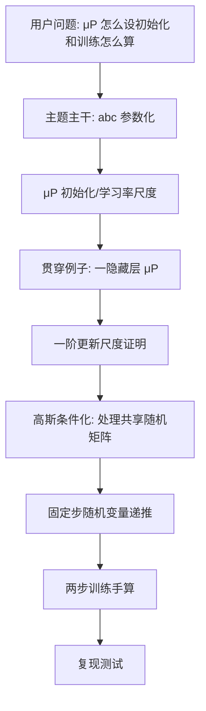

## 一页摘要

本讲重新回答一个更准确的问题：μP 到底怎样设置初始化和学习率，Tensor Programs 又怎样把固定步训练算出来？上一版只算了初始化核，所以即使结构通过，也没有教会 μP 的核心机制。

核心答案有三块。第一，`abc 参数化`把每层的参数缩放、初始化方差、全局学习率写成指数账本；μP 是其中让各层在不爆炸前提下尽量大幅更新的顶点。第二，`高斯条件化`是深层多步计算里处理“同一个随机矩阵及其转置反复出现”的关键工具。第三，固定步训练不是套一个核，而是递推坐标随机变量；一隐藏层 μP 可以完整写成 $`(Z^{nV}_t,Z^U_t)`$ 的多步更新。

阅读路线：第 1 节先用一隐藏层线性/非线性网络作贯穿例子；第 2 节讲 abc 参数化；第 3 节把 abc 翻译成 μP 初始化和学习率；第 4 节证明为什么标准参数化会爆、μP 不爆；第 5--6 节讲高斯条件化和多步递推；第 7 节做两步训练的完整复现。

边界也先说清：本讲讲固定训练步数的宽度极限，不证明训练到收敛；讲 MLP 的核心尺度，不覆盖所有 Transformer 细节；讲 Tensor Programs 的计算机制，不把完整 Master Theorem 证明重写一遍。

## 目录
<table_of_contents color="gray"/>

## 前置路线图

## 术语约定

<table header-row="true">
<tr><td>中文术语</td><td>英文原词</td><td>本讲含义</td></tr>
<tr><td>最大更新参数化 / μP</td><td>Maximal Update Parametrization / muP</td><td>在保持激活和输出有界的前提下，让每类参数在宽度极限中尽量产生非平凡更新的参数化</td></tr>
<tr><td>abc 参数化</td><td>abc parametrization</td><td>用指数 $`a_l,b_l,c`$ 同时记录每层参数乘子、初始化尺度和全局学习率尺度</td></tr>
<tr><td>高斯条件化</td><td>Gaussian conditioning</td><td>对已经观测到的有限个线性约束条件化，把高斯矩阵分解成投影部分加独立残差</td></tr>
<tr><td>初始输出条件化</td><td>conditioning on initial logits</td><td>当初始输出在极限中是非退化高斯时，先固定这些初始输出再分析后续轨迹</td></tr>
<tr><td>固定步递推</td><td>fixed-step recurrence</td><td>训练步数不随宽度增长时，把每一步参数更新写成坐标随机变量的递推</td></tr>
<tr><td>特征学习</td><td>feature learning</td><td>最后隐藏层表示在宽度极限中发生 $`O(1)`$ 级别变化，而不是冻结在初始化附近</td></tr>
<tr><td>核 regime / 核极限</td><td>kernel regime</td><td>表示冻结，函数训练在极限中退化为固定核上的梯度下降</td></tr>
<tr><td>坐标随机变量</td><td>coordinate random variable</td><td>宽度坐标 $`\alpha`$ 上参数、预激活、激活、梯度在极限中的随机变量表示</td></tr>
</table>

## 0. 预备知识、学习目标与主题主干

**预备知识。** 本讲默认你熟悉多元高斯、大数律、中心极限定理、反向传播、SGD，以及前馈 MLP 的基本公式。不默认你已经会 Tensor Programs 的形式语言。

**学习目标。** 看完后你应该能做三件事：用 abc 参数化判断一个 MLP 的初始化和学习率尺度；写出一隐藏层 μP 的固定步坐标随机变量递推；解释深层多步计算为什么需要高斯条件化，而不是把矩阵重新当独立高斯。

本讲的主题主干有四个对象，缺任何一个都不能说“会了 μP 与 Tensor Programs 的计算”。

<table header-row="true">
<tr><td>主干对象</td><td>本讲位置</td><td>读完应会什么</td></tr>
<tr><td>abc 参数化</td><td>第 2 节</td><td>把 $`W^l=n^{-a_l}w^l`$、$`w^l_{\alpha\beta}\sim N(0,n^{-2b_l})`$、学习率 $`\eta n^{-c}`$ 放进同一指数账本</td></tr>
<tr><td>μP 初始化和学习率</td><td>第 3 节</td><td>给 MLP 写出输入层、隐藏层、输出层的初始化方差和学习率尺度</td></tr>
<tr><td>高斯条件化</td><td>第 5 节</td><td>解释为什么多步训练不能假装 $`W`$ 和 $`W^\top`$ 独立，以及怎样用条件高斯分解修正</td></tr>
<tr><td>多步训练递推</td><td>第 6--7 节</td><td>从 $`t=0`$ 递推到 $`t=1,2`$，写出 $`f_0,f_1,f_2`$ 的极限公式</td></tr>
</table>

上一版第七讲失败的根源是：它把 Tensor Programs I 的初始化核递推当成主菜，绕开了 μP 的参数化问题和训练递推问题。那份稿子最多是“初始化核补充说明”，不是合格的第七讲。

**本节带走什么。** 本讲不再用“会算一个核”替代“会设置 μP 并算固定步训练”。主题主干就是发布门槛。

## 1. 贯穿例子：一隐藏层 μP 网络

我们从最小但不偷懒的例子开始。输入先取一维，宽度为 $`n`$，网络为

$$
f_t(\xi)=V_t x_t(\xi),\qquad x_t(\xi)=\phi(h_t(\xi)),\qquad h_t(\xi)=U_t\xi,
$$

其中 $`U_t\in\mathbb R^{n\times 1}`$，$`V_t\in\mathbb R^{1\times n}`$。μP 写法使用底层可训练参数 $`u,v`$：

$$
U=\sqrt n\,u,\qquad V=\frac{1}{\sqrt n}v,
\qquad u_\alpha,v_\alpha\sim N(0,1/n).
$$

因此有效参数满足

$$
U_{0,\alpha}\sim N(0,1),\qquad V_{0,\alpha}\sim N(0,1/n^2).
$$

这正是 μP 最容易被误解的地方：输入侧权重不是 $`1/\sqrt n`$ 级别，而是坐标 $`O(1)`$；输出侧权重是 $`1/n`$ 级别；隐藏表示保持 $`O(1)`$，输出初始值却在特征学习参数化下趋向零。

训练用单样本序列 $`(\xi_t,y_t)`$ 和损失 $`L(f,y)`$。记

$$
\chi_t=L'(f_t(\xi_t),y_t).
$$

本讲的目标不是只算 $`f_0`$，而是把 $`f_0,f_1,f_2,\ldots`$ 的宽度极限递推出去。

**非例子。** 如果把这个网络写成 $`f_n(\xi)=n^{-1/2}\sum_\alpha v_\alpha\phi(U_\alpha\xi)`$ 且 $`v_\alpha\sim N(0,1)`$，那是神经网络高斯过程 / 初始化核常见归一化，不是这里的 μP 特征学习读出尺度。它能得到非退化随机初始函数，但不是 μP 训练动态的主角。

**本节带走什么。** μP 的一隐藏层例子已经暴露核心尺度：输入侧 $`U`$ 是 $`O(1)`$ 坐标，输出侧 $`V`$ 是 $`O(1/n)`$ 坐标，训练后输出靠坐标平均产生 $`O(1)`$ 变化。

## 2. 核心定义：abc 参数化

### 定义：abc 参数化

对 $`L`$ 隐藏层 MLP，写

$$
h^1=W^1\xi,
\qquad x^l=\phi(h^l),
\qquad h^{l+1}=W^{l+1}x^l,
\qquad f=W^{L+1}x^L.
$$

abc 参数化指定三类指数：

$$
W^l=n^{-a_l}w^l,
\qquad w^l_{\alpha\beta}\sim N(0,n^{-2b_l}),
\qquad \text{SGD learning rate}=\eta n^{-c}.
$$

所以有效权重 $`W^l_{\alpha\beta}`$ 的初始化标准差是

$$
n^{-(a_l+b_l)}.
$$

这里 $`a_l`$ 是参数乘子指数，$`b_l`$ 是底层参数初始化指数，$`c`$ 是全局学习率指数。只看 $`a_l+b_l`$ 不够，因为改变 $`a_l`$ 同时会改变梯度作用到有效权重上的学习率。

### 初始化稳定条件

若输入维度固定、所有隐藏层宽度同为 $`n`$，要让预激活坐标在初始化时保持 $`O(1)`$，需要

$$
a_1+b_1=0,
\qquad
 a_l+b_l=\frac12\quad (2\le l\le L),
\qquad
 a_{L+1}+b_{L+1}\ge \frac12.
$$

第一条说输入层每个坐标直接看固定维输入，因此权重坐标应是 $`O(1)`$。第二条说隐藏层有 $`n`$ 项求和，因此权重标准差应是 $`1/\sqrt n`$。第三条说输出层至少不能比 $`1/\sqrt n`$ 更大，否则初始输出会爆。

### 稳定、非平凡、特征学习

Tensor Programs IV 用一个指数 $`r`$ 刻画最后隐藏表示变化的量级：

$$
\Delta x^L_t(\xi)=\Theta(n^{-r}).
$$

直观上，$`r\ge 0`$ 才不爆；$`r=0`$ 才有 $`O(1)`$ 特征变化。非平凡稳定 abc 参数化满足一个二分：

- 若 $`r=0`$，得到特征学习极限。
- 若 $`r>0`$，得到核极限，表示冻结，训练退化为固定核梯度下降。

这就是为什么 μP 不是“把初始化调一下”而已。它是在 abc 多面体中选择让每层尽量更新、同时不爆炸的尺度。

**假设在哪里用。** 固定宽度路线和固定深度让每层只有一种主导宽度 $`n`$；输入维度固定让第一层条件是 $`a_1+b_1=0`$；隐藏层宽度为 $`n`$ 让中间层条件是 $`1/2`$；训练步数固定让 $`r`$ 可以解释有限步变化，而不是长期优化稳定性。

**本节带走什么。** abc 参数化是一张尺度账本。不会这张账本，就无法判断“μP 初始化应该怎么设”和“学习率为什么要分层缩放”。

## 3. μP 初始化和学习率怎么设置

### 定义：MLP 的 μP 指数

在 TP IV 的 MLP 记号中，μP 取

$$
c=0,
\qquad b_l=\frac12\quad\text{for all }l,
$$

并取

$$
a_l=
\begin{cases}
-1/2,& l=1,\\
0,&2\le l\le L,\\
1/2,&l=L+1.
\end{cases}
$$

于是有效权重初始化尺度为

$$
W^1_{\alpha r}=O(1),
\qquad
W^l_{\alpha\beta}=O(1/\sqrt n)\quad(2\le l\le L),
\qquad
W^{L+1}_{\beta}=O(1/n).
$$

这三行就是 MLP μP 初始化的核心。

### 工程式等价表

若写成更接近实现的 dense MLP，输入维度 $`d_{\rm in}`$ 固定，隐藏宽度为 $`n`$，两隐藏层网络

$$
f(\xi)=W^3\phi(W^2\phi(W^1\xi+b^1)+b^2),
$$

μP 的基本 SGD 尺度是

<table header-row="true">
<tr><td>参数</td><td>初始化方差</td><td>SGD 学习率倍数</td><td>直觉</td></tr>
<tr><td>输入权重 $`W^1`$ 与偏置</td><td>$`1/d_{\rm in}`$ 或 $`O(1)`$</td><td>$`\eta n`$</td><td>坐标输入固定维，梯度坐标约小 $`1/n`$，所以学习率要放大</td></tr>
<tr><td>隐藏权重 $`W^2`$</td><td>$`1/n`$</td><td>$`\eta`$</td><td>前向求和有 $`n`$ 项，训练改变量需保持 $`1/n`$ 坐标级</td></tr>
<tr><td>输出权重 $`W^3`$</td><td>$`1/n^2`$</td><td>$`\eta/n`$</td><td>输出是 $`n`$ 项相加，读出坐标必须是 $`1/n`$ 级</td></tr>
</table>

如果使用基准宽度 $`n_0`$，常写宽度倍率 $`\tilde n=n/n_0`$，把上表中的 $`n`$ 替换为 $`\tilde n`$ 的倍率，使得在基准宽度处 μP 与标准参数化数值一致，但随宽度扩展时走 μP 路线。

### Adam 的同一原则

对 Adam，TP V 的尺度推导仍按三类层看：输出权重学习率是 $`O(1/n)`$，隐藏权重学习率是 $`O(1/n)`$，输入权重和偏置学习率是 $`O(n)`$ 级别。不同实现会用参数乘子和学习率乘子的等价变换改写表格；不要背某个库的表面写法，要看有效目标：激活坐标 $`O(1)`$、训练后输出 $`O(1)`$、每类参数尽量非平凡更新。

### 非例子：标准参数化为什么不是 μP

标准参数化通常取

$$
W^1=O(1),
\qquad W^2=O(1/\sqrt n),
\qquad W^3=O(1/\sqrt n).
$$

它让初始输出 $`O(1)`$，但输出层太大，训练时某些项会爆；若把全局学习率缩小到防爆，隐藏表示又几乎不动，进入核极限。这就是“能初始化稳定”不等于“能训练尺度正确”。

**本节带走什么。** MLP μP 初始化不是每层都 fan-in 标准化。输入层保持 $`O(1)`$，隐藏层 $`1/\sqrt n`$，输出层 $`1/n`$；学习率也必须按层缩放，否则 μP 被破坏。

## 4. 证明尺度：标准参数化会爆，μP 不爆

本节用一隐藏层线性网络证明尺度差异。取 $`\phi(z)=z`$，标量输入，网络为

$$
f(x)=V^\top Ux,
\qquad U,V\in\mathbb R^n.
$$

### 命题：标准参数化一步会产生宽度爆炸项

标准参数化取

$$
U_\alpha=O(1),
\qquad V_\alpha=O(1/\sqrt n),
$$

并用 $`O(1)`$ 学习率。对平方损失的一步更新在尺度上可写成

$$
V'=V+\theta U,
\qquad U'=U+\theta V,
$$

其中 $`\theta=O(1)`$。于是

$$
f'(x)=V'^\top U'x
=\left(V^\top U+\theta U^\top U+\theta V^\top V+\theta^2 U^\top V\right)x.
$$

其中

$$
U^\top U=\Theta(n),
$$

所以 $`f'(x)`$ 出现 $`\Theta(n)`$ 爆炸项。

**证明路线。** 展开一步更新后的内积；用大数律估计 $`U^\top U`$；比较各项量级。

**证明。** 因为 $`U_\alpha`$ 是 $`O(1)`$ 坐标，且平方均值非零，

$$
\frac1n U^\top U=\frac1n\sum_{\alpha=1}^nU_\alpha^2\longrightarrow \mathbb E U_1^2>0.
$$

所以 $`U^\top U=\Theta(n)`$。更新展开式中 $`\theta U^\top U`$ 因而是 $`\Theta(n)`$，导致输出爆炸。证毕。

### 命题：μP 一步保持 $`O(1)`$

μP 取

$$
U_\alpha=O(1),
\qquad V_\alpha=O(1/n),
$$

并令输入侧有效学习率放大、输出侧有效学习率缩小，使一步后尺度等价于

$$
V'=V+\theta n^{-1}U,
\qquad U'=U+\theta nV.
$$

于是

$$
f'(x)=\left(V^\top U+\theta n^{-1}U^\top U+\theta nV^\top V+\theta^2U^\top V\right)x.
$$

逐项看：

$$
V^\top U=O(1),
\qquad n^{-1}U^\top U=O(1),
\qquad nV^\top V=O(1/n),
\qquad U^\top V=O(1).
$$

所以 $`f'(x)=O(1)`$。

**假设在哪里用。** $`U_\alpha=O(1)`$ 让隐藏特征有非退化坐标；$`V_\alpha=O(1/n)`$ 让读出层不会把 $`n`$ 项相加爆掉；输出侧 $`1/n`$ 更新让新增读出项是经验平均；输入侧 $`n`$ 更新抵消反传梯度的 $`1/n`$ 小量。

**本节带走什么。** μP 不是为了让初始函数像 GP；μP 是为了让训练更新最大但不爆。标准参数化的问题不是初始前向，而是训练一步后的项量级失衡。

## 5. 高斯条件化：为什么多步不能假装独立

深层网络多步训练中，同一个中间层矩阵 $`W`$ 会在前向中以 $`Wx`$ 出现，在反向中以 $`W^\top y`$ 出现。一步以后，新的 $`x`$ 和 $`y`$ 往往已经依赖 $`W`$。如果还把 $`W`$ 当作“新抽的独立高斯矩阵”，就是梯度独立假设；Tensor Programs 的重点之一正是避免这个错误。

### 高斯条件化引理

设 $`W\in\mathbb R^{n\times n}`$ 的条目独立，分布为 $`N(0,1/n)`$。给定有限个向量 $`x^1,\ldots,x^k\in\mathbb R^n`$ 和对应观测 $`g^i=Wx^i`$。把这些向量按行/列组成矩阵 $`X`$ 和 $`G`$。则条件在 $`WX=G`$ 上，$`W`$ 的分布可以写成

$$
W\mid(WX=G)
=GX^+ + \widetilde W\Pi_{X}^{\perp},
$$

其中 $`X^+`$ 是伪逆，$`\Pi_X^\perp`$ 是到 $`\operatorname{span}\{x^1,
\ldots,x^k\}`$ 正交补的投影，$`\widetilde W`$ 是新的独立高斯矩阵。

若采用宽度归一化 Gram 矩阵

$$
\Sigma_X=\frac1nX^\top X,
$$

则投影系数可以写成由 $`\Sigma_X^+`$ 控制的有限维对象。Tensor Programs 的主定理负责说明这些 Gram 矩阵有确定极限，因此条件化后的投影项和残差项都能继续递推。

**证明路线。** 高斯向量在有限个线性约束下仍是高斯；条件均值是到约束子空间的正交投影；条件协方差是原协方差限制在正交补上。

**证明。** 把 $`W`$ 的每一行看成高斯向量 $`w`$。约束 $`wX=g`$ 是有限个线性约束。多元高斯条件分布公式给出

$$
\mathbb E[w\mid wX=g]=gX^+,
\qquad
\operatorname{Cov}(w\mid wX=g)=\frac1n\Pi_X^\perp.
$$

不同行条件后仍独立，因此矩阵形式就是 $`GX^+ + \widetilde W\Pi_X^\perp`$。证毕。

### 初始输出条件化

在一般 abc 参数化中，如果输出层满足

$$
a_{L+1}+b_{L+1}=\frac12,
$$

那么初始输出 $`f_0(\xi)`$ 可能通过中心极限定理收敛到非退化高斯，而不是确定的零。为了描述训练轨迹，TP IV 的证明会对有限输入集合上的初始输出

$$
\{f_0(\xi):\xi\in X\}
$$

做条件化：先固定这些初始输出为 $`g(\xi)`$，再分析后续程序。条件化后的输出权重等于“解释这些初始输出的投影项”加“独立高斯残差”。

对 μP，输出层有效标准差是 $`1/n`$，即 $`a_{L+1}+b_{L+1}=1>1/2`$，所以

$$
f_0(\xi)\longrightarrow 0.
$$

因此一隐藏层 μP 的主递推通常不需要保留随机初始输出；但你必须知道高斯条件化这件事，因为一旦落在临界输出尺度，或者深层多步里同一个矩阵被反复使用，它就是避免错误独立化的核心工具。

**本节带走什么。** 高斯条件化不是装饰性证明技巧。它解决的是多步训练中“矩阵已经被看过，还能不能当新高斯用”的问题；答案是不能直接当新高斯，但可以分解成投影记忆加独立残差。

## 6. 一隐藏层 μP 的固定步递推

现在回到贯穿例子，完整写出多步怎么算。定义两个初始坐标随机变量

$$
Z^U_0\sim N(0,1),
\qquad
Z^{nV}_0\sim N(0,1),
$$

彼此独立。这里 $`Z^{nV}_0`$ 表示 $`nV_{0,\alpha}`$ 的极限坐标，而不是 $`V_{0,\alpha}`$ 本身。

对任意时间 $`t`$ 和输入 $`\xi`$，定义

$$
Z^h_t(\xi)=\xi Z^U_t,
\qquad
Z^x_t(\xi)=\phi(Z^h_t(\xi)),
$$

以及极限输出

$$
\bar f_t(\xi)=\mathbb E\left[Z^{nV}_t Z^x_t(\xi)\right].
$$

训练样本为 $`(\xi_t,y_t)`$，令

$$
\bar\chi_t=L'(\bar f_t(\xi_t),y_t).
$$

则一隐藏层 μP 的固定步递推是

$$
Z^{nV}_{t+1}=Z^{nV}_t-\bar\chi_t Z^x_t(\xi_t),
$$

$$
Z^U_{t+1}=Z^U_t-\bar\chi_t\xi_t Z^{nV}_t\phi'(Z^h_t(\xi_t)).
$$

最后输出继续由

$$
\bar f_{t+1}(\xi)=\mathbb E\left[Z^{nV}_{t+1}\phi(\xi Z^U_{t+1})\right]
$$

给出。

### 定理：一隐藏层 μP 固定步极限

在上面的网络和 μP 尺度下，若 $`\phi'`$ 满足 Tensor Programs IV 所需的伪 Lipschitz 型增长条件，训练步数 $`t`$ 固定，则对每个固定输入 $`\xi`$，有限宽输出 $`f_{n,t}(\xi)`$ 几乎必然收敛到 $`\bar f_t(\xi)`$。

**证明路线。** 先在 $`t=0`$ 用大数律得到 $`f_{n,0}`$；再证明一步更新可写成旧坐标和全局标量 $`\chi_t`$ 的逐坐标函数；最后对固定步数做归纳。

**证明。** 初始时，$`U_{0,\alpha}`$ 和 $`nV_{0,\alpha}`$ 是独立同分布坐标，所以

$$
f_{n,0}(\xi)=\sum_{\alpha=1}^nV_{0,\alpha}\phi(U_{0,\alpha}\xi)
=\frac1n\sum_{\alpha=1}^n(nV_{0,\alpha})\phi(U_{0,\alpha}\xi)
\longrightarrow
\mathbb E[Z^{nV}_0\phi(\xi Z^U_0)].
$$

因为 $`Z^{nV}_0`$ 与 $`Z^U_0`$ 独立且均值为零，右侧为零。于是 $`\chi_{n,0}`$ 收敛到 $`\bar\chi_0`$。

对一步更新，SGD 在 μP 有效变量上给出

$$
nV_{1,\alpha}=nV_{0,\alpha}-\chi_{n,0}\phi(U_{0,\alpha}\xi_0),
$$

$$
U_{1,\alpha}=U_{0,\alpha}-\chi_{n,0}\xi_0(nV_{0,\alpha})\phi'(U_{0,\alpha}\xi_0).
$$

由于 $`\chi_{n,0}\to\bar\chi_0`$，每个新坐标都是旧坐标的同一个受控函数加一个收敛标量。于是对任意受控测试函数 $`\psi`$，

$$
\frac1n\sum_{\alpha=1}^n\psi(nV_{1,\alpha},U_{1,\alpha})
\longrightarrow
\mathbb E\psi(Z^{nV}_1,Z^U_1).
$$

这给出 $`f_{n,1}(\xi)\to\bar f_1(\xi)`$。重复同一论证，从 $`t`$ 到 $`t+1`$，因为训练步数固定，复合次数有限，得到所有固定 $`t`$ 的结论。证毕。

**假设在哪里用。** 固定步数保证只需有限次归纳；伪 Lipschitz 条件保证每次更新后的测试函数仍可用大数律；μP 尺度保证 $`nV_t`$ 和 $`U_t`$ 坐标保持 $`O(1)`$；若步数随 $`n`$ 增长，这个证明不够。

**本节带走什么。** 多步不是“重新算一个核”。多步是递推坐标随机变量，然后每一步用期望读出输出。

## 7. 贯穿例子的两步手算

为了让递推真正落地，下面把前两步完全写出来。记

$$
A=Z^U_0,
\qquad B=Z^{nV}_0,
\qquad A,B\stackrel{\rm iid}{\sim}N(0,1).
$$

### 第零步

$$
\bar f_0(\xi)=\mathbb E[B\phi(\xi A)]=0.
$$

对第一个训练样本 $`(\xi_0,y_0)`$，

$$
\bar\chi_0=L'(0,y_0).
$$

### 第一步坐标更新

由第 6 节递推，

$$
B_1=B-\bar\chi_0\phi(\xi_0A),
$$

$$
A_1=A-\bar\chi_0\xi_0B\phi'(\xi_0A).
$$

于是任意测试输入 $`\xi`$ 的一步输出为

$$
\bar f_1(\xi)
=
\mathbb E\left[
\left(B-\bar\chi_0\phi(\xi_0A)\right)
\phi\left(\xi\left(A-\bar\chi_0\xi_0B\phi'(\xi_0A)\right)\right)
\right].
$$

这不是固定核公式，因为 $`A_1`$ 已经依赖 $`B`$，表示本身发生了非线性变化。

### 第二步坐标更新

给第二个训练样本 $`(\xi_1,y_1)`$，先算

$$
\bar\chi_1=L'(\bar f_1(\xi_1),y_1).
$$

再递推

$$
B_2=B_1-\bar\chi_1\phi(\xi_1A_1),
$$

$$
A_2=A_1-\bar\chi_1\xi_1B_1\phi'(\xi_1A_1).
$$

因此

$$
\bar f_2(\xi)=\mathbb E[B_2\phi(\xi A_2)].
$$

把 $`A_1,B_1`$ 展开，就是一个只关于初始高斯 $`A,B`$ 的二维期望。这就是 Tensor Programs 在一隐藏层 μP 中自动化的事情：每个固定步数都变成有限维初始高斯上的确定期望。

### 线性激活的闭式检查

若 $`\phi(z)=z`$，则

$$
B_1=B-\bar\chi_0\xi_0A,
\qquad
A_1=A-\bar\chi_0\xi_0B.
$$

写

$$
B_t=p_tB+q_tA,
\qquad A_t=r_tB+s_tA.
$$

初值为

$$
p_0=s_0=1,
\qquad q_0=r_0=0.
$$

递推为

$$
(p_{t+1},q_{t+1})=(p_t,q_t)-\bar\chi_t\xi_t(r_t,s_t),
$$

$$
(r_{t+1},s_{t+1})=(r_t,s_t)-\bar\chi_t\xi_t(p_t,q_t).
$$

输出为

$$
\bar f_t(\xi)=\mathbb E[(p_tB+q_tA)\xi(r_tB+s_tA)]
=\xi(p_tr_t+q_ts_t).
$$

这给出一个完全可手算的多步版本。

**本节带走什么。** 看懂多步计算的关键是保存坐标状态，而不是保存一个标量核。非线性时状态是随机变量递推；线性时状态退化成四个系数递推。

## 8. 深层网络中高斯条件化怎样进入多步

一隐藏层例子没有中间 $`n\times n`$ 随机矩阵，所以多步递推看起来只靠大数律。深层 MLP 多了中间矩阵 $`W^2,\ldots,W^L`$，问题变成：同一个 $`W^l`$ 在不同时间、前向和反向里被反复查询。

Tensor Programs 的做法可以压缩成四步：

<table header-row="true">
<tr><td>步骤</td><td>计算动作</td><td>为什么需要</td></tr>
<tr><td>1</td><td>把到目前为止出现过的 $`W^l x^i`$、$`(W^l)^\top y^j`$ 记入有限观测集</td><td>记录矩阵已被哪些方向“看过”</td></tr>
<tr><td>2</td><td>对这些有限线性约束做高斯条件化</td><td>得到投影记忆项和独立高斯残差</td></tr>
<tr><td>3</td><td>用 Gram 矩阵极限替换投影系数</td><td>把宽度对象降成有限维确定系数</td></tr>
<tr><td>4</td><td>把新向量加入坐标随机变量递推</td><td>进入下一步训练</td></tr>
</table>

这解释了为什么 TP IV 说深层情形比一隐藏层复杂：不是原则变了，而是每个中间矩阵都带有一份“被观测过的子空间记忆”。

**常见误区。** 只在第一步训练时，某些 $`W`$ 与输入向量近似独立，所以传统 NTK 推导常能走通。超过一步后，$`x_t`$ 已经依赖早先的 $`W`$，再把 $`Wx_t`$ 当作独立高斯乘法就会漏掉投影项。

**本节带走什么。** 深层多步训练的难点是矩阵记忆。高斯条件化把“记忆”变成有限维投影项，把剩余部分继续当独立高斯残差。

## 9. 复现测试

**输入。** 给定一隐藏层 μP 网络

$$
f_t(\xi)=\sum_{\alpha=1}^nV_{t,\alpha}\phi(U_{t,\alpha}\xi),
\qquad
U_{0,\alpha}\sim N(0,1),
\qquad
V_{0,\alpha}\sim N(0,1/n^2),
$$

训练样本为 $`(\xi_0,y_0),(\xi_1,y_1)`$，损失导数为 $`L'`$。

**输出。** 你应该能写出

$$
A=Z^U_0,
\qquad B=Z^{nV}_0,
\qquad \bar f_0(\xi)=0,
\qquad \bar\chi_0=L'(0,y_0),
$$

$$
B_1=B-\bar\chi_0\phi(\xi_0A),
\qquad
A_1=A-\bar\chi_0\xi_0B\phi'(\xi_0A),
$$

$$
\bar f_1(\xi)=\mathbb E[B_1\phi(\xi A_1)],
\qquad
\bar\chi_1=L'(\bar f_1(\xi_1),y_1),
$$

$$
B_2=B_1-\bar\chi_1\phi(\xi_1A_1),
\qquad
A_2=A_1-\bar\chi_1\xi_1B_1\phi'(\xi_1A_1),
$$

$$
\bar f_2(\xi)=\mathbb E[B_2\phi(\xi A_2)].
$$

**通过标准。** 你必须说明四件事：为什么使用 $`nV`$ 而不是 $`V`$ 作坐标变量；为什么 $`f_0`$ 在 μP 下趋向零；为什么 $`\chi_t`$ 在极限中变成确定标量；为什么深层网络中还需要高斯条件化来处理共享矩阵记忆。

## 10. 练习

**Level 0：abc 账本。** 对两隐藏层 MLP 写出 μP 的 $`a_l,b_l,c`$，并计算每层有效权重的初始化标准差。

**Level 1：尺度检查。** 用第 4 节方法证明：标准参数化若把学习率缩小到 $`O(1/n)`$ 可避免线性例子的爆炸，但输入侧特征更新会变成 $`o(1)`$。

**Level 2：两步递推。** 对 $`\phi(z)=z`$ 和平方损失，把第 7 节的 $`p_t,q_t,r_t,s_t`$ 递推写到 $`t=2`$，并给出 $`\bar f_2(\xi)`$。

**Level 3：条件化。** 设 $`W\in\mathbb R^{n\times n}`$，已知一个方向上的 $`Wx=g`$。写出 $`W`$ 条件分布中的投影项和残差项，并说明为什么残差只能作用在 $`x^\perp`$ 上。

**Level 4：深层张量程序草图。** 对两隐藏层 μP MLP，列出一步训练后第二层矩阵 $`W^2`$ 在下一次前向/反向中被哪些方向观测过。不要证明完整极限，只列观测子空间和需要条件化的矩阵乘法。

## 11. 常见误区

- 误区一：μP 就是把输出层初始化调小。错。输出层调小只是结果之一；输入层和输出层学习率也必须相应缩放。
- 误区二：会算 NNGP 初始化核就会算 μP。错。NNGP 初始化核通常关心 $`t=0`$ 的随机函数；μP 关心训练后特征如何 $`O(1)`$ 更新。
- 误区三：Tensor Programs 多步就是重复套同一个核递推。错。多步要保存坐标随机变量和矩阵观测记忆。
- 误区四：Gaussian conditioning 是边缘技术细节。错。它是深层训练中处理 $`W`$ 与 $`W^\top`$ 相关性的核心机制。
- 误区五：μP 下初始输出为零说明模型没用。错。μP 的目标是训练后输出 $`O(1)`$ 且特征学习非平凡；初始输出趋零是特征学习极限的自然结果。

## 12. 总结与来源

本讲重新把第七讲的中心放回 μP 本身：abc 参数化给尺度账本，μP 给初始化和分层学习率，高斯条件化处理共享高斯矩阵的记忆，固定步训练通过坐标随机变量递推来计算。一隐藏层情形的多步公式已经完整写出；深层情形原则相同，但每个中间矩阵都要额外携带条件化投影项。

主要来源：Tensor Programs IV `Feature Learning in Infinite-Width Neural Networks` 第 2--5 节及 Appendix N；Tensor Programs V `Tuning Large Neural Networks via Zero-Shot Hyperparameter Transfer` 第 4 节和 Appendix J。前者给 abc 参数化、μP 定义和一隐藏层固定步极限；后者给工程式 μP 初始化/学习率表和尺度推导。