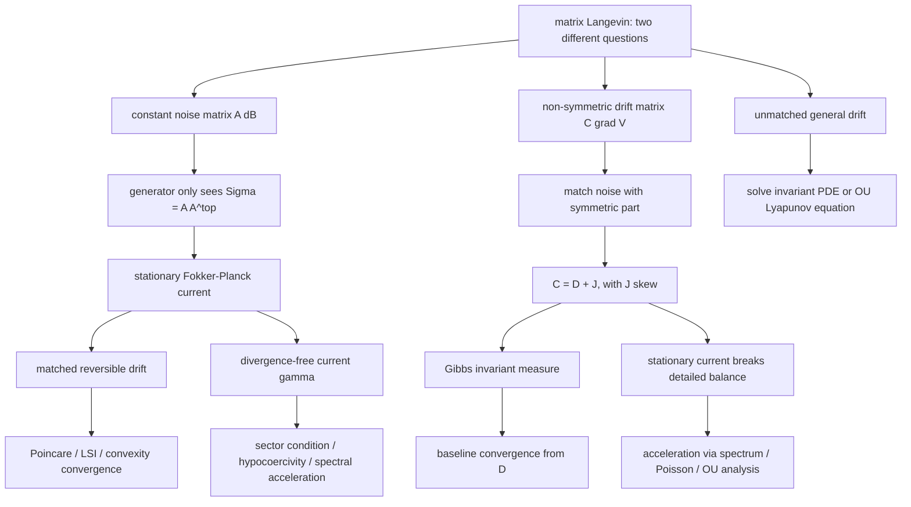
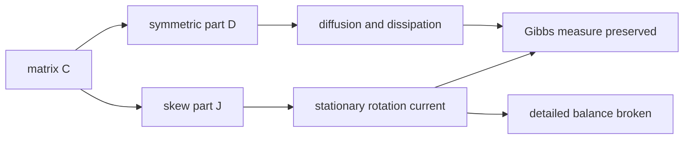
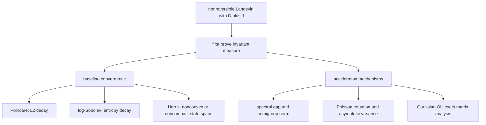

## 一页摘要

这份讲义回答两个容易混淆但必须分开的矩阵 Langevin 问题。第一，若 overdamped Langevin dynamics 的噪声不是标量 Brownian noise，而是

$$
dX_t=b(X_t)\,dt+A\,dB_t,
$$

其中 $`A`$ 是非退化但可能非对称的矩阵，那么平衡态和收敛只通过什么矩阵对象决定？第二，若 drift 本身是非对称矩阵乘梯度，

$$
dX_t=-C\nabla V(X_t)dt+\sqrt{2D}dB_t,
$$

那么什么条件才能保持 Gibbs 平衡态，反对称部分又怎样影响收敛？

第一条结论非常重要：在 Itô、常系数噪声情形，$`A`$ 的非对称性本身不是动力学不变性的来源。生成元只看

$$
\Sigma=A A^\top,
$$

也就是噪声协方差。若要让 $`\pi(dx)=Z^{-1}e^{-V(x)}dx`$ 成为不变分布，漂移必须和 $`\Sigma`$ 匹配。对于本讲义的 convention

$$
dX_t=b(X_t)\,dt+A\,dB_t,
$$

reversible Gibbs drift 是

$$
b_{\mathrm{rev}}(x)=-\frac12 \Sigma \nabla V(x).
$$

更一般地，所有保持同一个 Gibbs 平衡态的常扩散系数 drift 可写成

$$
b(x)=-\frac12\Sigma\nabla V(x)+\gamma(x),\qquad \nabla\cdot(\gamma e^{-V})=0.
$$

其中 $`\gamma`$ 是相对于 $`\pi`$ 的 divergence-free current，它破坏 detailed balance，但不破坏 invariant measure。

这份讲义有两条主线。第 1-12 节处理“非对称噪声矩阵 $`A`$”这个容易误读的问题：常系数 $`A dB_t`$ 只通过 $`AA^\top`$ 影响 generator。第 13-24 节处理更核心的不可逆 Langevin：

$$
dX_t=-C\nabla V(X_t)\,dt+\sqrt{2D}\,dB_t,
$$

其中 $`C`$ 不一定对称。若目标仍是 $`e^{-V}`$，常矩阵的结构性条件是

$$
C=D+J,
\qquad D=D^\top\succeq0,
\qquad J=-J^\top.
$$

也就是说，对称部分 $`D`$ 负责 diffusion/dissipation，反对称部分 $`J`$ 负责 stationary rotation current。收敛则分三层：reversible 或对称耗散部分由 Poincare/log-Sobolev/convexity 控制；非可逆 current 可通过 hypocoercivity、谱比较或 Poisson 方程带来加速；若 drift 与 Gibbs 不匹配，则平衡态一般只能通过 stationary Fokker-Planck 或 Lyapunov 方程求出。

## 目录

<table_of_contents color="gray"/>

## 读者画像与预备知识

默认读者是 目标读者。需要熟悉多元微积分、线性代数、Itô diffusion 的 generator、Fokker-Planck 方程、Poincare/log-Sobolev 不等式的基本形式。第一遍不需要完整 Dirichlet form 理论，但需要接受“generator 的 adjoint 决定 density 演化”这个标准事实。

可跳过内容：如果只想纠正“非对称噪声矩阵是否导致不可逆”这个误解，读第 1 到第 5 节；如果关心一般 drift 的存在唯一性与收敛，读第 6 节；如果关心抽象 divergence-free drift 的不可逆加速，读第 7 节；如果想检查线性矩阵条件，读第 8 节；如果真正关心 $`-C\nabla V`$ 且 $`C`$ 不对称的不可逆 Langevin，直接读第 13 到第 20 节，再用第 22 节练习检查理解。
## 学习目标

| 层次 | 结束后应该能做什么 | 检查方式 |
|---|---|---|
| 概念 | 解释为什么常系数 $`A dB_t`$ 只通过 $`AA^\top`$ 进入 law | 能把 $`A`$ 换成 $`\Sigma^{1/2}`$ 而不改变 generator |
| 平衡态 | 判断一个 drift 是否保持 $`e^{-V}`$ | 能写出 stationary current 并检查 divergence |
| 证明 | 证明 reversible Gibbs drift 与 $`C=D+J`$ 不可逆 drift 的不变性 | 能用 Fokker-Planck、分部积分和反对称矩阵恒等式完成证明 |
| 收敛 | 区分 Poincare、log-Sobolev、Harris、hypocoercivity、谱比较和 Poisson 方程的适用条件 | 能说清每个 theorem 需要什么假设，以及哪些结论只是保底 rate |
| 研究判断 | 识别“非对称噪声”和“非可逆 drift”之间的差别 | 能指出错误模型 $`dX=-\nabla Vdt+A dB`$ 和错配模型 $`dX=-C\nabla Vdt+\sqrt{2D}dB`$ 什么时候不以 $`e^{-V}`$ 为平衡态 |
## 路线图

本讲义的问题顺序是：先去掉“非对称矩阵噪声”的表面迷惑，再给出 Gibbs 平衡态的 current 检查，最后进入真正的不可逆矩阵 drift。核心分界线是：常系数噪声矩阵 $`A`$ 的非对称外形会被 $`AA^\top`$ 吸收；drift 中的反对称部分 $`J\nabla V`$ 才会产生非零 stationary current。读者如果已经确认自己关心的是 $`dX_t=-C\nabla V(X_t)dt+\sqrt{2D}dB_t`$，可以把第 1-12 节当作防错铺垫，然后重点读第 13-20 节。
## 1. 先把 convention 固定下来

本讲义使用以下 Itô SDE convention：

$$
dX_t=b(X_t)\,dt+A\,dB_t,
\qquad X_t\in \mathbb R^d,
$$

其中 $`B_t`$ 是标准 $`d`$ 维 Brownian motion，$`A`$ 是可逆常矩阵，

$$
\Sigma=A A^\top\succ 0.
$$

生成元为

$$
\mathcal L f(x)=b(x)\cdot \nabla f(x)+\frac12\operatorname{Tr}\bigl(\Sigma\nabla^2 f(x)\bigr).
$$

若 $`\rho_t`$ 是 $`X_t`$ 的密度，则 Fokker-Planck 方程是

$$
\partial_t\rho_t=-\nabla\cdot(b\rho_t)+\frac12\nabla\cdot(\Sigma\nabla\rho_t),
$$

这里使用 $`\Sigma`$ 常数。把它写成 current 形式：

$$
\partial_t\rho_t=-\nabla\cdot J_t,
\qquad
J_t=b\rho_t-\frac12\Sigma\nabla\rho_t.
$$

平衡态就是找 $`\rho_\infty`$ 使得

$$
\nabla\cdot J_\infty=0.
$$

**本节带走什么。** 讲 equilibrium 时不要从 SDE 外形猜。先写 generator，再写 adjoint，再写 stationary current。

## 2. 非对称 $`A`$ 的真正含义

**命题 1，常系数噪声只看 $`AA^\top`$。** 设 $`A`$ 可逆，$`\Sigma=A A^\top`$。令 $`\Sigma^{1/2}`$ 是正定平方根。则 SDE

$$
dX_t=b(X_t)\,dt+A\,dB_t
$$

和

$$
d\widetilde X_t=b(\widetilde X_t)\,dt+\Sigma^{1/2}\,d\widetilde B_t
$$

有相同的 generator，因而在同样初值下有相同的 law，只要 martingale problem well-posed。

**证明。** 对任意光滑 $`f`$，Itô 公式给出二阶变差项

$$
d\langle A B\rangle_t=A A^\top dt=\Sigma dt.
$$

因此二阶项是

$$
\frac12\sum_{i,j}\Sigma_{ij}\partial_{ij}f.
$$

漂移项相同，所以 generator 相同。若 martingale problem 唯一，则 Markov semigroup 唯一，law 相同。等价地，由极分解可写 $`A=\Sigma^{1/2}O`$，其中 $`O`$ 正交；$`OB_t`$ 仍是 Brownian motion。证毕。

**非例子。** 把 $`A`$ 的反对称部分当成非可逆 drift 是错的。若 $`A`$ 是常矩阵，$`A`$ 的“方向旋转”会被 Brownian motion 的旋转不变性吸收。真正造成非可逆性的，是 drift 中存在相对于 $`\pi`$ divergence-free 的 current，例如 $`\gamma\cdot\nabla`$。

**本节带走什么。** 常噪声矩阵的非对称外形不是物理 current。要区分 noise covariance $`\Sigma`$ 与 nonreversible drift $`\gamma`$。

## 3. Gibbs 平衡态的必要检查：stationary current

令目标密度为

$$
\pi(x)=Z^{-1}e^{-V(x)},
\qquad Z=\int_{\mathbb R^d}e^{-V(x)}dx<\infty.
$$

代入 current：

$$
J_\pi(x)=b(x)\pi(x)-\frac12\Sigma\nabla\pi(x).
$$

因为

$$
\nabla\pi(x)=-\pi(x)\nabla V(x),
$$

所以

$$
J_\pi(x)=\left(b(x)+\frac12\Sigma\nabla V(x)\right)\pi(x).
$$

因此 $`\pi`$ 是 stationary density 当且仅当

$$
\nabla\cdot\left[\left(b+\frac12\Sigma\nabla V\right)e^{-V}\right]=0.
$$

这给出两种重要情形。

| drift | stationary current | reversibility | 备注 |
|---|---|---|---|
| $`b=-\frac12\Sigma\nabla V`$ | $`J_\pi=0`$ | reversible | detailed balance |
| $`b=-\frac12\Sigma\nabla V+\gamma`$，$`\nabla\cdot(\gamma e^{-V})=0`$ | $`J_\pi=\gamma\pi`$ | generally nonreversible | invariant measure 不变，但有稳态流 |
| $`b=-\nabla V`$，任意 $`A`$ | $`J_\pi=(-I+\frac12\Sigma)\nabla V\,\pi`$ | 一般不是 | 只有特殊 $`\Sigma`$ 或特殊 $`V`$ 才对 |

**定理 1，Gibbs 不变性条件。** 对常扩散矩阵 $`\Sigma\succ0`$，若

$$
b(x)=-\frac12\Sigma\nabla V(x)+\gamma(x),
\qquad \nabla\cdot(\gamma e^{-V})=0,
$$

且过程非爆炸，边界通量在无穷远消失，则 $`\pi(dx)=Z^{-1}e^{-V(x)}dx`$ 是不变分布。

**证明路线。**

1. 写出 Fokker-Planck 的 current。
2. 把 $`\rho=\pi`$ 代入。
3. reversible 部分抵消扩散通量，剩下 $`\gamma\pi`$。
4. 用 $`\nabla\cdot(\gamma\pi)=0`$ 得到 stationary equation。

**证明。** 由上面的 current 公式，若

$$
b=-\frac12\Sigma\nabla V+\gamma,
$$

则

$$
J_\pi=\left(-\frac12\Sigma\nabla V+\gamma+\frac12\Sigma\nabla V\right)\pi=\gamma\pi.
$$

假设 $`\nabla\cdot(\gamma\pi)=0`$，则

$$
\mathcal L^*\pi=-\nabla\cdot J_\pi=0.
$$

于是若 $`X_0\sim\pi`$，Fokker-Planck 方程的解保持 $`\rho_t=\pi`$。这就是不变性。证毕。

**假设在哪里用。** 可积性 $`Z<\infty`$ 保证 $`\pi`$ 是概率分布；非爆炸保证 Markov semigroup 不丢质量；无穷远边界通量消失保证分部积分没有边界项；divergence-free 条件是保持 Gibbs 的核心。

**本节带走什么。** Gibbs 平衡态不是“加了 Brownian noise 就自然出现”。漂移和扩散必须满足 fluctuation-dissipation matching，或者剩余 current 必须相对于 $`\pi`$ 无散。

## 4. Reversible anisotropic Langevin：完整证明与坐标变换

考虑

$$
dX_t=-\frac12\Sigma\nabla V(X_t)\,dt+A\,dB_t,
\qquad \Sigma=AA^\top\succ0.
$$

生成元是

$$
\mathcal L f=-\frac12\Sigma\nabla V\cdot\nabla f+\frac12\operatorname{Tr}(\Sigma\nabla^2f).
$$

它可以写成 divergence form：

$$
\mathcal L f=\frac{1}{2\pi}\nabla\cdot(\pi\Sigma\nabla f).
$$

**命题 2，reversibility。** 对足够光滑、衰减足够快的 $`f,g`$，有

$$
\int f\,\mathcal L g\,d\pi
=-\frac12\int \nabla f^\top\Sigma\nabla g\,d\pi
=\int g\,\mathcal L f\,d\pi.
$$

因此 $`\mathcal L`$ 在 $`L^2(\pi)`$ 中对称，且 $`\pi`$ 不变。

**证明。** 由 divergence form，

$$
\int f\mathcal L g\,d\pi
=\frac12\int f\nabla\cdot(\pi\Sigma\nabla g)\,dx.
$$

分部积分并使用边界项消失，得

$$
\int f\mathcal L g\,d\pi
=-\frac12\int \nabla f^\top\Sigma\nabla g\,\pi dx.
$$

右侧关于 $`f,g`$ 对称，所以 generator 对称。取 $`f=1`$ 得 $`\int\mathcal L g\,d\pi=0`$，即不变性。证毕。

**坐标变换直觉。** 令 $`Y_t=\Sigma^{-1/2}X_t`$，并设

$$
U(y)=V(\Sigma^{1/2}y).
$$

则 reversible anisotropic Langevin 变成

$$
dY_t=-\frac12\nabla U(Y_t)\,dt+dB_t.
$$

所以 $`\Sigma`$ 可以理解为改变了状态空间中的度量：沿 $`\Sigma`$ 大的方向扩散更强，同时 drift 也按同一个 metric 预条件化。

**本节带走什么。** 对 Gibbs-preserving reversible dynamics，扩散矩阵和梯度 drift 必须同一个 $`\Sigma`$。这就是 anisotropic preconditioning，而不是任意加矩阵噪声。

## 5. 收敛到 Gibbs 平衡态：三种常用 theorem

本节讨论 reversible 情形

$$
\mathcal L=\frac{1}{2\pi}\nabla\cdot(\pi\Sigma\nabla).
$$

令 $`P_t=e^{t\mathcal L}`$。

### 5.1 Poincare 给 $`L^2`$ / 方差收敛

定义 Dirichlet form：

$$
\mathcal E(f,f)=\frac12\int \nabla f^\top\Sigma\nabla f\,d\pi.
$$

假设存在 $`C_P<\infty`$，使得对所有平均为零的 $`f`$，

$$
\operatorname{Var}_\pi(f)\le C_P\mathcal E(f,f).
$$

则

$$
\operatorname{Var}_\pi(P_t f)\le e^{-2t/C_P}\operatorname{Var}_\pi(f).
$$

**证明。** 因为 $`\mathcal L`$ 对称，

$$
\frac{d}{dt}\operatorname{Var}_\pi(P_t f)
=2\int P_t f\,\mathcal L P_t f\,d\pi
=-2\mathcal E(P_t f,P_t f).
$$

由 Poincare，

$$
\mathcal E(P_t f,P_t f)\ge C_P^{-1}\operatorname{Var}_\pi(P_t f).
$$

于是

$$
\frac{d}{dt}\operatorname{Var}_\pi(P_t f)
\le -2C_P^{-1}\operatorname{Var}_\pi(P_t f),
$$

用 Gronwall 即得。证毕。

### 5.2 Log-Sobolev 给熵收敛

令 $`h_t=d\rho_t/d\pi`$。定义 anisotropic Fisher information：

$$
I_\Sigma(h)=\int \frac{\nabla h^\top\Sigma\nabla h}{h}\,d\pi.
$$

由于本讲义的 generator 有 $`1/2`$，entropy dissipation 是

$$
\frac{d}{dt}\operatorname{Ent}_\pi(h_t)
=-\frac12 I_\Sigma(h_t).
$$

若 log-Sobolev 不等式以如下常数归一化成立：

$$
\operatorname{Ent}_\pi(h)\le C_{LS} I_\Sigma(h),
$$

则

$$
\operatorname{Ent}_\pi(h_t)
\le \exp\left(-\frac{t}{2C_{LS}}\right)\operatorname{Ent}_\pi(h_0).
$$

不同文献的 $`C_{LS}`$ convention 会差一个 $`2`$ 或 $`4`$。研究中最安全的写法是先声明 entropy dissipation 和 LSI 的归一化，再读出 rate。

### 5.3 Strong convexity 给显式 rate

若在 transformed coordinate 中

$$
\nabla^2 U(y)=\Sigma^{1/2}\nabla^2V(\Sigma^{1/2}y)\Sigma^{1/2}\succeq m_\Sigma I,
$$

则 $`\pi`$ 满足 Gaussian 型 Poincare 与 log-Sobolev 常数，rate 可由 $`m_\Sigma`$ 控制。若 $`\nabla^2V\succeq mI`$，则可取

$$
m_\Sigma\ge m\lambda_{\min}(\Sigma).
$$

这说明预条件矩阵 $`\Sigma`$ 会改变不同方向的收敛尺度。若 $`\Sigma`$ 在低曲率方向更大，可能显著改善最慢方向；若错配，则可能浪费扩散预算。

**本节带走什么。** Reversible 收敛的最小工具链是 Poincare 控制方差、log-Sobolev 控制熵、strong convexity 给可计算常数。矩阵噪声通过 Dirichlet form 的 metric 进入这些常数。

## 6. 一般 drift：平衡态不再是显式 Gibbs

若只给出

$$
dX_t=b(X_t)\,dt+A\,dB_t,
$$

而没有 $`b=-\frac12\Sigma\nabla V+\gamma`$ 的结构，则 invariant density $`\rho_\infty`$ 必须解 elliptic PDE：

$$
0=-\nabla\cdot(b\rho_\infty)+\frac12\nabla\cdot(\Sigma\nabla\rho_\infty).
$$

一般没有闭式解。

### 6.1 存在唯一性与遍历性的常用条件

一个常见 sufficient package 是：

| 条件 | 作用 |
|---|---|
| $`\Sigma\succ0`$ | uniform ellipticity，给 smooth positive transition density 与 strong Feller |
| $`b`$ 局部 Lipschitz | strong solution 局部存在唯一 |
| Lyapunov drift：存在 $`W\ge1`$，$`\mathcal LW\le -cW+d`$ | 非爆炸、tightness、回到 compact set |
| irreducibility / minorization | 排除多个 invariant components |
| geometric drift | exponential ergodicity |

对于扩散，uniform ellipticity 加局部可达性通常给 irreducibility。定量版本可用 Harris theorem、reflection coupling、或 Wasserstein contraction。

### 6.2 Subgeometric 情形

若 Lyapunov drift 只有

$$
\mathcal LW\le -\phi(W)+d
$$

其中 $`\phi`$ 增长次线性，则通常只能得到 subgeometric ergodicity。也就是说，$`V`$ 不够 confining 或 drift 远处回拉太弱时，平衡态可能仍唯一，但收敛不指数。

**本节带走什么。** 对一般 drift，先别问“是不是 $`e^{-V}`$”。先问 stationary Fokker-Planck 有没有概率解，再问 Lyapunov/Harris/coupling 条件能给什么 rate。

## 7. 非可逆 drift：同一平衡态，更快收敛的机制

考虑

$$
dX_t=\left[-\frac12\Sigma\nabla V(X_t)+\gamma(X_t)\right]dt+A\,dB_t,
\qquad \nabla\cdot(\gamma e^{-V})=0.
$$

在 $`L^2(\pi)`$ 中，generator 分解为

$$
\mathcal L=\mathcal S+\mathcal A,
$$

其中

$$
\mathcal S f=\frac{1}{2\pi}\nabla\cdot(\pi\Sigma\nabla f),
\qquad
\mathcal A f=\gamma\cdot\nabla f.
$$

$`\mathcal S`$ 对称负定，$`\mathcal A`$ 反对称。证明反对称只需分部积分：

$$
\int f\gamma\cdot\nabla g\,d\pi
=-\int g\gamma\cdot\nabla f\,d\pi,
$$

其中用到 $`\nabla\cdot(\gamma\pi)=0`$。

### 7.1 最基础的能量事实

对 $`h_t=P_t h_0`$，

$$
\frac{d}{dt}\lVert h_t-1\rVert_{L^2(\pi)}^2
=2\langle h_t-1,\mathcal S(h_t-1)\rangle_\pi.
$$

反对称部分不直接耗散 $`L^2`$ 能量。因此 Poincare 给出的保底 rate 不会因为加 $`\gamma`$ 变坏。但实际谱实部、mixing、asymptotic variance 可能改善，因为 $`\mathcal A`$ 把慢方向旋转进 $`\mathcal S`$ 能耗散的方向。

### 7.2 典型构造：skew-symmetric drift

若 $`J=-J^\top`$ 是常反对称矩阵，令

$$
\gamma(x)=J\nabla V(x),
$$

则

$$
\nabla\cdot(\gamma e^{-V})=0.
$$

证明如下：

$$
\nabla\cdot(J\nabla V e^{-V})
=e^{-V}\operatorname{Tr}(J\nabla^2V)-e^{-V}\nabla V^\top J\nabla V=0.
$$

第一项为零，因为反对称矩阵与对称 Hessian 的 trace pairing 为零；第二项为零，因为 $`u^\top Ju=0`$。

于是

$$
dX_t=\left[-\frac12\Sigma\nabla V(X_t)+J\nabla V(X_t)\right]dt+A\,dB_t
$$

保持同一个 $`e^{-V}`$，但通常不 reversible。

### 7.3 收敛加速的证明脊柱

非可逆加速常见有三条证明路线：

| 路线 | 核心对象 | 结论类型 | 参考 |
|---|---|---|---|
| 谱比较 | $`\mathcal L=\mathcal S+\mathcal A`$ 的 spectrum | 非可逆 drift 可改善 spectral gap 或 convergence exponent | Hwang-Hwang-Ma-Sheu |
| Poisson equation / CLT variance | $`-\mathcal L\phi=f-\pi f`$ | asymptotic variance 下降 | Duncan-Lelievre-Pavliotis |
| hypocoercivity | modified Lyapunov functional / commutator | degenerate 或非对称 operator 的指数收敛 | Villani；Baudoin-Bonnefont-Chen |

关键不是“有反对称项就自动无限加速”。如果 $`\mathcal A`$ 有大量守恒量，慢 observable 可能落在 $`\ker\mathcal A`$ 里，variance 或 spectral improvement 会有限。强非可逆极限常常受 $`\mathcal A`$ 的 nullspace 控制。

**本节带走什么。** 非可逆 drift 能保留平衡态，是因为 stationary current 无散；它能加速，是因为反对称 transport 改变慢模态与耗散方向的耦合。

## 8. 线性 Gaussian case：所有矩阵条件一次看清

设

$$
dX_t=-M X_t\,dt+A\,dB_t,
\qquad \Sigma=AA^\top.
$$

### 8.1 平衡态

若 $`M`$ 是 Hurwitz，即所有 eigenvalue 的实部为正，则存在唯一 Gaussian invariant measure

$$
\mu_\infty=\mathcal N(0,C),
$$

其中 $`C`$ 是 Lyapunov equation 的唯一正定解：

$$
M C+C M^\top=\Sigma.
$$

**证明路线。** 显式解为

$$
X_t=e^{-Mt}X_0+\int_0^t e^{-M(t-s)}A\,dB_s.
$$

若 $`M`$ Hurwitz，第一项衰减，第二项收敛到均值零 Gaussian，协方差为

$$
C=\int_0^\infty e^{-Ms}\Sigma e^{-M^\top s}\,ds.
$$

直接微分该积分得到 Lyapunov equation。

### 8.2 什么时候是 Gibbs $`e^{-V}`$？

若想要

$$
V(x)=\frac12x^\top Hx,
\qquad H\succ0,
$$

对应的 $`\pi=\mathcal N(0,H^{-1})`$，则必须有 $`C=H^{-1}`$，也就是

$$
M H^{-1}+H^{-1}M^\top=\Sigma.
$$

reversible choice 是

$$
M=\frac12\Sigma H.
$$

更一般地，可写

$$
M=\frac12\Sigma H-KH,
\qquad K^\top=-K,
$$

因为 drift $`-MX`$ 等于

$$
-\frac12\Sigma Hx+KHx,
$$

其中 $`KHx`$ 是 Gaussian target 下的 divergence-free current。

### 8.3 Detailed balance 条件

Gaussian OU 可逆当且仅当 stationary current 为零，即

$$
M=\frac12\Sigma C^{-1}.
$$

等价地，

$$
MC=CM^\top=\frac12\Sigma.
$$

若只满足 Lyapunov equation 但不满足上式，则 invariant Gaussian 存在，但 dynamics 非可逆。

**本节带走什么。** OU case 是矩阵 Langevin 的 sanity check。平衡 covariance 由 Lyapunov equation 决定；Gibbs covariance 只有在 drift/noise 匹配时出现；非对称 drift 可保持同一 covariance 但产生 stationary rotation current。

## 9. State-dependent noise 的扩展与 Itô correction

若

$$
dX_t=b(X_t)\,dt+\sigma(X_t)dB_t,
\qquad a(x)=\sigma(x)\sigma(x)^\top,
$$

则 generator 是

$$
\mathcal L f=b\cdot\nabla f+\frac12 a:\nabla^2 f.
$$

Fokker-Planck 为

$$
\partial_t\rho=-\nabla\cdot(b\rho)+\frac12\sum_{i,j}\partial_{ij}(a_{ij}\rho).
$$

若要保持 $`\pi\propto e^{-V}`$，一个常见充分结构是

$$
b_i(x)=\frac12\sum_j\partial_j a_{ij}(x)-\frac12\sum_j a_{ij}(x)\partial_jV(x)+\gamma_i(x),
\qquad \nabla\cdot(\gamma e^{-V})=0.
$$

这里第一项是 Itô divergence correction。若使用 Stratonovich convention 或 Riemannian Langevin convention，公式会以不同形式出现，但本质仍是 stationary Fokker-Planck current。

**本节带走什么。** 常系数时没有 Itô correction；位置依赖 diffusion 时必须加入 $`\nabla\cdot a`$ 型项，否则目标 Gibbs 会错。

## 10. 常见误解与常见坑

| 说法 | 是否正确 | 修正 |
|---|---|---|
| “$`A`$ 非对称，所以 dynamics 非可逆” | 错 | 常 $`A`$ 只通过 $`AA^\top`$ 进入 generator |
| “$`dX=-\nabla Vdt+A dB`$ 的平衡态是 $`e^{-V}`$” | 一般错 | 需要 $`AA^\top=2I`$，或改 drift 为 $`-\frac12AA^\top\nabla V`$ |
| “加 divergence-free drift 改变 target” | 错 | 若 $`\nabla\cdot(\gamma\pi)=0`$，target 不变 |
| “非可逆 drift 一定改善所有 observable” | 太强 | 改善受 $`\mathcal A`$ 的 nullspace 和谱结构限制 |
| “有 invariant measure 就指数收敛” | 错 | 需要 Poincare/LSI/geometric Lyapunov/contractivity 等附加条件 |

## 11. Reference map

| 主题 | 推荐 reference | 用在本讲义的地方 |
|---|---|---|
| Fokker-Planck、Langevin equation、diffusion 基础 | Grigorios A. Pavliotis, *Stochastic Processes and Applications*, Springer, 2014. DOI: https://doi.org/10.1007/978-1-4939-1323-7 | generator、Fokker-Planck、Langevin 基础 |
| Markov diffusion operators、Poincare、log-Sobolev、Bakry-Emery | Dominique Bakry, Ivan Gentil, Michel Ledoux, *Analysis and Geometry of Markov Diffusion Operators*, Springer, 2014. DOI: https://doi.org/10.1007/978-3-319-00227-9 | reversible 收敛和 functional inequalities |
| 非可逆 diffusion 加速谱隙 | Chii-Ruey Hwang, Shu-Yin Hwang-Ma, Shuenn-Jyi Sheu, “Accelerating diffusions,” *Annals of Applied Probability*, 2005. arXiv: https://arxiv.org/abs/math/0505245 | weighted divergence-free drift 与谱比较 |
| 非可逆 Langevin 的 asymptotic variance | A. B. Duncan, T. Lelièvre, G. A. Pavliotis, “Variance Reduction Using Nonreversible Langevin Samplers,” *Journal of Statistical Physics*, 2016. DOI: https://doi.org/10.1007/s10955-016-1491-2 | Poisson equation、非可逆 variance reduction |
| General recipe for invariant target in SG-MCMC | Yi-An Ma, Tianqi Chen, Emily B. Fox, “A Complete Recipe for Stochastic Gradient MCMC,” NeurIPS 2015. arXiv: https://arxiv.org/abs/1506.04696 | drift-diffusion-skew decomposition |
| Quantitative Harris / Lyapunov coupling | Andreas Eberle, Arnaud Guillin, Raphael Zimmer, “Quantitative Harris type theorems for diffusions and McKean-Vlasov processes,” 2017. arXiv: https://arxiv.org/abs/1606.06012 | 一般 drift 的 geometric/subgeometric convergence |
| Kinetic Langevin coupling rates | Andreas Eberle, Arnaud Guillin, Raphael Zimmer, “Couplings and quantitative contraction rates for Langevin dynamics,” *Annals of Probability*, 2019. arXiv: https://arxiv.org/abs/1703.01617 | coupling 与 kinetic/underdamped 对比 |
| Hypocoercivity 总论 | Cedric Villani, *Hypocoercivity*, AMS Memoirs, 2009. arXiv: https://arxiv.org/abs/math/0609050 | 非对称/退化 operator 收敛框架 |
| 非对称 hypoelliptic OU | Fabrice Baudoin, Michel Bonnefont, Li Chen, “Convergence to equilibrium for hypoelliptic non-symmetric Ornstein-Uhlenbeck type operators,” 2019. arXiv: https://arxiv.org/abs/1906.10828 | 非对称 OU 与 $`L^2`$/entropy convergence |

## 12. 分层练习

**Level 0，定义检查。** 给定 $`A`$，写出 $`dX=bdt+A dB`$ 的 generator。指出哪里用到 $`A`$，哪里只用到 $`AA^\top`$。

**Level 1，平衡态验证。** 设 $`\Sigma\succ0`$，证明

$$
dX_t=-\frac12\Sigma\nabla V(X_t)dt+\Sigma^{1/2}dB_t
$$

以 $`e^{-V}`$ 为不变密度。

**Level 2，错误模型修复。** 对模型

$$
dX_t=-\nabla V(X_t)dt+A dB_t,
$$

找出使 $`e^{-V}`$ 不变的必要条件。然后写出不改变噪声 $`A dB_t`$ 时应该如何修改 drift。

**Level 3，Gaussian OU。** 令 $`dX=-MXdt+A dB`$。证明 invariant covariance 满足 $`MC+CM^\top=AA^\top`$。再给出可逆条件。

**Level 4，非可逆 drift。** 设 $`J=-J^\top`$，证明 $`\gamma=J\nabla V`$ 满足 $`\nabla\cdot(\gamma e^{-V})=0`$。思考：若 $`V`$ 有强各向异性，什么样的 $`J`$ 可能加速慢方向？

**Level 5，研究延伸。** 对 state-dependent diffusion $`a(x)`$，从 stationary current 出发推导保持 $`e^{-V}`$ 的 Itô drift。然后比较它和 Riemannian Langevin / SG-MCMC recipe 中的 correction term。

## 总结压缩

- 常系数矩阵噪声 $`A dB_t`$ 的 law 只依赖 $`\Sigma=AA^\top`$，所以 $`A`$ 非对称不是非可逆性的本质。
- 要保持 $`\pi\propto e^{-V}`$，reversible drift 必须是 $`-\frac12\Sigma\nabla V`$；如果加 drift，只能加相对于 $`\pi`$ divergence-free 的 current。
- Reversible 收敛由 Dirichlet form、Poincare、log-Sobolev、convexity 控制；一般 drift 需要 Lyapunov/Harris/coupling；非可逆 drift 的加速需要看反对称 transport 如何耦合慢模态。
- 线性 OU 是最好的 sanity check：invariant covariance 解 Lyapunov equation；可逆性等价于 stationary current 为零。

## 下一步链接

- 如果继续学习：下一份 notes 可以专门讲 hypocoercivity，把 kinetic Langevin、non-symmetric OU 和 commutator method 统一起来。
- 如果用于采样算法：下一步应讲 ULA/MALA 在 anisotropic preconditioning 与 nonreversible proposal 下的 discretization bias。
- 如果用于研究写作：最关键的 lemma 是 stationary current decomposition，可直接作为论文里验证 invariant measure 的模板。

## 13. 主问题升级：drift 为非对称矩阵乘梯度的不可逆 Langevin

前 12 节先澄清“常系数非对称噪声矩阵 $`A`$ 本身不产生不可逆性”。更常见、也更有用的不可逆模型是 drift 本身带非对称矩阵：

$$
dX_t=-C\nabla V(X_t)\,dt+\sqrt{2D}\,dB_t,
$$

其中 $`C`$ 不一定对称，$`D=D^\top\succeq0`$ 是噪声协方差的一半。最重要的结论是：若目标仍然是

$$
\pi(dx)=Z^{-1}e^{-V(x)}dx,
$$

那么常矩阵情形的自然匹配条件是

$$
C=D+J,\qquad D=D^\top\succeq0,\qquad J=-J^\top.
$$

也就是说，$`C`$ 的对称部分必须给出 diffusion/dissipation，$`C`$ 的反对称部分才是不可逆旋转流。此时

$$
dX_t=-(D+J)\nabla V(X_t)\,dt+\sqrt{2D}\,dB_t
$$

以 $`e^{-V}`$ 为不变分布；若 $`J\ne0`$，通常不满足 detailed balance。

**本部分要解决的问题。**

| 问题 | 正确回答 |
|---|---|
| $`C`$ 非对称是否自动保持 Gibbs？ | 不。需要噪声与 $`\operatorname{Sym}C`$ 匹配。 |
| 反对称部分 $`J`$ 做了什么？ | 保持 $`\pi`$ 不变但产生 stationary current，破坏 reversibility。 |
| 收敛如何证明？ | 保底由 $`D`$ 的 Poincare/LSI/Lyapunov 控制；加速由 $`J`$ 改变谱和慢模态耦合。 |
| 线性 Gaussian 时能否完全算清？ | 可以。平衡态由 Lyapunov 方程检查，收敛由 $`(D+J)H`$ 的谱与 prefactor 控制。 |

**Reference 定位。** Hwang-Hwang-Ma-Sheu 把 $`-\nabla U`$ 加上 weighted divergence-free drift 来加速 diffusion；Lelièvre-Nier-Pavliotis 研究 Gaussian/linear drift 中最优不可逆扰动；Duncan-Lelièvre-Pavliotis 研究非可逆 Langevin 的 asymptotic variance；Ma-Chen-Fox 给出 $`D+Q`$ 的一般 SG-MCMC recipe。

**本节带走什么。** 真正的“非对称矩阵 Langevin”问题不是 $`A dB_t`$ 的外形，而是 drift/noise 是否满足 fluctuation-dissipation matching。对 $`-C\nabla V`$ 型模型，先拆 $`C`$ 的 symmetric 和 skew parts，再判断 Gibbs 不变性与不可逆 current。

## 14. Convention：三种容易混淆的写法

文献中至少有三种 normalization。为了避免常数错误，本讲义固定以下主 convention：

$$
dX_t=-(D+J)\nabla V(X_t)\,dt+\sqrt{2D}\,dB_t,
\qquad D=D^\top\succeq0,
\qquad J=-J^\top.
$$

它的 generator 是

$$
\mathcal L f=-(D+J)\nabla V\cdot\nabla f+D:\nabla^2 f.
$$

Fokker-Planck 方程写成 current form：

$$
\partial_t\rho_t=-\nabla\cdot J_t,
\qquad
J_t=-(D+J)\nabla V\,\rho_t-D\nabla\rho_t.
$$

如果写成

$$
dX_t=-C\nabla V(X_t)\,dt+\sqrt{2D}\,dB_t,
$$

那么要让 $`e^{-V}`$ 成为 invariant density，标准条件是

$$
C-D\quad \text{is skew-symmetric},
\qquad\text{equivalently}\qquad
D=\frac12(C+C^\top).
$$

如果文献使用

$$
dX_t=-(I+S)\nabla V(X_t)dt+\sqrt2\,dB_t,
\qquad S=-S^\top,
$$

这就是上式取 $`D=I`$、$`J=S`$ 的特例。

**本节带走什么。** 看到 $`C\nabla V`$ 时先问两个问题：符号是什么？噪声 covariance 是否等于 $`2\operatorname{Sym}C`$？如果答案不清楚，就不能直接声称 Gibbs 平衡态。

## 15. 平衡态定理：$`C=D+J`$ 正是 Gibbs-preserving 的矩阵结构

**定理 3，常矩阵非可逆 Langevin 的 Gibbs 不变性。** 设 $`V\in C^2(\mathbb R^d)`$，$`Z=\int e^{-V}<\infty`$，$`D=D^\top\succeq0`$，$`J=-J^\top`$ 为常矩阵。考虑

$$
dX_t=-(D+J)\nabla V(X_t)dt+\sqrt{2D}\,dB_t.
$$

若该过程非爆炸，且无穷远边界通量可忽略，则

$$
\pi(dx)=Z^{-1}e^{-V(x)}dx
$$

是不变分布。若 $`J\ne0`$ 且 $`J\nabla V`$ 不恒为零，则该过程一般不可逆。

**证明路线。**

1. 把 Fokker-Planck current 写出来。
2. 把 $`\rho=\pi`$ 代入，reversible current 抵消。
3. 剩余 current 是 $`-J\nabla V\,\pi`$。
4. 用 $`J`$ 反对称证明 $`\nabla\cdot(J\nabla V e^{-V})=0`$。
5. 用 stationary current 非零说明 detailed balance 一般失败。

**证明。** 因为 $`\nabla\pi=-\pi\nabla V`$，将 $`\rho=\pi`$ 代入 current 得

$$
J_\pi=-(D+J)\nabla V\,\pi-D(-\pi\nabla V)
=-J\nabla V\,\pi.
$$

现在计算散度：

$$
\nabla\cdot(J\nabla V e^{-V})
=e^{-V}\operatorname{Tr}(J\nabla^2V)-e^{-V}\nabla V^\top J\nabla V.
$$

第一项为零，因为 $`J`$ 反对称而 $`\nabla^2V`$ 对称；第二项为零，因为任意向量 $`u`$ 都满足 $`u^\top Ju=0`$。所以

$$
\nabla\cdot J_\pi=-\nabla\cdot(J\nabla V\pi)=0.
$$

这说明 $`\mathcal L^*\pi=0`$，因此 $`\pi`$ 不变。若过程可逆，则 stationary current 必须为零；但这里 $`J_\pi=-J\nabla V\pi`$，除非 $`J\nabla V=0`$ 几乎处处，否则 current 非零，所以 detailed balance 失败。证毕。

**假设在哪里用。** $`J=-J^\top`$ 是 invariant measure 的核心；$`D\succeq0`$ 是扩散项合法性；$`Z<\infty`$ 使 $`\pi`$ 是概率分布；非爆炸和边界通量条件保证 stationary Fokker-Planck 真的对应 Markov semigroup 的不变测度。

**必要性说明。** 对模型

$$
dX_t=-C\nabla V(X_t)dt+\sqrt{2D}dB_t
$$

若想对一般 $`V`$ 都保持 $`e^{-V}`$，则必须有 $`C-D`$ 反对称。因为代入 $`\pi`$ 后 current 为

$$
J_\pi=-(C-D)\nabla V\,\pi.
$$

若令 $`R=C-D`$，stationary 条件为

$$
\operatorname{Tr}(R\nabla^2V)-\nabla V^\top R\nabla V=0.
$$

当这个式子要对一般 $`V`$ 成立时，$`R`$ 的对称部分必须为零，即 $`R`$ 反对称。对某个特殊 $`V`$ 可能有偶然抵消，但那不是结构性 Gibbs-preserving 条件。

**本节带走什么。** 不可逆 Langevin 的矩阵结构不是“任意非对称 $`C`$”。它是“对称部分负责噪声和耗散，反对称部分负责旋转 current”。

## 16. Operator 分解：为什么它保平衡但破坏 detailed balance

把 generator 分成

$$
\mathcal L=\mathcal S+\mathcal A,
$$

其中

$$
\mathcal S f=-D\nabla V\cdot\nabla f+D:\nabla^2 f,
\qquad
\mathcal A f=-J\nabla V\cdot\nabla f.
$$

在 $`L^2(\pi)`$ 中，$`\mathcal S`$ 是对称耗散部分，$`\mathcal A`$ 是反对称 transport 部分：

$$
\langle f,\mathcal Sg\rangle_\pi
=-\int \nabla f^\top D\nabla g\,d\pi,
$$

并且

$$
\langle f,\mathcal Ag\rangle_\pi=-\langle \mathcal Af,g\rangle_\pi.
$$

第二个式子的证明是：

$$
\int f(-J\nabla V\cdot\nabla g)d\pi
=-\int f\,J\nabla V\cdot\nabla g\,\pi dx.
$$

由于 $`\nabla\cdot(J\nabla V\pi)=0`$，对 vector field $`J\nabla V`$ 做加权分部积分，得到

$$
-\int f\,J\nabla V\cdot\nabla g\,d\pi
=\int g\,J\nabla V\cdot\nabla f\,d\pi
=-\int (\mathcal Af)g\,d\pi.
$$

**解释。** $`\mathcal S`$ 让密度往 Gibbs 平衡态耗散；$`\mathcal A`$ 沿 $`V`$ 的等高线方向搬运概率质量。因为 $`J\nabla V\cdot\nabla V=0`$，它不直接改变能量，却能把慢混合方向旋转到可耗散方向。

**本节带走什么。** 不可逆性不是靠改变 invariant measure，而是靠在同一 invariant measure 下引入非零 stationary current。

## 17. 收敛到平衡态：保底结论、加强结论和真正的加速

本节的逻辑是先给不依赖 $`J`$ 的保底收敛，再解释哪些工具真正能看到 $`J`$ 的加速效应。这样可以避免一个常见误读：Poincare 或 LSI 证明看不到加速，并不说明不可逆项没有用；它只说明这些能量证明过于保守。

### 17.1 $`L^2`$ 保底：Poincare rate 不会变坏

令 $`h_t=P_t h_0`$，并假设 $`\int h_0d\pi=1`$。在 $`L^2(\pi)`$ 中，

$$
\frac{d}{dt}\|h_t-1\|_{L^2(\pi)}^2
=2\langle h_t-1,\mathcal L(h_t-1)\rangle_\pi
=2\langle h_t-1,\mathcal S(h_t-1)\rangle_\pi.
$$

反对称部分完全消失。若 $`\pi`$ 满足相对于 $`D`$ 的 Poincare inequality

$$
\operatorname{Var}_\pi(f)
\le C_P\int \nabla f^\top D\nabla f\,d\pi,
$$

则

$$
\|P_tf-\pi f\|_{L^2(\pi)}^2
\le e^{-2t/C_P}\|f-\pi f\|_{L^2(\pi)}^2.
$$

这个 rate 是保底 rate。它不展示 $`J`$ 的加速，因为这个证明只看能量耗散，不看 $`J`$ 如何改变谱结构。

### 17.2 熵保底：log-Sobolev rate 也由 $`D`$ 控制

令 $`h_t=d\rho_t/d\pi`$。Fokker-Planck 对 $`h_t`$ 的演化是 $`\partial_t h_t=\mathcal L^\dagger h_t=\mathcal S h_t-\mathcal A h_t`$。熵导数为

$$
\frac{d}{dt}\operatorname{Ent}_\pi(h_t)
=\int (\mathcal S h_t-\mathcal A h_t)\log h_t\,d\pi.
$$

其中反对称项为零：

$$
\int \mathcal A h_t\log h_t\,d\pi
=\int \mathcal A\Phi(h_t)\,d\pi=0,
\qquad \Phi'(r)=\log r.
$$

对称项给出

$$
\frac{d}{dt}\operatorname{Ent}_\pi(h_t)
=-\int \frac{\nabla h_t^\top D\nabla h_t}{h_t}\,d\pi.
$$

若 log-Sobolev inequality

$$
\operatorname{Ent}_\pi(h)
\le C_{LS}\int \frac{\nabla h^\top D\nabla h}{h}\,d\pi
$$

成立，则

$$
\operatorname{Ent}_\pi(h_t)
\le e^{-t/C_{LS}}\operatorname{Ent}_\pi(h_0).
$$

同样，这只是保底 rate；它说明 $`J`$ 不破坏熵收敛，但不完全量化 $`J`$ 的加速潜力。

### 17.3 谱加速：Hwang-Hwang-Ma-Sheu 型结论

先定义这里说的“谱加速”是什么。设 $`\mathcal L`$ 在 $`L^2_0(\pi)=\{f:\pi f=0\}`$ 上生成 semigroup。若 spectrum 离 $`0`$ 有 gap，可以定义 convergence exponent

$$
\lambda(\mathcal L)
=-\sup\{\operatorname{Re}z:z\in\sigma(\mathcal L|_{L^2_0(\pi)})\}.
$$

越大的 $`\lambda(\mathcal L)`$ 代表 asymptotic spectral decay 越快。注意它不同于前面的能量证明 rate：能量证明给的是一定成立的 semigroup norm 上界；谱指数描述的是长时间最慢模态。

Hwang-Hwang-Ma-Sheu 的典型设定是

$$
dX_t=(-\nabla U(X_t)+C(X_t))dt+\sqrt2dW_t,
\qquad \nabla\cdot(Ce^{-U})=0.
$$

令

$$
\mathcal L_C=\mathcal L_0+C\cdot\nabla,
\qquad
\mathcal L_0=\Delta-\nabla U\cdot\nabla.
$$

由于 $`\nabla\cdot(Ce^{-U})=0`$，$`C\cdot\nabla`$ 在 $`L^2(\pi)`$ 中是反对称项。Hwang-Hwang-Ma-Sheu 证明，在合适的 compact-resolvent / discrete-spectrum / regularity 条件下，加入这样的 divergence-free drift 不会降低 convergence exponent，并且在慢特征空间被非可逆 transport 有效耦合时可以严格提升指数。

**一个本讲义够用的谱比较 lemma。** 令

$$
\mathcal L=\mathcal S+\mathcal A,
$$

其中 $`\mathcal S`$ 自伴、非正，$`\mathcal A`$ 反自伴。假设 $`\mathcal S`$ 在平均为零函数上有 spectral gap $`\lambda_0>0`$，即

$$
\langle f,\mathcal Sf\rangle_\pi
\le -\lambda_0\lVert f\rVert_{L^2(\pi)}^2,
\qquad \pi f=0.
$$

若 $`u`$ 是 $`\mathcal L`$ 的平均为零 eigenfunction，$`\mathcal Lu=zu`$，则

$$
\operatorname{Re}z\le -\lambda_0.
$$

**证明。** 对 eigenvalue equation 取内积：

$$
z\lVert u\rVert^2=\langle u,\mathcal Su\rangle+\langle u,\mathcal Au\rangle.
$$

第二项纯虚，因为 $`\mathcal A^*=-\mathcal A`$。所以

$$
\operatorname{Re}z\lVert u\rVert^2
=\langle u,\mathcal Su\rangle
\le -\lambda_0\lVert u\rVert^2.
$$

证毕。

这个 lemma 只说明“不会比 reversible 的 gap 更差”。真正的严格加速来自更细的结构：旧的慢 eigenfunction 若被 $`\mathcal A`$ 搬到其他方向，就不能继续作为慢模态存在。直观上，$`\mathcal A`$ 不耗散能量，但它把概率质量沿等高线搬运，让 $`\mathcal S`$ 更快看见原来难耗散的方向。

**在常矩阵模型中的翻译。** 对

$$
dX_t=-(D+J)\nabla V(X_t)dt+\sqrt{2D}dB_t,
$$

有

$$
\mathcal S f=-D\nabla V\cdot\nabla f+D:\nabla^2f,
\qquad
\mathcal A f=-J\nabla V\cdot\nabla f.
$$

如果 $`D`$ 对应的 reversible dynamics 已有 $`L^2(\pi)`$ gap，那么 $`J`$ 至少不破坏这个保底谱位置；是否严格加速，要看 $`-J\nabla V\cdot\nabla`$ 是否真正耦合了慢 eigenspace。Gaussian case 中这个问题可完全化成矩阵 $`(D+J)H`$ 的谱和 semigroup norm，见第 18 节。

**需要注意的技术条件。** 谱比较不是只靠形式计算。通常需要：

| 条件 | 为什么需要 |
|---|---|
| $`e^{-U}`$ 可积且过程 non-explosive | semigroup 和 invariant measure 真实存在 |
| $`C`$ smooth 且 $`\nabla\cdot(Ce^{-U})=0`$ | 保持 invariant measure 且给反自伴性 |
| reversible generator 有 spectral gap 或 compact resolvent | convergence exponent 可被谱描述 |
| domain 对 $`C\cdot\nabla`$ 稳定 | 防止反对称 perturbation 只是形式上的 |

**本小节带走什么。** 谱加速不是一句“加 skew drift 就会更快”。能量方法只给不变差的保底结论；严格加速需要检查不可逆 transport 是否真的打破慢 eigenspace，并且相关 operator/domain 条件必须足够好。

### 17.4 Poisson 方程与 asymptotic variance

谱 gap 讨论的是分布收敛；采样里更常见的问题是时间平均的方差。令 $`f`$ 是平均为零 observable，考虑

$$
\frac1T\int_0^T f(X_t)dt.
$$

若 Poisson equation

$$
-\mathcal L\phi=f
$$

有足够好的解，则中心极限定理中的 asymptotic variance 通常写成

$$
\sigma^2_{\mathcal L}(f)
=2\langle \phi,f\rangle_\pi
=2\langle (-\mathcal L)^{-1}f,f\rangle_\pi.
$$

这给出不可逆加速的另一个精确含义：即使 $`L^2`$ 能量 rate 看不出变快，Poisson resolvent 也可能变小，从而长期平均方差降低。

**定理 5，反对称 perturbation 降低 asymptotic variance 的 Hilbert-space 模板。** 设

$$
\mathcal L=\mathcal S+\mathcal A,
$$

其中 $`\mathcal S`$ 自伴负定，$`\mathcal A`$ 反自伴。为了避免 domain 技术，先在有限维或 bounded perturbation 情形下理解。对平均为零的 $`f`$，若 resolvent 都存在，则

$$
\sigma^2_{\mathcal S+\mathcal A}(f)
\le \sigma^2_{\mathcal S}(f).
$$

**证明。** 令 $`G=(-\mathcal S)^{1/2}`$，并写

$$
B=G^{-1}\mathcal A G^{-1}.
$$

因为 $`\mathcal A`$ 反自伴，$`B`$ 也是反自伴。令 $`g=G^{-1}f`$。则

$$
-(\mathcal S+\mathcal A)=G(I-B)G,
$$

所以

$$
\frac12\sigma^2_{\mathcal S+\mathcal A}(f)
=\langle (I-B)^{-1}g,g\rangle.
$$

取实部，并用 $`B^*=-B`$：

$$
\operatorname{Re}(I-B)^{-1}
=\frac12\left[(I-B)^{-1}+(I+B)^{-1}\right]
=(I-B^2)^{-1}.
$$

由于 $`-B^2\succeq0`$，有

$$
0\preceq (I-B^2)^{-1}\preceq I.
$$

因此

$$
\frac12\sigma^2_{\mathcal S+\mathcal A}(f)
\le \lVert g\rVert^2
=\frac12\sigma^2_{\mathcal S}(f).
$$

证毕。

**强不可逆极限。** 若考虑

$$
\mathcal L_\alpha=\mathcal S+\alpha\mathcal A,
$$

上面的证明把关键对象变成 $`(I-\alpha B)^{-1}`$。当 $`\alpha\to\infty`$ 时，实部只保留 $`\ker B`$ 上的投影。因此强不可逆扰动的极限方差由 $`\mathcal A`$ 的守恒方向控制：若 $`f`$ 的相关分量落在 $`\ker\mathcal A`$，再大的不可逆强度也不能消除那部分方差。

**本节带走什么。** Poisson 方程把“加速”变成 resolvent 变小的问题。反对称项通常降低 asymptotic variance，但降低多少取决于 observable 是否被不可逆 transport 真正混合；强扰动极限由 $`\ker\mathcal A`$ 决定。
### 17.5 Harris / Lyapunov 条件：非凸和非紧空间的实用收敛

前面 Poincare 和 log-Sobolev 的优点是证明短、rate 清楚；缺点是它们把难点转移到“证明目标分布满足函数不等式”。在非凸、多井、非紧空间或 heavy-tail 情形，研究里更常用的兜底路线是 Harris theorem。它回答的问题不是“Dirichlet form 有没有 spectral gap”，而是：过程会不会反复回到一个局部可混合区域，并且从无穷远回来的时间有没有指数尾。

**先把三个对象说清楚。**

| 名称 | 数学形式 | 直觉 |
|---|---|---|
| Lyapunov function | $`W:E\to[1,\infty)`$ | 测量“离无穷远有多远”的函数 |
| drift condition | $`\mathcal LW\le -aW+b\mathbf 1_K`$ | 在 compact set $`K`$ 外，过程平均往回走 |
| small set / minorization | $`P_T(x,\cdot)\ge \varepsilon\nu(\cdot)`$ for $`x\in K`$ | 只要进入 $`K`$，不同初值有统一概率被“刷新”到同一分布 |

这里 $`P_T`$ 是时间 $`T`$ 的 Markov kernel。连续时间扩散用 Harris theorem 时，通常先固定一个 $`T>0`$，对 skeleton chain $`X_0,X_T,X_{2T},\ldots`$ 应用离散时间 Harris theorem，再把结论扩展回所有 $`t\ge0`$。

**定理 4，Harris theorem 的一个够用版本。** 设 $`P`$ 是 Polish space $`E`$ 上的 Markov kernel。假设存在 $`W\ge1`$、$`0<\lambda<1`$、$`B<\infty`$，使得

$$
PW(x)\le \lambda W(x)+B.
$$

再假设某个 sublevel set

$$
C_R=\{x:W(x)\le R\}
$$

是 small set，即存在概率测度 $`\nu`$ 和 $`\varepsilon>0`$，使得

$$
P(x,A)\ge \varepsilon \nu(A),
\qquad x\in C_R,
$$

对所有 measurable set $`A`$ 成立。若 $`R`$ 取得足够大，则 $`P`$ 至多有一个 invariant probability measure $`\pi`$，且若 invariant measure 存在，则存在常数 $`M<\infty`$ 和 $`0<r<1`$，使得

$$
\lVert P^n(x,\cdot)-\pi\rVert_W
\le M W(x) r^n.
$$

这里 weighted total variation norm 定义为

$$
\lVert \mu\rVert_W
=\sup_{|f|\le W}\left|\int f\,d\mu\right|.
$$

对连续时间 semigroup $`P_t`$，若 generator 满足

$$
\mathcal LW\le -aW+b
$$

且某个 $`P_T`$ 的 sublevel set small，则由 Dynkin 公式得到

$$
P_TW(x)\le e^{-aT}W(x)+\frac{b}{a}(1-e^{-aT}),
$$

于是上面的离散时间定理给

$$
\lVert P_t(x,\cdot)-\pi\rVert_W
\le C W(x)e^{-\kappa t}.
$$

**证明脊柱。** Harris theorem 的完整证明通常用 Nummelin splitting 或 Hairer-Mattingly 的 weighted norm argument。讲义里需要记住四步。

1. Lyapunov drift 给回归：$`PW\le \lambda W+B`$ 意味着 $`W`$ 很大时下一步的平均 $`W`$ 会缩小，所以过程不会长期留在无穷远。
2. 选 $`R`$ 足够大，使 $`C_R`$ 成为“再生区域”：每次进入 $`C_R`$，minorization 给出至少 $`\varepsilon`$ 的概率从同一个 $`\nu`$ 重新开始。
3. 两个从不同初值出发的过程，只要都回到 $`C_R`$，就有正概率在下一步耦合；Lyapunov drift 控制等待回归的尾部。
4. 回归的指数尾加上局部统一耦合概率，推出全局指数收敛。权重 $`W(x)`$ 只是在记录：从很远的初值出发，前面需要更久才能回到可混合区域。

所以 Harris 不是一句“有 Lyapunov 就收敛”。它必须同时有：远处回拉、局部混合、不可爆炸、以及 invariant measure 的存在或 tightness。

**怎么用于不可逆矩阵 Langevin。** 考虑

$$
dX_t=-(D+J)\nabla V(X_t)dt+\sqrt{2D}\,dB_t,
\qquad D\succ0,
\qquad J=-J^\top.
$$

假设 $`V\in C^2`$、$`\nabla V`$ 局部 Lipschitz、$`V(x)\to\infty`$，并且已经由第 15 节知道

$$
\pi(dx)=Z^{-1}e^{-V(x)}dx
$$

是不变分布。为了用 Harris theorem，我们还需要验证两个东西。

**第一步，构造 Lyapunov function。** 最自然的选择不是 $`|x|^2`$，而是

$$
W(x)=e^{\eta V(x)},
\qquad 0<\eta<1.
$$

原因是对 $`W=\phi(V)`$，反对称 drift 在 $`\mathcal LW`$ 中自动消失。直接计算：

$$
\nabla W=\eta W\nabla V,
\qquad
\nabla^2W=\eta W\nabla^2V+
\eta^2W\nabla V\nabla V^\top.
$$

生成元

$$
\mathcal L f=-(D+J)\nabla V\cdot\nabla f+D:\nabla^2f
$$

作用到 $`W`$ 上，得到

$$
\mathcal LW
=\eta W\left[D:\nabla^2V-(1-\eta)\nabla V^\top D\nabla V\right].
$$

这里没有 $`J`$，因为

$$
(J\nabla V)\cdot\nabla V=0.
$$

因此如果存在 $`c>0`$ 和 compact set $`K`$，使得在 $`K^c`$ 上

$$
(1-\eta)\nabla V^\top D\nabla V-D:\nabla^2V\ge c,
$$

那么

$$
\mathcal LW\le -\eta c W+b\mathbf 1_K
$$

对某个 $`b<\infty`$ 成立。这就是 Harris 所需的 Lyapunov drift。这个条件的含义很直观：远处梯度回拉 $`\nabla V^\top D\nabla V`$ 必须压过 Hessian correction $`D:\nabla^2V`$。

**第二步，验证 small set。** 因为 $`D\succ0`$，扩散是 uniformly elliptic。若系数光滑且过程非爆炸，则 $`P_T(x,dy)`$ 有正的、连续的 transition density。于是对任意 compact set $`K`$，可以找到 $`\varepsilon>0`$ 和一个局部概率测度 $`\nu`$，使得

$$
P_T(x,\cdot)\ge \varepsilon\nu(\cdot),
\qquad x\in K.
$$

这就是 minorization。技术上可由 Aronson 型 heat-kernel lower bound、support theorem，或扩散的强 Feller + irreducibility 推出。若 $`D`$ 只是半正定，这一步不再自动成立；通常需要 Hörmander bracket condition 或控制可达性假设。

**结论。** 在上述 Lyapunov 条件、uniform ellipticity、小集条件和非爆炸条件下，Harris theorem 给出唯一遍历并且

$$
\lVert P_t(x,\cdot)-\pi\rVert_W
\le C W(x)e^{-\kappa t}.
$$

这是一种 weighted total variation 收敛。它和 Poincare 的 $`L^2(\pi)`$ 收敛、LSI 的 entropy 收敛不是同一个 norm；它更适合从点初值 $`X_0=x`$ 出发、非紧状态空间上的全局遍历性证明。

**Subgeometric 版本。** 如果远处回拉较弱，只能证明

$$
\mathcal LW\le -\phi(W)+b\mathbf 1_K,
$$

其中 $`\phi`$ 是递增但次线性的函数，例如 $`\phi(u)=cu^\alpha`$、$`0<\alpha<1`$，则通常得到 subgeometric convergence，而不是指数收敛。Douc-Fort-Guillin 的框架就是把这种 drift inequality 转换成显式 subgeometric rate。

**这节最容易错的地方。**

| 错误说法 | 为什么错 | 正确说法 |
|---|---|---|
| “有 Lyapunov function 就 Harris 收敛” | 少了 small set / minorization | Lyapunov 控制远处回归，minorization 控制局部混合 |
| “uniform elliptic 就够了” | 只给局部混合，不保证从无穷远回来 | 还需要 Lyapunov drift 或 tightness |
| “不可逆项 $`J`$ 会破坏 Lyapunov drift” | 对 $`W=\phi(V)`$，$`J\nabla V\cdot\nabla V=0`$ | $`J`$ 通常不改变这种能量型回拉验证 |
| “Harris rate 就是 spectral gap” | norm 不同，常数也不同 | Harris 给 weighted total variation，Poincare 给 $`L^2(\pi)`$ |

**Reference 定位。** Harris theorem 的现代清晰证明可看 Hairer-Mattingly；general state space Markov chain 的系统理论见 Meyn-Tweedie；SDE 中用 Lyapunov + minorization 证明几何遍历性的典型入口是 Mattingly-Stuart-Higham；subgeometric drift 条件见 Douc-Fort-Guillin。

**本节带走什么。** Harris/Lyapunov 是“远处回拉 + 局部混合 = 全局遍历”的工具。对不可逆 Langevin，选 $`W=e^{\eta V}`$ 时 skew drift 不进入 Lyapunov 计算；真正要检查的是对称耗散 $`D`$ 是否足够 confining，以及扩散是否能在 compact set 上产生 minorization。

## 18. Gaussian / linear case：最完整的矩阵 sanity check

令

$$
V(x)=\frac12x^\top Hx,
\qquad H=H^\top\succ0,
$$

并考虑

$$
dX_t=-(D+J)HX_tdt+\sqrt{2D}dB_t,
\qquad D=D^\top\succ0,
\qquad J=-J^\top.
$$

这是 Ornstein-Uhlenbeck process，drift matrix 为

$$
M=(D+J)H.
$$

### 18.1 平衡 covariance

OU invariant covariance $`\Gamma`$ 满足 Lyapunov equation

$$
M\Gamma+\Gamma M^\top=2D.
$$

取 $`\Gamma=H^{-1}`$，则

$$
M H^{-1}+H^{-1}M^\top
=(D+J)+(D+J)^\top
=2D.
$$

所以 invariant measure 是

$$
\mathcal N(0,H^{-1}),
$$

正是 $`e^{-V}`$。

### 18.2 稳定性

由于

$$
H^{1/2}MH^{-1/2}=H^{1/2}(D+J)H^{1/2},
$$

其对称部分为

$$
H^{1/2}DH^{1/2}\succ0.
$$

因此所有 eigenvalue 的实部为正，$`e^{-Mt}`$ 衰减，OU 过程收敛到唯一 Gaussian 平衡态。

### 18.3 收敛 rate 和 prefactor

线性系统的均值按

$$
\mathbb E X_t=e^{-Mt}\mathbb E X_0
$$

衰减。协方差按 Lyapunov flow 收敛。直觉上，$`J`$ 可以增大 $`M=(D+J)H`$ 的最小实部，从而加快慢方向；但非正规矩阵可能带来 transient growth，所以只看 eigenvalue 不够，prefactor 也重要。Lelièvre-Nier-Pavliotis 特别强调并解决的正是 Gaussian linear drift 中“最佳不可逆扰动”和 prefactor 的问题。

**二维例子。** 设

$$
D=I,
\qquad
J=\alpha\begin{pmatrix}0&-1\\1&0\end{pmatrix},
\qquad
H=\begin{pmatrix}m_1&0\\0&m_2\end{pmatrix}.
$$

当 $`m_1\ll m_2`$ 时，reversible dynamics 在低曲率方向慢。$`J`$ 把两个坐标方向耦合起来，使慢方向被旋转到高曲率耗散方向。适当 $`\alpha`$ 可加速 convergence，但 $`\alpha`$ 过大时非正规 prefactor 可能变差。

**本节带走什么。** Gaussian case 中，平衡态验证完全由 Lyapunov equation 完成；不可逆加速完全体现在 $`(D+J)H`$ 的谱和 semigroup norm 上。

## 19. Variable matrix $`C(x)`$：什么时候还保 Gibbs

更一般地，若

$$
dX_t=b(X_t)dt+\sqrt{2D(X_t)}dB_t,
$$

并希望 $`\pi\propto e^{-V}`$，常见 Itô recipe 是

$$
b_i(x)=-\sum_j(D_{ij}(x)+Q_{ij}(x))\partial_jV(x)
+\sum_j\partial_j(D_{ij}(x)+Q_{ij}(x)),
$$

其中

$$
D(x)=D(x)^\top\succeq0,
\qquad Q(x)=-Q(x)^\top.
$$

常矩阵时 divergence correction 消失，回到

$$
b=-(D+Q)\nabla V.
$$

这正是 Ma-Chen-Fox 的 complete recipe 中最常用的形式。它提醒我们：如果 $`C`$ 依赖 $`x`$，只写 $`-C(x)\nabla V`$ 通常不够；还必须加 $`\nabla\cdot C(x)`$ 型 Itô correction，否则 stationary Fokker-Planck 会多出未抵消项。

**本节带走什么。** 常矩阵 $`C`$ 的不可逆 Langevin 很干净；位置依赖矩阵必须处理 divergence correction，这是很多 informal 写法最容易漏掉的地方。

## 20. 研究用条件清单

| 目标 | 够用条件 | 得到什么 | 主要参考 |
|---|---|---|---|
| 保持 $`e^{-V}`$ | 常矩阵 $`C=D+J`$，$`D=D^\top\succeq0`$，$`J=-J^\top`$ | $`\mathcal L^*\pi=0`$ | Hwang-Hwang-Ma-Sheu；Ma-Chen-Fox |
| 可逆性判别 | stationary current $`-J\nabla V\pi`$ 是否为零 | $`J=0`$ 或 $`J\nabla V=0`$ 才 detailed balance | diffusion generator / Dirichlet form 标准理论 |
| $`L^2`$ 指数收敛保底 | $`D`$-Dirichlet Poincare inequality | $`L^2(\pi)`$ exponential decay | Bakry-Gentil-Ledoux |
| 熵指数收敛保底 | $`D`$-Fisher LSI | entropy decay | Bakry-Gentil-Ledoux |
| 非紧非凸遍历 | Lyapunov drift + irreducibility/minorization | geometric/subgeometric ergodicity | Harris；Eberle-Guillin-Zimmer |
| 谱加速 | weighted divergence-free perturbation + spectral gap/discrete spectrum | spectral gap/convergence exponent improvement | Hwang-Hwang-Ma-Sheu |
| 方差降低 | Poisson equation well-posed，反对称 perturbation controlled | asymptotic variance comparison | Duncan-Lelievre-Pavliotis |
| Gaussian 最优不可逆 | $`V`$ quadratic，linear drift | optimal skew perturbation / prefactor analysis | Lelièvre-Nier-Pavliotis |
| 退化 $`D`$ | Hörmander/bracket + Lyapunov + hypocoercivity | hypoelliptic convergence | Villani；Baudoin-Bonnefont-Chen |

**本节带走什么。** 研究中先选目标结论，再选工具：Gibbs 不变性用 current，保底收敛用 Poincare/LSI/Harris，采样方差用 Poisson 方程，Gaussian sanity check 用 Lyapunov equation 和 semigroup norm。不要把这些不同 norm 和不同结论混成一个“收敛 rate”。

## 21. 不可逆矩阵 Langevin 的常见误解

| 误解 | 修正 |
|---|---|
| “$`C`$ 非对称就可以随便配噪声” | 错。要保持 $`e^{-V}`$，噪声必须匹配 $`\operatorname{Sym}C`$。 |
| “不可逆项改变能量 landscape” | 常 skew 项满足 $`(J\nabla V)\cdot\nabla V=0`$，它主要沿等高线搬运。 |
| “Poincare proof 看不到加速，所以不可逆没有用” | Poincare energy proof 只是保底；真正加速在谱结构、Poisson 方程和慢模态耦合里。 |
| “$`J`$ 越大越好” | 不一定。强不可逆极限受 $`\ker\mathcal A`$ 和非正规 prefactor 限制。 |
| “variable $`C(x)`$ 直接照搬常矩阵公式” | 错。通常需要 divergence / Itô correction。 |

**本节带走什么。** 常见错误都来自同一个源头：把矩阵外形当成结论。正确流程永远是先写 generator/current，再检查 symmetric-noise matching、skew current、边界条件和收敛工具的 norm。

## 22. 不可逆矩阵 Langevin 分层练习

**Level 0，符号检查。** 对

$$
dX_t=-C\nabla V(X_t)dt+\sqrt{2D}dB_t
$$

写出 Fokker-Planck current，并指出 $`C`$ 与 $`D`$ 如何进入 stationary condition。

**Level 1，Gibbs 不变性证明。** 假设 $`C=D+J`$，$`J=-J^\top`$。完整证明 $`e^{-V}`$ 是 invariant density。

**Level 2，必要性。** 证明若 $`e^{-V}`$ 要对所有足够光滑 confining $`V`$ 都 invariant，则 $`C-D`$ 必须反对称。

**Level 3，OU 验证。** 对 $`V(x)=\frac12x^\top Hx`$，证明 $`\Gamma=H^{-1}`$ 解 Lyapunov equation

$$
(D+J)H\Gamma+\Gamma H(D-J)=2D.
$$

**Level 4，加速判断。** 在二维例子 $`H=\operatorname{diag}(m_1,m_2)`$、$`J=\alpha\begin{pmatrix}0&-1\\1&0\end{pmatrix}`$ 中，计算 drift matrix 的 eigenvalue，分析 $`\alpha`$ 对实部和非正规性的影响。

**Level 5，研究延伸。** 对 variable $`D(x)+Q(x)`$，从 stationary Fokker-Planck 反推 Ma-Chen-Fox correction term，并指出哪些 regularity / boundary 条件需要补充才能从形式计算变成定理。

## 23. Reference map

| Reference | 与本部分的关系 |
|---|---|
| Chii-Ruey Hwang, Shu-Yin Hwang-Ma, Shuenn-Jyi Sheu, “Accelerating diffusions,” *Annals of Applied Probability*, 2005. arXiv: https://arxiv.org/abs/math/0505245 | 标准 weighted divergence-free 非可逆 drift；谱隙和 convergence exponent 加速。 |
| Tony Lelièvre, Francis Nier, Grigorios A. Pavliotis, “Optimal non-reversible linear drift for the convergence to equilibrium of a diffusion,” *Journal of Statistical Physics*, 2013. arXiv: https://arxiv.org/abs/1212.0876 | Gaussian/linear drift 中最优 skew perturbation 与 prefactor。 |
| A. B. Duncan, T. Lelièvre, G. A. Pavliotis, “Variance Reduction Using Nonreversible Langevin Samplers,” *Journal of Statistical Physics*, 2016. DOI: https://doi.org/10.1007/s10955-016-1491-2 | Poisson 方程、CLT asymptotic variance、强不可逆极限受 nullspace 控制。 |
| Yi-An Ma, Tianqi Chen, Emily B. Fox, “A Complete Recipe for Stochastic Gradient MCMC,” NeurIPS 2015. arXiv: https://arxiv.org/abs/1506.04696 | 一般 $`D+Q`$ matrix recipe 与 divergence correction。 |
| Dominique Bakry, Ivan Gentil, Michel Ledoux, *Analysis and Geometry of Markov Diffusion Operators*, Springer, 2014. DOI: https://doi.org/10.1007/978-3-319-00227-9 | Poincare、log-Sobolev、Dirichlet form 收敛工具。 |
| Sean P. Meyn, Richard L. Tweedie, *Markov Chains and Stochastic Stability*, Springer 1993；2nd ed., Cambridge University Press, 2009. https://probability.ca/MT/ | general state space Markov chain、small set、Foster-Lyapunov drift、geometric ergodicity 的系统理论。 |
| Martin Hairer, Jonathan C. Mattingly, “Yet another look at Harris' ergodic theorem for Markov chains,” 2008. arXiv: https://arxiv.org/abs/0810.2777 | Harris theorem 的现代短证明；weighted norm argument 很适合讲义理解。 |
| Jonathan C. Mattingly, Andrew M. Stuart, Desmond J. Higham, “Ergodicity for SDEs and approximations: locally Lipschitz vector fields and degenerate noise,” *Stochastic Processes and their Applications*, 2002. DOI: https://doi.org/10.1016/S0304-4149(02)00150-3 | 用 Lyapunov + minorization 证明 SDE 几何遍历性的经典入口。 |
| Randal Douc, Gersende Fort, Arnaud Guillin, “Subgeometric rates of convergence of f-ergodic strong Markov processes,” *Stochastic Processes and their Applications*, 2009. arXiv: https://arxiv.org/abs/math/0605791 | subgeometric Lyapunov drift $`\mathcal LW\le -\phi(W)+b\mathbf 1_K`$ 到显式 subgeometric rate。 |
| Andreas Eberle, Arnaud Guillin, Raphael Zimmer, “Quantitative Harris type theorems for diffusions and McKean-Vlasov processes,” 2017. arXiv: https://arxiv.org/abs/1606.06012 | Lyapunov/coupling/Harris 型定量遍历。 |
| Cedric Villani, *Hypocoercivity*, AMS Memoirs, 2009. arXiv: https://arxiv.org/abs/math/0609050 | 退化扩散和非对称 operator 的 hypocoercive 收敛框架。 |
## 24. 不可逆矩阵 Langevin 总结压缩

- 对 drift $`-C\nabla V`$ 型 Langevin，Gibbs 平衡态要求 $`C`$ 的对称部分匹配噪声：$`D=\operatorname{Sym}C`$。
- 反对称部分 $`J=\operatorname{Skew}C`$ 产生 stationary current $`-J\nabla V\pi`$，保持 $`\pi`$ 但破坏 detailed balance。
- Poincare 和 log-Sobolev 给由 $`D`$ 控制的保底指数收敛；不可逆加速要看 $`J`$ 如何改变谱、Poisson 方程和慢模态耦合。
- Gaussian/OU case 是完全可算的模板：$`\mathcal N(0,H^{-1})`$ invariant，收敛由 $`(D+J)H`$ 的 semigroup 控制。
- Variable matrix 情形必须加 divergence correction；常矩阵公式不能直接照搬。
