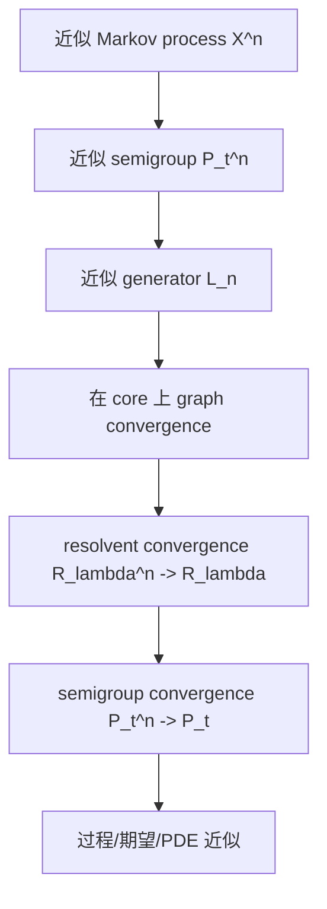

## 一页摘要

这份讲义讲 Markov semigroup 里的 Trotter--Kato approximation theorem。它解决的问题是：我们常常能写出近似过程的 generator $`L_n`$，也能猜到极限 generator $`L`$，但真正想要的是转移半群

$$
P_t^{(n)}f(x)=\mathbb E_x[f(X_t^{(n)})]
$$

收敛到

$$
P_tf(x)=\mathbb E_x[f(X_t)]
$$

并且最好在 $`t\in[0,T]`$ 上一致。Trotter--Kato theorem 的核心意思是：在 $`C_0(E)`$ 或类似 Banach 空间上，如果 Markov semigroup 都是 strongly continuous contractions，那么“generator 在 core 上收敛”可以通过 resolvent 转换成“semigroup 在 compact time interval 上收敛”。

本讲义会把三个层次分开：

- **Markov 层**：$`P_t`$ 是 positive contraction semigroup，保概率、保正性，适合描述过程。
- **Generator 层**：$`L`$ 是 $`t=0`$ 的 infinitesimal object，通常比 $`P_t`$ 更容易从模型中算出来。
- **Resolvent 层**：$`R_\lambda=(\lambda-L)^{-1}=\int_0^\infty e^{-\lambda t}P_tdt`$ 是证明里的桥。它把无界 generator 的问题变成有界 contraction 的问题。

最常用的 Markov 版本可以记成：若 $`D`$ 是 $`L`$ 的 core，且对每个 $`f\in D`$ 能找到 $`f_n\in\mathcal D(L_n)`$ 使

$$
\|f_n-f\|\to0,\qquad \|L_nf_n-Lf\|\to0,
$$

则对每个测试函数 $`g`$，

$$
\sup_{0\le t\le T}\|P_t^{(n)}g-P_tg\|\to0.
$$

证明路线不是直接比较 $`P_t^{(n)}`$ 和 $`P_t`$。正确路线是

$$
\text{generator graph convergence}
\Longrightarrow
\text{resolvent convergence}
\Longrightarrow
\text{semigroup convergence}.
$$

这份讲义会详细证明第一条箭头，并把第二条箭头作为 Hille--Yosida resolvent inversion 的 analytic core 单独展开说明：它不是 Markov 特有，而是 $`C_0`$ semigroup theory 的核心收敛引理。最后会给出扩散过程和 birth--death chain 的应用模板。

## 目录
<table_of_contents color="gray"/>

## 一、读者画像、预备知识与学习目标

默认读者是 目标读者：已经熟悉基本概率、Markov process、Banach space 上的线性算子语言，但希望证明路线不要跳过关键桥梁，尤其不要把“generator 收敛推出 semigroup 收敛”当作口号。

### 预备知识

需要的背景如下。

| 背景 | 本讲义怎么用 | 不需要什么 |
|---|---|---|
| Markov process 与 transition kernel | 理解 $`P_t f(x)=\mathbb E_x f(X_t)`$ | 不需要 general martingale problem 的完整理论 |
| Banach space 上的 contraction semigroup | 定义 generator、resolvent、strong convergence | 不需要 spectral theorem |
| 基本泛函分析 | 使用 dense core、closed operator、graph norm | 不需要 distribution theory |
| Laplace transform | 解释 resolvent 是半群的 Laplace transform | 不需要 complex inversion 细节 |

### 学习目标

| 层次 | 结束后应该会什么 | 本讲义提供什么 |
|---|---|---|
| 概念层 | 区分 generator convergence、resolvent convergence、semigroup convergence | 三层对象图和反例 |
| 技术层 | 能复现 core criterion 的 proof spine | 逐步证明 graph convergence $`\Rightarrow`$ resolvent convergence |
| 应用层 | 会在 Markov chain / diffusion approximation 中检查条件 | 两个 worked examples |
| 研究层 | 能判断一篇 process approximation 论文到底用了哪个版本 | 定理版本对照表和误区清单 |

**本节带走什么。**

- Trotter--Kato 不是“generator pointwise 收敛”这么简单；它需要在正确的 domain/core 上收敛。
- Markov 语境里最自然的 Banach 空间通常是 $`C_0(E)`$ 或 $`C_b(E)`$ 的某个 strongly continuous 子空间。
- 证明的桥梁是 resolvent，而不是直接对 transition kernels 做微分。

## 二、问题先行：为什么 Markov semigroup 需要 Trotter--Kato

设 $`E`$ 是状态空间，$`X=C_0(E)`$ 是无穷远处消失的连续函数空间，带 sup norm $`\|f\|=\sup_x|f(x)|`$。一个 Feller Markov process $`X_t`$ 给出 semigroup

$$
P_tf(x)=\mathbb E_x[f(X_t)].
$$

如果我们有一列近似过程 $`X_t^{(n)}`$，例如 random walk 近似 diffusion，或者粒子系统近似 deterministic flow，就会得到一列 semigroup $`P_t^{(n)}`$。真正想要的结论通常是

$$
\sup_{0\le t\le T}\|P_t^{(n)}f-P_tf\|\to0.
$$

这比单点 $`t`$ 收敛强，也比只说 finite-dimensional distributions 更适合做 PDE、expectation、control 或 invariant measure 的后续分析。

问题是：$`P_t^{(n)}`$ 往往很难直接算。相反，generator 很容易从短时间跃迁或 Itô formula 算出来：

$$
L_nf=\lim_{t\downarrow0}\frac{P_t^{(n)}f-f}{t}.
$$

Trotter--Kato theorem 正是在回答：什么时候可以只检查 $`L_n`$ 接近 $`L`$，就推出 $`P_t^{(n)}`$ 接近 $`P_t`$？

### 路线图

### 例子：random walk 近似 Brownian motion

令 $`Y_k^{(n)}`$ 是步长 $`1/n`$、时间步长 $`1/n^2`$ 的 symmetric random walk。其连续时间插值的 generator 在光滑紧支撑函数上满足

$$
L_nf(x)=\frac{n^2}{2}\{f(x+1/n)+f(x-1/n)-2f(x)\}.
$$

Taylor 展开给

$$
L_nf(x)=\frac12 f''(x)+O(n^{-2}\|f^{(4)}\|_\infty).
$$

极限 generator 是 Brownian generator

$$
Lf(x)=\frac12 f''(x).
$$

Trotter--Kato 告诉我们：如果选定的 core 足够好，比如 $`C_c^\infty(\mathbb R)`$ 对 Brownian generator 是 core，那么这个 generator convergence 能推出 random walk semigroup 收敛到 Brownian semigroup。

### 非例子：只在一个函数上算对 generator 不够

若只验证某一个 $`f`$ 满足 $`L_nf\to Lf`$，这不能推出整个 semigroup 收敛。原因是 generator 是一个 operator，收敛要控制一个足够大的 domain；如果只看一个测试函数，无法排除 $`L_n`$ 在其他方向上产生额外高速振荡或边界层。

一个有限维类比是矩阵 $`A_n`$ 在一个向量 $`v`$ 上满足 $`A_nv\to Av`$，但在 $`v^\perp`$ 上可能有很大的特征值或旋转。因此 $`e^{tA_n}`$ 未必接近 $`e^{tA}`$。无穷维 Markov generator 中，domain 控制更关键，因为 $`L_n`$ 和 $`L`$ 通常都是无界算子。

**本节带走什么。**

- Markov approximation 的目标是半群收敛，而不是只比较短时间 drift。
- Generator 易算，semigroup 难算；Trotter--Kato 是从 generator 回到 semigroup 的桥。
- 检查必须在 core 或 graph norm 意义下进行，只在少数函数上 pointwise 算对没有足够信息。

## 三、核心定义：Markov semigroup、generator 与 resolvent

### 核心定义一：Markov/Feller semigroup

令 $`X=C_0(E)`$。一族线性算子 $`(P_t)_{t\ge0}`$ 称为 $`X`$ 上的 strongly continuous Markov contraction semigroup，如果满足：

1. $`P_0=I`$，$`P_{t+s}=P_tP_s`$。
2. $`\|P_tf\|\le\|f\|`$，即 contraction。
3. 若 $`f\ge0`$，则 $`P_tf\ge0`$，即 positivity。
4. 对每个 $`f\in X`$，$`\|P_tf-f\|\to0`$ as $`t\downarrow0`$，即 strong continuity。

若 $`E`$ compact，常常还要求 $`P_t1=1`$。在 $`C_0(E)`$ 上常数 $`1`$ 不一定属于空间，所以用 sub-Markov 或 conservative Feller 语言会更精细；本讲义关注 approximation theorem 的 analytic mechanism，因此用 contraction 和 positivity 表达 Markov 结构。

### 核心定义二：generator

Generator $`L`$ 定义在 domain

$$
\mathcal D(L)=\left\{f\in X:\lim_{t\downarrow0}\frac{P_tf-f}{t}\text{ exists in }X\right\}
$$

上，并令

$$
Lf=\lim_{t\downarrow0}\frac{P_tf-f}{t}.
$$

这个定义的重点是 norm convergence，不是逐点 convergence。对 $`C_0(E)`$，它要求

$$
\left\|\frac{P_tf-f}{t}-Lf\right\|_\infty\to0.
$$

Generator 通常是无界算子，所以不能把 $`P_t`$ 简单写成普通矩阵指数。形式上可以写 $`P_t=e^{tL}`$，但证明时要通过 resolvent 或 Hille--Yosida theorem 解释这个指数。

### 核心定义三：resolvent

对 $`\lambda>0`$，定义 resolvent

$$
R_\lambda f=\int_0^\infty e^{-\lambda t}P_tf\,dt.
$$

因为 $`\|P_tf\|\le\|f\|`$，积分在 $`X`$ 中绝对收敛，并且

$$
\|R_\lambda f\|\le\frac1\lambda\|f\|.
$$

Hille--Yosida theory 给出

$$
R_\lambda=(\lambda-L)^{-1},
$$

也就是对每个 $`g\in X`$，$`h=R_\lambda g`$ 是唯一满足

$$
\lambda h-Lh=g
$$

的 domain 元素。

### 引理：resolvent identity

对任意 $`\lambda,\mu>0`$，有

$$
R_\lambda-R_\mu=(\mu-\lambda)R_\lambda R_\mu.
$$

**证明路线。** 用 $`R_\lambda=(\lambda-L)^{-1}`$ 的代数恒等式；也可以用 Laplace transform 和 semigroup property 直接计算。

**证明。** 令 $`h=R_\lambda R_\mu f`$。因为 resolvent 彼此 commute，代数上有

$$
(\lambda-L)R_\lambda=I,\qquad (\mu-L)R_\mu=I.
$$

于是

$$
R_\lambda-R_\mu
=R_\lambda(\mu-L)R_\mu-R_\lambda(\lambda-L)R_\mu
=(\mu-\lambda)R_\lambda R_\mu.
$$

这一步只用到两个 resolvent 是同一个 generator 的函数，因此可以相乘并交换。若从 Laplace transform 出发，也可以把双重积分写成

$$
R_\lambda R_\mu f
=\int_0^\infty\int_0^\infty e^{-\lambda s}e^{-\mu t}P_{s+t}f\,dsdt,
$$

然后换变量 $`u=s+t`$ 得到相同 identity。

### 正例与非例子

**正例。** Brownian semigroup 在 $`C_0(\mathbb R^d)`$ 上是 Feller semigroup，generator 是 $`L=\frac12\Delta`$，domain 包含 $`C_c^\infty(\mathbb R^d)`$，且该空间是一个常用 core。

**非例子。** 若一个 transition operator family 不满足 strong continuity，例如 $`P_tf=f`$ for $`t=0`$ 但 $`P_tf=Qf`$ for every $`t>0`$，其中 $`Q\ne I`$ 是某个 Markov operator，则 semigroup 即使代数上可能近似成立，也没有良好的 generator。Trotter--Kato 的 $`C_0`$ semigroup framework 不适用于这种跳变到另一个 operator 的族。

**本节带走什么。**

- Generator 是短时间导数，但定义在 graph norm 控制的 domain 上。
- Resolvent 是 semigroup 的 Laplace transform，也是 $`\lambda-L`$ 的 inverse。
- 证明 Trotter--Kato 时，resolvent 的 contraction bound $`\|R_\lambda\|\le1/\lambda`$ 是最常用的 estimate。

## 四、定理陈述：三个等价入口

### 版本对照表

| 版本 | 假设怎么写 | 结论 | 最适合什么场景 |
|---|---|---|---|
| Resolvent version | $`R_\lambda^{(n)}f\to R_\lambda f`$ | $`P_t^{(n)}f\to P_tf`$ uniformly on $`[0,T]`$ | 抽象 semigroup theory |
| Generator graph version | 对 $`f\in\mathcal D(L)`$ 找 $`f_n`$，使 $`f_n\to f`$ 且 $`L_nf_n\to Lf`$ | resolvent 收敛，再推出 semigroup 收敛 | unbounded generator |
| Core version | 只在 core $`D`$ 上检查 graph convergence | 同上 | Markov process approximation |
| Martingale-problem version | generator convergence + well-posedness + compact containment | process-level weak convergence | Ethier--Kurtz 路线 |

### 定理 A：Trotter--Kato resolvent form

设 $`(P_t^{(n)})`$ 和 $`(P_t)`$ 是 Banach space $`X`$ 上的 strongly continuous contraction semigroups，generators 分别为 $`L_n`$ 和 $`L`$，resolvents 为 $`R_\lambda^{(n)}`$ 和 $`R_\lambda`$。则以下两件事等价：

1. 对每个 $`f\in X`$ 和每个 $`T<\infty`$，

$$
\sup_{0\le t\le T}\|P_t^{(n)}f-P_tf\|\to0.
$$

2. 对每个 $`f\in X`$ 和某个等价地每个 $`\lambda>0`$，

$$
\|R_\lambda^{(n)}f-R_\lambda f\|\to0.
$$

### 定理 B：Markov semigroup 的 core criterion

设 $`P_t^{(n)}`$ 和 $`P_t`$ 是 $`X=C_0(E)`$ 上的 Feller contraction semigroups，generators 为 $`L_n`$ 和 $`L`$。设 $`D\subset\mathcal D(L)`$ 是 $`L`$ 的 core，也就是 $`D`$ 在 graph norm

$$
\|f\|_L=\|f\|+\|Lf\|
$$

下 dense in $`\mathcal D(L)`$。若对每个 $`f\in D`$，存在 $`f_n\in\mathcal D(L_n)`$ 使

$$
\|f_n-f\|\to0,
\qquad
\|L_nf_n-Lf\|\to0,
$$

则对每个 $`g\in X`$ 和每个 $`T<\infty`$，

$$
\sup_{0\le t\le T}\|P_t^{(n)}g-P_tg\|\to0.
$$

这就是 Markov approximation 中最常用的 Trotter--Kato 形式。

### 证明路线

定理 B 的证明分三步：

1. 用 core density 把任意 $`h=R_\lambda g`$ 逼近到 $`D`$。
2. 用 graph convergence 证明 $`R_\lambda^{(n)}g\to R_\lambda g`$。
3. 用定理 A 的 resolvent-to-semigroup implication 得到 compact-time semigroup convergence。

**本节带走什么。**

- 定理 A 是 analytic equivalence；定理 B 是 Markov 应用时最方便的 sufficient condition。
- Core 的作用是避免在整个 generator domain 上直接构造 $`f_n`$。
- 证明中最重要的估计来自 resolvent contraction bound。

## 五、主证明第一半：semigroup convergence 推出 resolvent convergence

这一节证明定理 A 的一个方向。它比较直接，但很重要，因为它解释了为什么 resolvent 是 semigroup 收敛的自然观测量。

### 命题

若对每个 $`f\in X`$ 和每个 $`T<\infty`$，有

$$
\sup_{0\le t\le T}\|P_t^{(n)}f-P_tf\|\to0,
$$

则对每个 $`\lambda>0`$，

$$
\|R_\lambda^{(n)}f-R_\lambda f\|\to0.
$$

### 证明路线

把 resolvent 差写成 Laplace integral，然后把积分分成 $`[0,T]`$ 和 tail $`[T,\infty)`$。前半段由 compact-time semigroup convergence 控制，后半段由 contraction 和指数衰减控制。

### 证明

由 resolvent 定义，

$$
R_\lambda^{(n)}f-R_\lambda f
=\int_0^\infty e^{-\lambda t}(P_t^{(n)}f-P_tf)\,dt.
$$

取范数并用 triangle inequality：

$$
\|R_\lambda^{(n)}f-R_\lambda f\|
\le
\int_0^\infty e^{-\lambda t}\|P_t^{(n)}f-P_tf\|\,dt.
$$

固定 $`\varepsilon>0`$。因为 semigroups 都是 contractions，

$$
\|P_t^{(n)}f-P_tf\|
\le \|P_t^{(n)}f\|+\|P_tf\|
\le2\|f\|.
$$

选择 $`T`$ 使 tail 满足

$$
\int_T^\infty e^{-\lambda t}2\|f\|\,dt
=\frac{2\|f\|}{\lambda}e^{-\lambda T}
<\frac\varepsilon2.
$$

在 $`[0,T]`$ 上，由假设存在 $`N`$，当 $`n\ge N`$ 时

$$
\sup_{0\le t\le T}\|P_t^{(n)}f-P_tf\|
<\frac{\lambda\varepsilon}{2}.
$$

于是

$$
\int_0^T e^{-\lambda t}\|P_t^{(n)}f-P_tf\|\,dt
\le
\frac{\lambda\varepsilon}{2}\int_0^T e^{-\lambda t}\,dt
\le\frac\varepsilon2.
$$

两段相加得到 $`\|R_\lambda^{(n)}f-R_\lambda f\|<\varepsilon`$。命题得证。

### 假设在哪里用

| 假设 | 使用位置 | 如果缺失会怎样 |
|---|---|---|
| compact-time uniform convergence | 控制 $`[0,T]`$ 积分 | 只能得到 subsequence 或单点弱结论 |
| contraction bound | 控制 tail | 指数 tail 可能压不住 semigroup growth |
| $`\lambda>0`$ | 让 Laplace tail 有衰减 | $`\lambda=0`$ 时 integral 不一定存在 |

**本节带走什么。**

- Semigroup convergence 到 resolvent convergence 是 dominated-convergence style 的证明。
- 这一步不需要 Markov positivity，只需要 contraction 或统一指数有界性。
- 真正困难的方向是反过来：resolvent convergence 如何恢复所有 compact-time semigroup values。

## 六、主证明第二半：core graph convergence 推出 resolvent convergence

这一节证明定理 B 中最常用、最可操作的部分。它是 Trotter--Kato 在 Markov 近似中的核心计算。

### 命题

在定理 B 的假设下，对每个 $`g\in X`$ 和每个 $`\lambda>0`$，

$$
\|R_\lambda^{(n)}g-R_\lambda g\|\to0.
$$

### 证明路线

给定 $`g`$，先令

$$
h=R_\lambda g.
$$

则 $`h\in\mathcal D(L)`$ 且

$$
(\lambda-L)h=g.
$$

因为 $`D`$ 是 core，可以用 $`\phi\in D`$ 在 graph norm 中逼近 $`h`$。再由假设找 $`\phi_n\in\mathcal D(L_n)`$ 逼近 $`\phi`$ 和 $`L\phi`$。关键 identity 是

$$
R_\lambda^{(n)}(\lambda-L_n)\phi_n=\phi_n.
$$

这把 generator graph convergence 转成 resolvent convergence。

### 完整证明

固定 $`g\in X`$、$`\lambda>0`$ 和 $`\varepsilon>0`$。令

$$
h=R_\lambda g.
$$

则 $`h\in\mathcal D(L)`$，并满足

$$
g=(\lambda-L)h.
$$

因为 $`D`$ 是 $`L`$ 的 core，存在 $`\phi\in D`$ 使

$$
\|\phi-h\|+\|L\phi-Lh\|<\delta,
$$

其中 $`\delta>0`$ 稍后选择。定义

$$
g_\phi=(\lambda-L)\phi.
$$

先估计 $`g_\phi`$ 和 $`g`$ 的距离：

$$
\begin{aligned}
\|g_\phi-g\|
&=\|(\lambda-L)\phi-(\lambda-L)h\|\\
&\le \lambda\|\phi-h\|+\|L\phi-Lh\|\\
&\le (\lambda+1)\delta.
\end{aligned}
$$

由 graph convergence 假设，对这个 $`\phi\in D`$，存在 $`\phi_n\in\mathcal D(L_n)`$ 使

$$
\|\phi_n-\phi\|\to0,
\qquad
\|L_n\phi_n-L\phi\|\to0.
$$

于是

$$
\begin{aligned}
\|(\lambda-L_n)\phi_n-g_\phi\|
&=\|\lambda\phi_n-L_n\phi_n-(\lambda\phi-L\phi)\|\\
&\le \lambda\|\phi_n-\phi\|+\|L_n\phi_n-L\phi\|\\
&\to0.
\end{aligned}
$$

现在使用 resolvent identity for $`L_n`$：因为 $`\phi_n\in\mathcal D(L_n)`$，

$$
R_\lambda^{(n)}(\lambda-L_n)\phi_n=\phi_n.
$$

所以

$$
\begin{aligned}
\|R_\lambda^{(n)}g_\phi-\phi\|
&\le
\|R_\lambda^{(n)}g_\phi-R_\lambda^{(n)}(\lambda-L_n)\phi_n\|+\|\phi_n-\phi\|\\
&\le
\|R_\lambda^{(n)}\|\cdot\|g_\phi-(\lambda-L_n)\phi_n\|+\|\phi_n-\phi\|\\
&\le
\frac1\lambda\|g_\phi-(\lambda-L_n)\phi_n\|+\|\phi_n-\phi\|.
\end{aligned}
$$

右边趋于 $`0`$。因此

$$
R_\lambda^{(n)}g_\phi\to\phi.
$$

接下来把 $`g_\phi`$ 换回原来的 $`g`$。由 contraction resolvent bound，

$$
\|R_\lambda^{(n)}(g-g_\phi)\|
\le\frac1\lambda\|g-g_\phi\|,
\qquad
\|R_\lambda(g-g_\phi)\|
\le\frac1\lambda\|g-g_\phi\|.
$$

于是

$$
\begin{aligned}
\|R_\lambda^{(n)}g-R_\lambda g\|
&\le
\|R_\lambda^{(n)}(g-g_\phi)\|
+\|R_\lambda^{(n)}g_\phi-\phi\|\\
&\quad +\|\phi-h\|+\|h-R_\lambda g\|.
\end{aligned}
$$

最后一项为 $`0`$，因为 $`h=R_\lambda g`$。因此

$$
\|R_\lambda^{(n)}g-R_\lambda g\|
\le
\frac1\lambda\|g-g_\phi\|
+\|R_\lambda^{(n)}g_\phi-\phi\|
+\|\phi-h\|.
$$

对固定的 $`\phi`$，中间项随 $`n\to\infty`$ 消失。其他两项由 core 逼近控制：

$$
\frac1\lambda\|g-g_\phi\|+\|\phi-h\|
\le
\frac{\lambda+1}{\lambda}\delta+\delta.
$$

先选 $`\delta`$ 使右边小于 $`\varepsilon/2`$，再选 $`n`$ 使中间项小于 $`\varepsilon/2`$，得到

$$
\|R_\lambda^{(n)}g-R_\lambda g\|<\varepsilon.
$$

命题得证。

### 假设在哪里用

| 假设 | 使用位置 | 弱化后的风险 |
|---|---|---|
| $`D`$ 是 core | 用 $`\phi\in D`$ graph-norm 逼近 $`h=R_\lambda g`$ | 只能证明 resolvent 在小范围上收敛 |
| $`f_n\to f`$ | 保证 $`\lambda f_n`$ 部分收敛 | resolvent identity 的输入不收敛 |
| $`L_nf_n\to Lf`$ | 保证 $`(\lambda-L_n)f_n\to(\lambda-L)f`$ | 只收敛函数本身不能控制 generator |
| contraction resolvent bound | 把 input error 变成 output error | 若只有指数有界，需要额外常数 $`M/(\lambda-\omega)`$ |

### 反例：为什么不能只要求 $`f_n=f`$

有些近似过程的 state space 或 boundary condition 随 $`n`$ 变化。此时同一个函数 $`f`$ 未必属于 $`\mathcal D(L_n)`$，或者虽然属于但 $`L_nf`$ 在边界附近不收敛。Trotter--Kato 允许选择 $`f_n`$，正是为了吸收 boundary layer、格点插值、截断 domain 等误差。

**本节带走什么。**

- Graph convergence 的本质是 $`(\lambda-L_n)f_n`$ 接近 $`(\lambda-L)f`$。
- Resolvent contraction bound 是把 generator approximation 变成 semigroup approximation 的第一块砖。
- Core 的作用是把所有 $`R_\lambda g`$ 都拉回可验证的测试函数类。

## 七、analytic core：resolvent convergence 如何恢复 semigroup convergence

上一节已经证明了 Markov 应用中最需要手算的部分。本节证明定理 A 的困难方向：为什么

$$
R_\lambda^{(n)}f\to R_\lambda f
$$

能推出

$$
P_t^{(n)}f\to P_tf
$$

在 $`t\in[0,T]`$ 上一致。证明的工具是 Yosida approximation。它把无界 generator $`L`$ 换成有界算子

$$
B_m=m^2R_m-mI=mLR_m,
$$

再用 $`e^{tB_m}`$ 逼近 $`P_t`$。

### 引理：Hille--Yosida / Trotter--Kato resolvent inversion

设 $`P_t^{(n)}`$ 和 $`P_t`$ 是 Banach space $`X`$ 上的 contraction $`C_0`$ semigroups，generators 为 $`L_n`$ 和 $`L`$。若对所有 $`\lambda>0`$ 与 $`f\in X`$，

$$
R_\lambda^{(n)}f\to R_\lambda f,
$$

则对所有 $`T<\infty`$ 与 $`f\in X`$，

$$
\sup_{0\le t\le T}\|P_t^{(n)}f-P_tf\|\to0.
$$

### 证明路线

证明分四步：

1. resolvent convergence 给出 bounded Yosida generators $`B_{n,m}=m^2R_m^{(n)}-mI`$ 的 strong convergence；
2. $`e^{tB_{n,m}}`$ 对 fixed $`m`$ 收敛到 $`e^{tB_m}`$；
3. $`e^{tB_m}`$ 用一个 Gamma/Poisson 时间平均逼近 $`P_t`$，且对 domain vectors 有显式误差；
4. 先在 $`\mathcal D(L)`$ 上证明 semigroup convergence，再用 density 和 contraction 延拓到全部 $`X`$。

### 第一步：Yosida generators 的 strong convergence

固定 $`m>0`$。定义

$$
B_{n,m}=m^2R_m^{(n)}-mI,
\qquad
B_m=m^2R_m-mI.
$$

由 resolvent convergence，

$$
B_{n,m}x\to B_mx
$$

for every $`x\in X`$。同时由 resolvent contraction bound，

$$
\|B_{n,m}\|
\le m^2\|R_m^{(n)}\|+m
\le 2m,
\qquad
\|B_m\|\le2m.
$$

因此 $`B_{n,m}`$ 是一列 uniformly bounded operators，并且 strong converge to $`B_m`$。

### 第二步：bounded exponentials 的 convergence

固定 $`m`$ 和 $`T`$。我们证明

$$
\sup_{0\le t\le T}\|e^{tB_{n,m}}x-e^{tB_m}x\|\to0
$$

for every $`x\in X`$。因为 $`B_{n,m}`$ 和 $`B_m`$ 都是 bounded operators，Duhamel formula 给

$$
 e^{tB_{n,m}}x-e^{tB_m}x
=\int_0^t e^{(t-s)B_{n,m}}(B_{n,m}-B_m)e^{sB_m}x\,ds.
$$

Yosida exponential 还是 contraction。原因是

$$
e^{tB_{n,m}}
=e^{-mt}\sum_{k=0}^\infty \frac{(mt)^k}{k!}(mR_m^{(n)})^k,
$$

而 $`\|mR_m^{(n)}\|\le1`$，所以 $`\|e^{tB_{n,m}}\|\le1`$。同理 $`\|e^{tB_m}\|\le1`$。

集合

$$
K_T=\{e^{sB_m}x:0\le s\le T\}
$$

是 compact 的，因为 $`s\mapsto e^{sB_m}x`$ 连续且 $`[0,T]`$ compact。Strong convergence $`B_{n,m}y\to B_my`$ 加上 uniform boundedness $`\sup_n\|B_{n,m}-B_m\|\le4m`$，在 compact set $`K_T`$ 上升级为 uniform convergence：

$$
\sup_{y\in K_T}\|(B_{n,m}-B_m)y\|\to0.
$$

于是

$$
\begin{aligned}
\sup_{0\le t\le T}\|e^{tB_{n,m}}x-e^{tB_m}x\|
&\le \int_0^T\sup_{y\in K_T}\|(B_{n,m}-B_m)y\|\,ds\\
&=T\sup_{y\in K_T}\|(B_{n,m}-B_m)y\|\to0.
\end{aligned}
$$

这证明了 fixed $`m`$ 的 bounded exponential convergence。

### 第三步：Yosida approximation 的概率表示和误差估计

现在证明 $`e^{tB_m}`$ 逼近 $`P_t`$。先对任意 contraction semigroup $`Q_t`$ 说明通用估计。令 generator 为 $`A`$，resolvent 为 $`S_m`$，Yosida generator 为

$$
C_m=m^2S_m-mI.
$$

由 resolvent 的 Laplace 表示，

$$
mS_mx=\int_0^\infty me^{-ms}Q_sx\,ds.
$$

若 $`E_1,E_2,\ldots`$ 是 rate $`m`$ 的 exponential random variables，则

$$
(mS_m)^kx=\mathbb E[Q_{E_1+\cdots+E_k}x].
$$

这是由 iterated integral 和 semigroup property $`Q_{s_1}\cdots Q_{s_k}=Q_{s_1+\cdots+s_k}`$ 得到的。又因为

$$
e^{tC_m}=e^{-mt}\sum_{k=0}^\infty\frac{(mt)^k}{k!}(mS_m)^k,
$$

若 $`N`$ 服从 Poisson distribution with mean $`mt`$，并令

$$
S_{m,t}=E_1+\cdots+E_N
$$

其中 $`N=0`$ 时 $`S_{m,t}=0`$，则

$$
e^{tC_m}x=\mathbb E[Q_{S_{m,t}}x].
$$

这个随机时间的均值和方差为

$$
\mathbb E S_{m,t}=t,
\qquad
\operatorname{Var}(S_{m,t})=\frac{2t}{m}.
$$

若 $`x\in\mathcal D(A)`$，则对任意 $`s,t\ge0`$，variation formula 给

$$
Q_sx-Q_tx=\int_t^s Q_rAx\,dr
$$

其中若 $`s<t`$，积分按负方向理解。因此

$$
\|Q_sx-Q_tx\|\le |s-t|\|Ax\|.
$$

于是对 $`0\le t\le T`$，

$$
\begin{aligned}
\|e^{tC_m}x-Q_tx\|
&\le \mathbb E\|Q_{S_{m,t}}x-Q_tx\|\\
&\le \mathbb E|S_{m,t}-t|\,\|Ax\|\\
&\le \sqrt{\operatorname{Var}(S_{m,t})}\,\|Ax\|\\
&\le \sqrt{\frac{2T}{m}}\|Ax\|.
\end{aligned}
$$

因此

$$
\sup_{0\le t\le T}\|e^{tC_m}x-Q_tx\|
\le
\sqrt{\frac{2T}{m}}\|Ax\|.
$$

这个 estimate 很重要：它不依赖 semigroup 的其他细节，只依赖 contraction 和 $`\|Ax\|`$。

### 第四步：在 domain 上证明 convergence

先取 $`x\in\mathcal D(L)`$。由 resolvent convergence，固定一个 $`\alpha>0`$，定义

$$
x_n=R_\alpha^{(n)}(\alpha-L)x.
$$

则

$$
x_n\to R_\alpha(\alpha-L)x=x.
$$

并且 $`x_n\in\mathcal D(L_n)`$，且

$$
L_nx_n=\alpha x_n-(\alpha-L)x\to Lx.
$$

于是 $`\sup_n\|L_nx_n\|<\infty`$ for all sufficiently large $`n`$。

对 $`0\le t\le T`$，写三角分解：

$$
\begin{aligned}
\|P_t^{(n)}x-P_tx\|
&\le \|P_t^{(n)}(x-x_n)\|\\
&\quad +\|P_t^{(n)}x_n-e^{tB_{n,m}}x_n\|\\
&\quad +\|e^{tB_{n,m}}x_n-e^{tB_m}x\|\\
&\quad +\|e^{tB_m}x-P_tx\|.
\end{aligned}
$$

第一项由 contraction 控制为 $`\|x-x_n\|`$。第二项对 semigroup $`P_t^{(n)}`$ 使用第三步的 estimate，得到

$$
\sup_{0\le t\le T}\|P_t^{(n)}x_n-e^{tB_{n,m}}x_n\|
\le
\sqrt{\frac{2T}{m}}\|L_nx_n\|.
$$

第四项对极限 semigroup 使用同一 estimate：

$$
\sup_{0\le t\le T}\|e^{tB_m}x-P_tx\|
\le
\sqrt{\frac{2T}{m}}\|Lx\|.
$$

第三项在 fixed $`m`$ 下由第二步得到

$$
\sup_{0\le t\le T}\|e^{tB_{n,m}}x_n-e^{tB_m}x\|\to0,
$$

因为 $`x_n\to x`$ 且 $`e^{tB_{n,m}}`$ 是 contractions。

现在给出 $`\varepsilon`$ argument。先选 $`m`$ 大，使

$$
\sqrt{\frac{2T}{m}}\left(\sup_{n\ge N_0}\|L_nx_n\|+\|Lx\|\right)<\frac\varepsilon3.
$$

再在这个 fixed $`m`$ 下取 $`n`$ 大，使 $`\|x-x_n\|<\varepsilon/3`$ 且 bounded exponential 中间项小于 $`\varepsilon/3`$。于是

$$
\sup_{0\le t\le T}\|P_t^{(n)}x-P_tx\|<\varepsilon.
$$

这证明了 convergence for all $`x\in\mathcal D(L)`$。

### 第五步：由 domain density 延拓到全部空间

Generator of a $`C_0`$ semigroup has dense domain，所以 $`\mathcal D(L)`$ dense in $`X`$。给定 $`f\in X`$ 和 $`\varepsilon>0`$，取 $`x\in\mathcal D(L)`$ 使

$$
\|f-x\|<\varepsilon.
$$

由 contraction，

$$
\begin{aligned}
\sup_{0\le t\le T}\|P_t^{(n)}f-P_tf\|
&\le \sup_t\|P_t^{(n)}(f-x)\|+\sup_t\|P_t^{(n)}x-P_tx\|+\sup_t\|P_t(x-f)\|\\
&\le 2\varepsilon+\sup_t\|P_t^{(n)}x-P_tx\|.
\end{aligned}
$$

对这个 $`x`$，上一段已经证明中间项趋于 $`0`$。先取 $`n`$ 大，再让 $`\varepsilon`$ 小，就得到

$$
\sup_{0\le t\le T}\|P_t^{(n)}f-P_tf\|\to0.
$$

引理证明完成。

### 为什么这个引理不是普通 Laplace transform 唯一性

单纯知道一列 bounded functions 的 Laplace transforms 收敛，不一定给出 uniform-in-time convergence。这里能推出结论，依赖的是额外 semigroup structure：

- $`P_{t+s}=P_tP_s`$ 给时间方向的刚性；
- contraction bound 给 Yosida approximation 的统一误差；
- strong continuity 让 generator domain dense；
- resolvent identity 保证不同 $`\lambda`$ 的 Laplace 信息来自同一个 generator。

这也是为什么 Trotter--Kato theorem 是 semigroup theorem，而不是普通 Laplace transform theorem。

**本节带走什么。**

- Resolvent-to-semigroup 可以用 Yosida approximation 证明，不只是抽象引用。
- 关键 estimate 是 $`\sup_{t\le T}\|e^{tC_m}x-Q_tx\|\le\sqrt{2T/m}\|Ax\|`$。
- Graph approximation 先给 domain vectors 上的 convergence，再由 contraction 和 density 延拓到全部测试函数。
## 八、合并证明：Markov core criterion 的完整逻辑

现在把前面几节拼起来，给出定理 B 的完整证明链。

### 定理 B 重述

设 $`P_t^{(n)}`$ 和 $`P_t`$ 是 $`C_0(E)`$ 上的 Feller contraction semigroups，generators 为 $`L_n`$ 和 $`L`$。设 $`D`$ 是 $`L`$ 的 core。若对每个 $`f\in D`$，存在 $`f_n\in\mathcal D(L_n)`$ 使

$$
f_n\to f,
\qquad
L_nf_n\to Lf,
$$

则

$$
\sup_{0\le t\le T}\|P_t^{(n)}g-P_tg\|\to0
$$

for every $`g\in C_0(E)`$ and $`T<\infty`$。

### 证明

第一步，由第六节命题，对每个 $`\lambda>0`$ 和每个 $`g\in X`$，

$$
R_\lambda^{(n)}g\to R_\lambda g.
$$

这一步已经逐行证明过，使用了 core、graph convergence 和 resolvent contraction。

第二步，由第七节 Hille--Yosida resolvent inversion convergence，引出 compact-time semigroup convergence：

$$
\sup_{0\le t\le T}\|P_t^{(n)}g-P_tg\|\to0.
$$

这就是定理 B 的结论。

### 假设在哪里用

| 假设 | 用于哪条箭头 | 数学角色 |
|---|---|---|
| $`P_t^{(n)}`$ 和 $`P_t`$ 是 contraction semigroups | resolvent bound 和 inversion lemma | 控制所有 approximation constants |
| $`D`$ 是 core | generator $`\Rightarrow`$ resolvent | 把 $`R_\lambda g`$ 逼近到可检查函数 |
| 存在 $`f_n`$ with graph convergence | generator $`\Rightarrow`$ resolvent | 把 $`(\lambda-L_n)f_n`$ 接到 $`(\lambda-L)f`$ |
| strong continuity | inversion lemma | 确保 generator 和 semigroup 一一对应 |
| Markov positivity | approximation theorem 本身不强依赖 | 保证极限 semigroup 仍有概率解释 |

### 一个可操作 checklist

在具体 Markov approximation 里，可以按以下顺序检查：

1. 明确状态空间和 Banach space：是 $`C_0(E)`$、$`C_b(E)`$、还是 weighted space。
2. 证明 $`P_t^{(n)}`$ 和候选 $`P_t`$ 是 strongly continuous contractions。
3. 写出 generator $`L_n`$ 和 $`L`$。
4. 选 core $`D`$，比如 $`C_c^\infty`$、polynomial core、cylinder functions。
5. 对每个 $`f\in D`$ 构造 $`f_n`$，通常是 restriction、interpolation、mollification 或 boundary correction。
6. 证明 $`\|f_n-f\|\to0`$ 和 $`\|L_nf_n-Lf\|\to0`$。
7. 调用 Trotter--Kato 得到 semigroup convergence。

**本节带走什么。**

- 定理 B 的 proof burden 集中在两个地方：core 的选择和 $`f_n`$ 的构造。
- Resolvent proof 是桥梁；不应该跳过它，因为它解释了 graph convergence 为什么足够。
- Markov positivity 保证概率语义，但 approximation theorem 的收敛机制主要是 contraction semigroup theory。

## 九、Worked example：格点 random walk 到 Brownian semigroup

这一节把 theorem 用到一个经典例子，目的是展示 $`f_n`$ 可以取 $`f`$ 本身，也展示 Taylor expansion 如何承担 generator convergence。

### 模型

令状态空间 $`E_n=n^{-1}\mathbb Z`$，考虑连续时间 random walk：从 $`x`$ 以 rate $`n^2/2`$ 跳到 $`x+1/n`$，以 rate $`n^2/2`$ 跳到 $`x-1/n`$。在格点函数上 generator 为

$$
L_nf(x)=\frac{n^2}{2}\{f(x+1/n)+f(x-1/n)-2f(x)\}.
$$

候选极限是 Brownian motion，generator

$$
Lf(x)=\frac12 f''(x).
$$

为了放在共同空间 $`C_0(\mathbb R)`$，可以把 $`P_t^{(n)}`$ 看成先限制到格点、运行 random walk、再用 piecewise-linear interpolation 回到 $`C_0(\mathbb R)`$ 的 operators。讲义里不展开 interpolation 的所有技术，只检查最核心的 generator convergence。

### Core 选择

取

$$
D=C_c^\infty(\mathbb R).
$$

这是 Brownian generator $`L=\frac12\frac{d^2}{dx^2}`$ 在 $`C_0(\mathbb R)`$ 上的 core。直觉上，紧支撑光滑函数足以逼近 domain 中的函数及其二阶导数；这可以由 mollification 和 cutoff 构造证明。

### Generator convergence

对 $`f\in C_c^\infty(\mathbb R)`$，Taylor 展开到四阶：

$$
f(x+h)=f(x)+hf'(x)+\frac{h^2}{2}f''(x)+\frac{h^3}{6}f^{(3)}(x)+\frac{h^4}{24}f^{(4)}(\xi_+),
$$

$$
f(x-h)=f(x)-hf'(x)+\frac{h^2}{2}f''(x)-\frac{h^3}{6}f^{(3)}(x)+\frac{h^4}{24}f^{(4)}(\xi_-).
$$

相加减去 $`2f(x)`$，一阶项和三阶项抵消，得到

$$
f(x+h)+f(x-h)-2f(x)
=h^2f''(x)+\frac{h^4}{24}\{f^{(4)}(\xi_+)+f^{(4)}(\xi_-)\}.
$$

令 $`h=1/n`$，

$$
L_nf(x)
=\frac12 f''(x)+O(n^{-2}\|f^{(4)}\|_\infty).
$$

因此

$$
\|L_nf-Lf\|_\infty\le Cn^{-2}\|f^{(4)}\|_\infty\to0.
$$

这里可以取 $`f_n=f`$，不需要 boundary correction。

### 结论

Trotter--Kato 给出：对每个 $`g\in C_0(\mathbb R)`$，

$$
\sup_{0\le t\le T}\|P_t^{(n)}g-P_tg\|_\infty\to0.
$$

概率语言里，这意味着对每个连续消失测试函数 $`g`$，random walk 的期望 $`\mathbb E_xg(X_t^{(n)})`$ uniform in $`x`$ 和 compact time 收敛到 Brownian expectation。

### 非例子：尺度选错会得到不同极限

如果跳跃 rate 取成 $`n`$ 而不是 $`n^2`$，则

$$
L_nf(x)=\frac n2\{f(x+1/n)+f(x-1/n)-2f(x)\}
\approx \frac{1}{2n}f''(x)\to0.
$$

极限 generator 是 $`0`$，对应 frozen process，而不是 Brownian motion。这个例子说明：Trotter--Kato 不会替你选择正确 scaling；它只保证你检查出来的 generator limit 对应 semigroup limit。

**本节带走什么。**

- Diffusion approximation 的 generator convergence 往往就是 Taylor expansion。
- 选择正确 time scaling 是 theorem 之外的建模步骤。
- Core 上的 uniform generator error 是最干净的 Trotter--Kato 检查方式。

## 十、Worked example：birth--death chain 到一阶 transport semigroup

这一节展示另一个常见情形：极限不是 diffusion，而是 deterministic flow。

### 模型

令 $`X_t^{(n)}`$ 是 $`\{0,1/n,2/n,\ldots,1\}`$ 上的 birth--death chain。假设从 $`x`$ 向上跳 $`1/n`$ 的 rate 是 $`n b(x)`$，向下跳 $`1/n`$ 的 rate 是 $`n d(x)`$，其中 $`b,d`$ 连续且边界 rate 使过程留在 $`[0,1]`$。

Generator 为

$$
L_nf(x)=n b(x)\{f(x+1/n)-f(x)\}+n d(x)\{f(x-1/n)-f(x)\}.
$$

对 $`f\in C^2([0,1])`$，Taylor 展开给

$$
n\{f(x+1/n)-f(x)\}=f'(x)+O(n^{-1}\|f''\|_\infty),
$$

$$
n\{f(x-1/n)-f(x)\}=-f'(x)+O(n^{-1}\|f''\|_\infty).
$$

所以候选极限 generator 是

$$
Lf(x)=\{b(x)-d(x)\}f'(x).
$$

这对应 deterministic ODE

$$
\dot x_t=b(x_t)-d(x_t).
$$

### Boundary correction 为什么可能需要 $`f_n`$

如果边界处 $`b(1)>0`$ 或 $`d(0)>0`$ 但 chain 被反射或截断，$`L_nf`$ 在边界可能不等于简单 Taylor expansion 的结果。此时直接取 $`f_n=f`$ 可能失败，需要构造满足近似边界条件的 $`f_n`$。

这正是定理 B 允许 $`f_n`$ 随 $`n`$ 改变的原因。一个典型做法是：在离边界 $`O(1/n)`$ 的薄层内修正 $`f`$，使离散 generator 的边界项与极限 generator 匹配，同时保持

$$
\|f_n-f\|\to0,
\qquad
\|L_nf_n-Lf\|\to0.
$$

### 结论

一旦 graph convergence 成立，Trotter--Kato 给出 semigroup convergence：

$$
P_t^{(n)}g(x)\to g(\Phi_t(x)),
$$

其中 $`\Phi_t`$ 是 ODE flow。这个结论把大规模 birth--death chain 的 expectation 近似成 deterministic mean-field flow。

**本节带走什么。**

- Jump rate 为 $`n`$、jump size 为 $`1/n`$ 时，一阶 drift survive，二阶 diffusion term 消失。
- Boundary 是 Trotter--Kato proof 中最容易漏掉的地方。
- $`f_n`$ 的自由度是处理 boundary layer 和离散 state space 的技术空间。

## 十一、常见误解与判断清单

### 常见误解

**误区一：只要 $`L_nf\to Lf`$ 就可以。** 不够。必须说明对哪些 $`f`$ 成立，以及这个函数类是否是 $`L`$ 的 core。否则 generator limit 可能只在太小的测试类上成立。

**误区二：逐点 convergence 等于 norm convergence。** 在 $`C_0(E)`$ 上，Trotter--Kato 用的是 sup norm convergence。逐点 Taylor expansion 要升级成 uniform bound，通常需要 compact support、uniform derivative bound 或 tightness/weight 控制。

**误区三：Markov positivity 自动给收敛。** Positivity 保持概率语义，但不替代 resolvent 或 generator graph convergence。很多 positive contractions 可以有完全不同的 generators。

**误区四：core 可以随便选。** Core 要在 graph norm 下 dense。一个代数上方便的函数类如果不能逼近 domain 元素及其 generator image，就不能支撑 theorem。

**误区五：边界条件可以最后再管。** 对 generator convergence，边界项常常是主误差。扩散近似、反射过程、吸收过程、截断状态空间都可能因为边界层导致 $`L_nf\not\to Lf`$。

### 判断清单

| 检查项 | 要回答的问题 | 失败信号 |
|---|---|---|
| State space | 所有 $`P_t^{(n)}`$ 是否作用在共同 Banach space 上 | 每个 $`n`$ 的空间不同但没有 embedding/interpolation |
| Semigroup property | 是否有 $`P_{t+s}^{(n)}=P_t^{(n)}P_s^{(n)}`$ 和 strong continuity | 只有离散时间 kernel 却直接套连续时间 theorem |
| Core | 选的 $`D`$ 是否是 $`L`$ 的 graph core | 只说“取光滑函数”，没有证明或引用 core 性质 |
| Graph convergence | 是否同时证明 $`f_n\to f`$ 和 $`L_nf_n\to Lf`$ | 只证明 generator 形式上 pointwise 收敛 |
| Resolvent/semigroup conclusion | 结论是 norm、weak、还是 finite-dimensional distribution 收敛 | 把不同 topology 的结论混用 |

**本节带走什么。**

- Trotter--Kato 检查的是 operator convergence，不是形式 Taylor expansion。
- Core、norm、boundary 是三个最常见 failure point。
- 读论文时要追问：作者到底证明了 graph convergence、resolvent convergence，还是只写了 formal generator limit？

## 十二、分层练习

Level 0：写出 $`R_\lambda f=\int_0^\infty e^{-\lambda t}P_tfdt`$ 的 contraction bound，并说明为什么 $`\lambda>0`$ 必要。

Level 1：完整复现第六节证明中

$$
\|R_\lambda^{(n)}g_\phi-\phi\|
\le
\frac1\lambda\|g_\phi-(\lambda-L_n)\phi_n\|+\|\phi_n-\phi\|
$$

这一行，标出用了哪个 resolvent identity。

Level 2：对 asymmetric random walk，假设向右跳 rate 为 $`n^2/2+nb/2`$，向左跳 rate 为 $`n^2/2-nb/2`$，jump size 为 $`1/n`$。计算 generator limit，并写出对应 diffusion generator。

Level 3：构造一个 finite-state Markov chain 序列，使 $`L_nf(x)`$ 对某个固定 $`f`$ 收敛，但 semigroup 不收敛到预期极限。解释为什么这不违反 Trotter--Kato。

Level 4：考虑反射 Brownian motion 在 $`[0,\infty)`$ 上的近似 random walk。写出合理的 core 和边界条件，并说明为什么需要 $`f'(0)=0`$ 类型的条件。

Level 5：阅读 Ethier--Kurtz 的 martingale problem convergence theorem，把它和本讲义的 semigroup Trotter--Kato 做对照：哪些假设对应 generator convergence，哪些假设对应 tightness 或 compact containment？

## 十三、参考路线与进一步阅读

### Semigroup theory 主线

1. Kato, `Perturbation Theory for Linear Operators`。读 semigroup 和 resolvent perturbation 的 operator-theoretic 背景。
2. Pazy, `Semigroups of Linear Operators and Applications to Partial Differential Equations`。读 Trotter--Kato theorem 的 Banach-space 版本。
3. Engel--Nagel, `One-Parameter Semigroups for Linear Evolution Equations`。读 Hille--Yosida、Yosida approximation、resolvent convergence。

### Markov process 主线

1. Ethier--Kurtz, `Markov Processes: Characterization and Convergence`。读 generator convergence、martingale problems、process-level convergence。
2. Liggett, `Continuous Time Markov Processes`。读 interacting particle systems 和 generator core 的使用。
3. Stroock--Varadhan, diffusion martingale problem。读 diffusion generator 如何确定过程。

### 读法建议

先把本讲义的 proof spine 记住：

$$
\boxed{
\text{core graph convergence}
\Rightarrow
\text{resolvent convergence}
\Rightarrow
\text{compact-time semigroup convergence}
}
$$

然后在具体论文中定位它们的证明：

- 若论文在做 scaling limit，重点看 $`L_nf_n\to Lf`$ 的估计是否 uniform。
- 若论文在处理边界，重点看 $`f_n`$ 是否真的修正了 boundary generator。
- 若论文声称 process convergence，重点看是否还需要 tightness、compact containment 或 martingale problem uniqueness。

**本节带走什么。**

- Pazy/Engel--Nagel 是 analytic theorem 的主线；Ethier--Kurtz 是 Markov convergence 的主线。
- Semigroup convergence 和 process weak convergence 相邻但不完全相同。
- 对研究用途，最值得内化的是 proof spine 和 checklist，而不是背诵定理编号。

## 总结：一句话压缩

Trotter--Kato approximation theorem 在 Markov semigroup 里的核心是：不要直接比较难算的 $`P_t^{(n)}`$；先在一个 graph core 上证明 $`L_n`$ 逼近 $`L`$，用 resolvent $`R_\lambda^{(n)}`$ 把无界 generator 变成有界 operator，再由 Hille--Yosida/Trotter--Kato 的 resolvent inversion 得到 compact-time semigroup convergence。

最小记忆公式是

$$
f_n\to f,
\qquad
L_nf_n\to Lf
\quad (f\in D\text{ core})
\Longrightarrow
R_\lambda^{(n)}g\to R_\lambda g
\Longrightarrow
P_t^{(n)}g\to P_tg.
$$

其中第一条箭头是应用中需要手工证明的部分；第二条箭头是 $`C_0`$ semigroup theory 的 analytic core。
