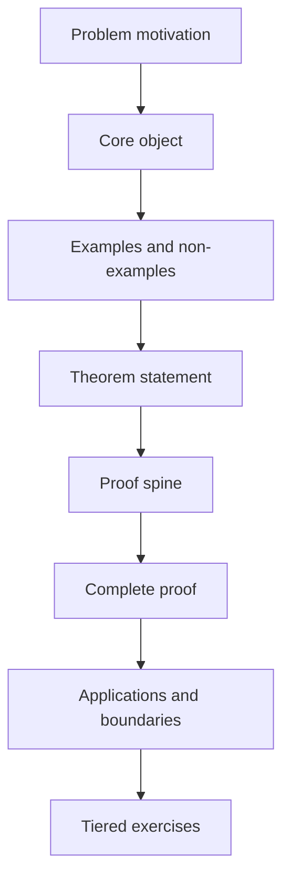

## One-Page Summary

This page defines the minimum standard for future English math lecture notes under `Lecture Notes`. The core principle is that a lecture note is not a reference dump; it helps the reader reconstruct a topic through a problem, objects, examples, theorems, proofs, exercises, and boundaries. The default reader can accept rigorous proof, but needs the note to explain why the object is natural, what the proof spine is, where hypotheses are used, and how the topic supports research judgment.

## Table of Contents

<table_of_contents color="gray"/>

## Prerequisites

Reading this standard requires no special mathematical background, but each concrete lecture note must state its own prerequisites. For example, a stochastic-process note should say whether it needs measure-theoretic probability, ODE/PDE tools, or functional inequalities; an optimization note should say whether it needs convex analysis, spectral theory, or stochastic approximation.

## Learning Goals

A qualified lecture note should support three levels.

| Level | What the reader should be able to do | What the note must provide |
|---|---|---|
| Conceptual | Explain why the central object appears | Motivation, definitions, examples, non-examples |
| Technical | Reproduce the proof route for a core theorem | Proof spine, key estimates, hypothesis-use points |
| Research-facing | Judge whether the topic transfers to a new problem | Boundaries, counterexamples, open-ended exercises |

## Front Roadmap

This is the default generation order. If a topic is better introduced through an example, move the example earlier, but do not delete the theorem, proof, and boundary analysis.

## Core Definition: What Counts as a Qualified Note

**Definition.** An English math lecture note is qualified if it represents a topic through three layers: a problem layer $`Q`$, a structural layer $`S`$, and a proof layer $`P`$. The note must explain why $`Q \to S`$ is natural, why $`S \to P`$ is sufficient, and which steps in $`P`$ depend on which hypotheses.

In formula form, a note should not merely list

$$
\text{Definition}_1,\text{Definition}_2,\ldots,\text{Theorem}_k.
$$

It should provide a learnable path

$$
\text{problem}\longrightarrow \text{object}\longrightarrow \text{example}\longrightarrow \text{theorem}\longrightarrow \text{proof}\longrightarrow \text{boundary}.
$$

## Examples

**Positive example.** If the topic is Langevin dynamics, the note should first ask why one constructs a continuous-time stochastic process to sample a target distribution $`\pi(dx)\propto e^{-V(x)}dx`$. It should then define the SDE, explain how drift and noise preserve $`\pi`$, and prove stationarity through the Fokker--Planck equation or the generator identity.

**Non-example.** A note that only says "Langevin dynamics is $`dX_t=-\nabla V(X_t)dt+\sqrt{2}dB_t`$ and its invariant distribution is $`e^{-V}`$" is not qualified. It lacks problem motivation, assumptions, proof spine, boundaries, and exercises.

## Theorem: Structural Completeness

**Theorem.** If a lecture note gives each core theorem a hypothesis explanation, proof spine, complete proof or exact citation, positive example, non-example, and exercises, then it can usually serve both as learning material and as a later reference.

**Proof spine.** Learning material and reference material do not mainly conflict in amount of content. They conflict in organization. Learning requires a causal route into the object; reference use requires locatable definitions, theorem statements, and proofs. A note that has both lets the reader first build a model and later search theorem/proof blocks.

**Proof.** Split the note into explanatory blocks and formal blocks. Explanatory blocks give motivation, examples, and pitfalls. Formal blocks give definitions, theorems, proofs, and exercises. If only explanatory blocks are present, the reader cannot check rigor. If only formal blocks are present, the reader cannot see why the formal objects were selected. Alternating the two types, with each formal block introduced by the previous explanatory block, yields a learnable path. A proof spine compresses a long proof into finitely many steps $`s_1,\ldots,s_m`$, and the full proof expands each $`s_i`$, preserving reference value.

### Where the hypotheses are used

The alternation requirement uses the assumption that each formal object has a local explanatory purpose. If the note lists objects that do not serve a later proof, the decomposition no longer gives a learnable path.

## Notion Math Standard

Inline math must use the stable Notion form, for example $`X_t`$, $`\nabla V`$, and $`\mathcal L`$. Display math uses double-dollar blocks:

$$
\mathcal L f = b\cdot \nabla f + \frac{1}{2}\operatorname{Tr}(a\nabla^2 f).
$$

Do not use ordinary inline dollar math. Do not damage LaTeX commands such as $`\mathbb R^d`$, and write matrix transpose as $`A^\top`$, not as a plain-text approximation.

## Layout and Visual Standards

| Element | Purpose | Minimum standard |
|---|---|---|
| Table | Compare definitions, hypotheses, theorem versions | At least one in a long note |
| Clickable TOC | Page navigation | `## Table of Contents` + `<table_of_contents color="gray"/>` after the summary |
| Mermaid or ASCII diagram | Dependencies, algorithm flow, or phase map | Use when the topic permits |
| Display equation | Core formulas | Do not bury large formulas in prose |
| Callout-style paragraph | Pitfall, memory point, or boundary | At least one per major section when useful |
| Exercise block | Active learning | Five levels |

## Exercises

Level 0: Restate the definition of a qualified note and identify what $`Q`$, $`S`$, and $`P`$ mean.

Level 1: Pick a familiar topic and write its problem layer, structural layer, and proof layer.

Level 2: Choose a theorem, write a three-step proof spine, and say which step is easiest to write badly.

Level 3: Construct a bad lecture note that is technically correct but hard to learn from. Identify the failure.

Level 4: Design a lecture-note outline for a research topic that supports learning, proof reproduction, and paper writing.

## Common Pitfalls

- Mistake 1: Longer is better. The real standard is whether the cognitive path is clear.
- Mistake 2: Complete proof alone is enough. Without motivation, examples, and hypothesis explanations, proofs become hard to reuse.
- Mistake 3: Visual structure is decoration. Visuals must encode mathematical dependencies, algorithms, or comparisons.
- Mistake 4: Notion math can be written casually. Ordinary inline dollar math can render literally; use the stable format.
- Mistake 5: A hand-written bullet list is a clickable table of contents. Completed notes must use Notion's native `<table_of_contents color="gray"/>` block.

## Summary

- The note's core task is to organize a topic's problem, objects, theorems, proofs, and boundaries into a learnable path.
- Every core concept needs motivation, definition, positive examples, and non-examples.
- Every core theorem needs a proof spine, full proof or exact citation, and hypothesis-use explanation.
- The Notion version must preserve formulas, layout, visual structure, and clickable navigation.
