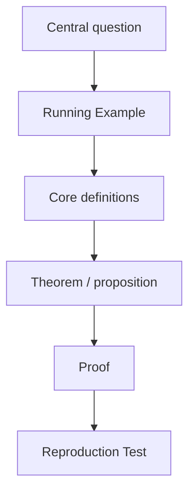

# Lecture Note Template

## One-Page Summary

Central problem:

Main answer:

Reading path:

Boundary:

## Table of Contents
<table_of_contents color="gray"/>

## Front Roadmap

## Terminology

| Term / notation | Meaning in this note | First used in |
| --- | --- | --- |
|  |  |  |

## 0. Prerequisites, Learning Goals, and Source/Request Spine

### Prerequisites

### Learning Goals

### Source/Request Spine

- Must cover:
- Out of scope:

## 1. Running Example

Give a small but expressive example that can carry the later definitions and proofs.

### Takeaways

-

## 2. Core Definition

### Definition

### Examples

### Non-examples

### Takeaways

-

## 3. Core Theorem

### Theorem

### Proof Spine

### Proof

### Where the hypotheses are used

### Takeaways

-

## 4. Reproduction Test

Input:

Expected Output:

Pass Criteria:

## 5. Tiered Exercises

- Level 0:
- Level 1:
- Level 2:
- Level 3:
- Level 4:

## Common Pitfalls

-

## Summary Compression

-
