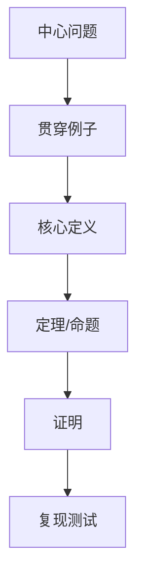

# Lecture Note Template

## 一页摘要

本讲解决的问题：

核心答案：

阅读路线：

边界：

## 目录
<table_of_contents color="gray"/>

## 前置路线图

## 术语约定

| 中文术语 | 英文原词 | 本讲含义 |
| --- | --- | --- |
|  |  |  |

## 0. 预备知识、学习目标与主题主干

### 预备知识

### 学习目标

### 主题主干

- 必须覆盖：
- 本讲不覆盖：

## 1. 贯穿例子

给出一个足够小、但能承载后续定义和证明的例子。

## 2. 核心定义

### 定义

### 正例

### 非例子

## 3. 核心定理

### 定理

### 证明路线

### 证明

### 假设在哪里用

## 4. 复现测试

输入：

预期输出：

通过标准：

## 5. 分层练习

- Level 0:
- Level 1:
- Level 2:
- Level 3:
- Level 4:

## 总结压缩

- 
